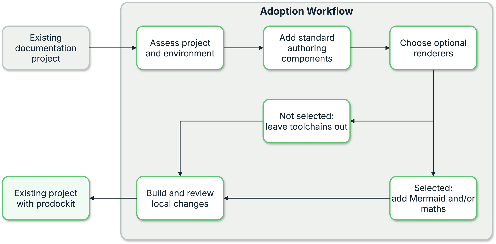

{{ heading_counter_reset(page) }}

# Add prodockit to an existing document

`prodockit adopt` is for an existing Zensical document, whether or not its
Python working environment has already been established. It prepares that
environment with the exact software combination supported by the installed
Prodockit release, then adds Prodockit's authoring extensions and website
styles without turning the project into a copy of prodockit-template.

Use [machine bootstrap](devcons/bootstrap.md) for a new computer or a new
repository. Adoption assumes that Git, SSH and the editor you prefer already
work. It does not configure or change any of them.

\ref{fig-adoption-workflow} shows the existing project entering the outlined
adoption process. Inside that boundary, prodockit assesses the project, adds
the standard components, and either installs or skips each optional renderer.
The author then builds and reviews the local changes before accepting the
updated project.

{ .documentation-diagram }
/// figure-caption
    attrs: {id: fig-adoption-workflow}

Adopting Prodockit into an existing document
///

## What the command changes

The standard installation adds:

- Exact declarations for Zensical, WeasyPrint, Prodockit, Markdown and PyMdown
    Extensions to the site's existing requirements file. It uses
    `requirements.txt`, `requirements/docs.txt` or `docs/requirements.txt`, in
    that order, and creates `requirements.txt` when none exists. An existing
    operator and extras, such as `prodockit[index]>=...`, are preserved while
    its version is aligned; a missing declaration is added with `==`.
- `.python-version` and `.prodockit-toolchain.toml`. The latter records every
    managed version, including Python and Pandoc, from the same tested-version
    manifest used by `prodockit pins` and `pdk diag`.
- The standard prodockit Markdown extensions to the existing
    `zensical.toml`, `zensical.yml` or `zensical.yaml`.
- `docs/stylesheets/pdk.css`, loaded before any project stylesheet so
    the project's own rules can override it.
- `.prodockit-components.toml`, recording whether this project selected
    Mermaid diagrams or mathematical notation.

Mermaid and mathematics are independent options and are off by default. A
document using neither does not need Node.js, MathJax, Mermaid CLI or a browser
renderer.

When either option is selected, adoption writes the component's `package.json`
and `package-lock.json` before installing it. The lockfile records the tested
dependency set, while npm's download cache makes later reinstalls quicker. If
the project already has an author-maintained Node manifest, adoption leaves it
unchanged and uses its existing lockfile when one is present.

The command never commits, pushes, changes a remote, or writes editor settings.

Adoption installs, upgrades or downgrades the managed Python packages in the
active virtual environment and installs the supported Pandoc executable into
that environment. It does not replace the Python interpreter that is running
it: a different Python minor release blocks the whole stage before packages or
project files are changed, and the report gives the exact Bootstrap or virtual
environment remediation.

Adoption is not a whole-machine native-library installer. WeasyPrint's Pango,
GLib, HarfBuzz and fontconfig libraries, and the document fonts, remain part of
the existing machine setup. Follow the adoption row under [Prepare the PDF
tools](pdf.md#pdf-requirements) before building a PDF.

## Review the existing project

Complete [section 3.1, Installation preparation](installation.md#installation-preparation)
before continuing. For adoption, use the directory containing the existing
project's `zensical.toml`, `zensical.yml` or `zensical.yaml` when section 3.1
asks you to choose a directory. This establishes the project's own `.venv`;
the steps below begin with installing Prodockit into it.

/// steps

//// step | Install or update prodockit

```bash
python -m pip install --upgrade pip
python -m pip install --upgrade prodockit
```

Confirm that the command comes from the active project environment:

```bash
prodockit --version
```

Adoption later aligns Prodockit and the other managed versions with the
combination supported by this installed command. This installation step makes
the command available for the first run.

////

//// step | Ask for an assessment

```bash
prodockit adopt
```

The report is read-only. It groups the work into phases and gives every change
its own stage, using the same presentation as `prodockit bootstrap`. It also says explicitly
that Git, SSH, remotes and editors are outside its scope.

////

///

## Choose optional renderers

Complete [Review the existing project](#review-the-existing-project) first.
Run every remaining command from the project directory with its `.venv`
active and with `python --version` reporting Python 3.14.

Choose Mermaid and mathematics only when the existing document uses them. Run:

```bash
prodockit adopt --configure
```

The command asks two separate questions:

```text
Does this document contain Mermaid diagrams? [y/N]:
Does this document contain mathematical notation? [y/N]:
```

Choose Mermaid only when the source contains `mermaid` fenced blocks. Choose
mathematics only when the document uses TeX notation that MathJax must render.
Selecting one does not select the other.

The answers are saved in `.prodockit-components.toml`, which should be
committed with the document so another contributor gets the same components.

Command-line flags can select them explicitly for a run:

```bash
prodockit adopt --mermaid --no-maths --dry-run
prodockit adopt --no-mermaid --maths --dry-run
```

## Preview and apply

Preview the complete plan before allowing any file or package change, then
build the result yourself so the review remains under your control. Keep the
project's `.venv` active throughout these steps.

/// steps

//// step | Preview every selected stage

```bash
prodockit adopt --dry-run
```

No files or packages are changed. The supported-toolchain stage always lists
its affected files and exact commands. Add `--verbose` to expose the equivalent
detail for the other stages.

////

//// step | Apply the reviewed stages

```bash
prodockit adopt --apply
```

The command asks before each stage that writes files or installs software. The
toolchain stage says which tools will be installed, upgraded or downgraded,
then verifies their versions before writing the matching declarations. A
failed installation therefore cannot leave the project claiming a combination
that was not reached.

Pip uses its normal wheel cache, five request retries and bounded request
timeouts. Set `PDK_PYPI_MIRROR` to add an institutional Python package mirror.
Pandoc downloads are validated as archives, retained in Prodockit's native
download cache and retried before moving from a configured
`PDK_PANDOC_MIRROR` to the official release source. A rerun reuses any valid
cached download rather than fetching it again.

Routine npm output is captured; a failure is reported with its own error rather
than leaving an apparently successful stage. After npm completes, Adoption
renders a minimal Mermaid diagram through its browser and converts a minimal
expression through MathJax. An incomplete npm extraction or unusable browser
therefore keeps both the renderer stage and Ready stage incomplete.

If Mermaid or mathematics is selected, its Node packages are installed below
`tools/`. These are project-local dependencies, not global software shared
with unrelated documents.

////

//// step | Work from prepared caches when offline

Use offline mode only after putting the exact Python wheels in a directory and
retaining a validated Pandoc archive in Prodockit's native download cache. Run
the command from the active project environment:

```bash
PDK_WHEELHOUSE=/path/to/wheels prodockit adopt --apply --offline
```

Offline mode passes `--no-index` to pip and does not silently contact PyPI or a
Pandoc source. If either cache is incomplete, the stage fails clearly and does
not update the declarations.

////

//// step | Build the website

Keep the project's `.venv` active so the build uses the supported Zensical and
Prodockit versions installed by adoption.

=== "zensical.toml"

    ```bash
    zensical build --clean --strict
    ```

=== "zensical.yml"

    ```bash
    zensical build -f zensical.yml --clean --strict
    ```

=== "zensical.yaml"

    ```bash
    zensical build -f zensical.yaml --clean --strict
    ```

This uses the document's actual pages and configuration, so it remains the
final proof that the adopted components work with the existing project. The
YAML filenames are supported inputs, but Zensical requires them to be supplied
explicitly with `-f`; only `zensical.toml` is discovered automatically.

////

//// step | Review the local changes

```bash
git diff
git status --short
```

Commit and publish them through the repository's normal professional workflow.
Adoption deliberately stops before either action.

////

///

## Run it again safely

The stages are idempotent: a satisfied stage is reported as `ok` and left
alone. If an installation is interrupted or you return in a new terminal,
change to the project directory and reactivate its environment first:

=== ":material-apple: macOS"

    ```bash
    cd /path/to/your-document
    source .venv/bin/activate
    ```

=== ":fontawesome-brands-windows: Windows"

    ```powershell
    cd C:\path\to\your-document
    Set-ExecutionPolicy -Scope CurrentUser -ExecutionPolicy RemoteSigned
    .\.venv\Scripts\Activate.ps1
    ```

=== ":material-linux: Linux (Ubuntu)"

    ```bash
    cd /path/to/your-document
    source .venv/bin/activate
    ```

Confirm that `python --version` still reports Python 3.14, then run the same
command again:

```bash
python --version
prodockit adopt --apply
```

It reassesses installed versions and files, reuses valid caches, and continues
with stages that still need work. It does not remove unrelated requirements or
existing Zensical configuration.
