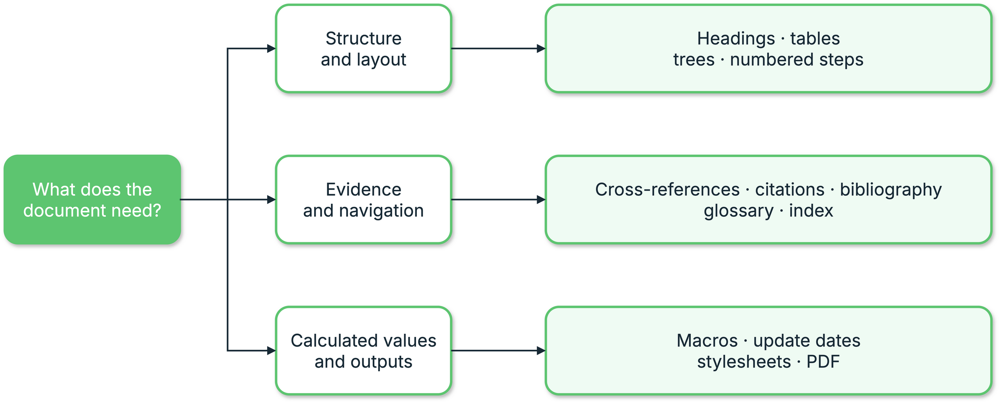

{{ heading_counter_reset(page) }}

# Authoring reference

This section is for a document author who has built a first Zensical site and
wants to add structure or specialist content to its \index{Markdown} pages,
use values calculated across the document, or produce a PDF. You do not need
to read every page: choose the feature or tool the document needs and start
with its smallest complete example.

\ref{fig-authoring-feature-map} starts with the document's need and groups the
available features into three paths. Use the top path for structure and
layout, the middle path for evidence and navigation, and the bottom path for
calculated values or generated outputs.

{ .documentation-diagram }
/// figure-caption
    attrs: {id: fig-authoring-feature-map}

Prodockit authoring feature map
///

## Build on PyMdown Blocks

Two prodockit extensions are built directly on \index{PyMdown Blocks} (see the
[upstream Blocks guide](https://facelessuser.github.io/pymdown-extensions/extensions/blocks/)):
`prodockit.steps` for procedures and `prodockit.tree` for directory listings.
They use PyMdown's slash-fenced container syntax, nesting rules, and block
options rather than introducing a separate container language.

If you already use PyMdown Blocks, the structure will be familiar. If you do
not, start with [Numbered steps](extensions/steps.md): its first example shows
the complete opening and closing fences before explaining nested blocks.

## Follow the same three stages

Every extension guide starts with the same learning path:

/// steps

//// step | Enable the extension

Add the extension's table to `zensical.toml`. Each prodockit extension is
independent, so enabling headings does not silently enable citations, tables,
or another feature.

////

//// step | Write the Markdown

Start with the complete copyable example. The guide shows both its Markdown
source and rendered result before introducing variations.

////

//// step | Configure only when needed

Keep the defaults for a first use. The configuration section explains the
available `zensical.toml` settings and shows a rendered example when an option
changes visible output.

////

///

## Choose a feature

Match the document outcome you need to its authoring feature in
\ref{tab-authoring-choose-a-feature}.

| Document need | Reference |
|---|---|
| Number sections and give headings stable links | [Headings](extensions/headings.md) |
| Refer to a heading, figure, or table without typing its changing number | [Cross-references](extensions/refs.md) |
| Define short references directly in Markdown | [Hand-written citations and references](extensions/citations.md) |
| Expand abbreviations and define specialist terms | [Acronyms and glossary](extensions/glossary.md) |
| Control column widths, merged cells, and dense layouts | [Tables](extensions/tables.md) |
| Show a folder and file hierarchy | [Directory trees](extensions/tree.md) |
| Present a procedure with connected numbered stages | [Numbered steps](extensions/steps.md) |
| Cite a BibTeX library in a selected CSL style | [Bibliography](extensions/bibliography.md) |
| Mark terms for a PDF back-of-book index | [Index](extensions/index-terms.md) |
/// table-caption | <
    attrs: {id: tab-authoring-choose-a-feature}

Choose a feature
///

The two citation choices in \ref{tab-authoring-choose-a-feature} are approaches
to the
same broad task. A small document can define sources directly in Markdown;
a report with an existing `.bib` library normally uses the bibliography
extension. You do not need to enable both.

### Choose a supported alternative when it is enough

Prodockit extends rather than replaces the features Zensical already supports.
Before enabling another extension, check Zensical's current
[MkDocs plugin compatibility](https://zensical.org/docs/compatibility/mkdocs/plugins/)
and
[Python-Markdown extension compatibility](https://zensical.org/docs/compatibility/markdown/python-markdown-extensions/)
lists. \ref{tab-authoring-supported-alternatives} identifies the closest
supported alternative to each Prodockit extension and the narrower case where
that alternative is sufficient.

| Prodockit feature {: width="25%" } | Closest supported alternative {: width="28%" } | Use the supported alternative when... |
|---|---|---|
| `prodockit.headings` | Python-Markdown [`toc`](https://python-markdown.github.io/extensions/toc/) and [`attr_list`](https://python-markdown.github.io/extensions/attr_list/) | You need stable heading ids and permalinks, but not hierarchical numbering across pages, appendices, captions, or navigation. |
| `prodockit.refs` | Zensical [`autorefs`](https://zensical.org/docs/compatibility/mkdocs/plugins/#autorefs) | You want path-independent links and will write their visible text yourself; you do not need automatic section numbers, figure or table labels, or PDF page numbers. |
| `prodockit.citations` | [Footnotes](https://zensical.org/docs/authoring/footnotes/) and ordinary links | A source note belongs only to its current page and does not need a reusable key, generated citation text, or a cross-page reference entry. |
| `prodockit.glossary` | [`abbr`, `attr_list`, and `pymdownx.snippets`](https://zensical.org/docs/authoring/tooltips/) | A central set of browser tooltips is enough; you do not need explicit `\gls{id}` links, missing-term markers, or separate linked acronym and glossary pages. |
| `prodockit.tables` | Standard [data tables](https://zensical.org/docs/authoring/data-tables/), `attr_list`, and [Blocks Caption](https://zensical.org/docs/compatibility/markdown/python-markdown-extensions/#caption) | You need an ordinary table or caption, but not controlled widths, dense layout, multiple header rows, merged cells, shading, vertical alignment, or rotated headings. |
| `prodockit.steps` | A Markdown numbered list | The sequence is short and does not need titled connected stages, rich nested block content, continued numbering, or matching website and PDF presentation. |
| `prodockit.tree` | A Markdown list or fenced code block | A plain hierarchy is sufficient and you do not need indentation validation, file/directory recognition, descriptions, or configurable icons. |
| `prodockit.bibliography` | [Footnotes](https://zensical.org/docs/authoring/footnotes/) | You do not need a BibTeX/BibLaTeX library, CSL formatting, keyed citations, or an automatically generated reference list. There is no direct equivalent in Zensical's supported lists. |
| `prodockit.index` | Zensical [`search`](https://zensical.org/docs/compatibility/mkdocs/plugins/#search) or [`tags`](https://zensical.org/docs/compatibility/mkdocs/plugins/#tags) | Readers will use the website only; you do not need an alphabetised PDF back-of-book index with page numbers and hierarchical entries. |
/// table-caption | <
    attrs: {id: tab-authoring-supported-alternatives}

Supported alternatives to Prodockit extensions
///

The alternatives in \ref{tab-authoring-supported-alternatives} overlap with a
specific part of each feature; they are not drop-in replacements for the whole
row. Prefer the smaller supported feature when its stated boundary matches the
document, and use the Prodockit extension when the document needs the
additional behaviour.

## Use features beyond Markdown extensions

Some authoring features are commands or Zensical template helpers rather than
Python-Markdown extensions:

\ref{tab-authoring-use-features-beyond-markdown-extensions} identifies the authoring features provided by commands or template helpers rather than Markdown syntax.

| Document need | Reference |
|---|---|
| Insert calculated values such as word counts, repository details, or document-wide layout settings | [Website macros](macros.md) |
| Show when each source page was last updated | [Page update dates](update-dates.md) |
| Produce a complete PDF, a single-page PDF, or a source bundle | [PDF generation](pdf.md) |
| Find the safe first form, write behaviour, and options for every public command | [Command-line tools](command-line.md) |
/// table-caption | <
    attrs: {id: tab-authoring-use-features-beyond-markdown-extensions}

Use features beyond Markdown extensions
///

The non-extension features in
\ref{tab-authoring-use-features-beyond-markdown-extensions} are part of the
same authoring reference because they affect
what the document contains or produces. Installation, repository maintenance,
continuous integration, and deployment remain in their task-based sections.

## Keep deployment concerns separate

The authoring pages explain what to write, how to configure its rendered
features, and how to build local outputs. When those outputs are ready for a
hosted website, continue to [Publish a document](publishing.md). Template
updates, CI, Pages deployment, and output tests live there so they do not
interrupt the authoring reference.
