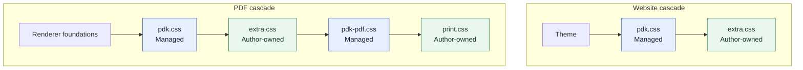

{{ heading_counter_reset(page) }}

# Authoring reference

This section is for a document author who has built a first Zensical site and
wants to add structure or specialist content to its \index{Markdown} pages,
use values calculated across the document, or produce a PDF. You do not need
to read every page: choose the feature or tool the document needs and start
with its smallest complete example.

## Build on PyMdown Blocks

Two prodockit extensions are built directly on \index{PyMdown Blocks} (see the
[upstream Blocks guide](https://facelessuser.github.io/pymdown-extensions/extensions/blocks/)):
`prodockit.steps` for procedures and `prodockit.tree` for directory listings.
They use PyMdown's slash-fenced container syntax, nesting rules, and block
options rather than introducing a separate container language.

If you already use PyMdown Blocks, the structure will be familiar. If you do
not, start with [Numbered steps](extensions/steps.md): its first example shows
the complete opening and closing fences before explaining nested blocks.

## Follow the same three stages

Every extension guide starts with the same learning path:

/// steps

//// step | Enable the extension

Add the extension's table to `zensical.toml`. Each prodockit extension is
independent, so enabling headings does not silently enable citations, tables,
or another feature.

////

//// step | Write the Markdown

Start with the complete copyable example. The guide shows both its Markdown
source and rendered result before introducing variations.

////

//// step | Configure only when needed

Keep the defaults for a first use. The configuration section explains the
available `zensical.toml` settings and shows a rendered example when an option
changes visible output.

////

///

## Choose a feature

| Document need | Reference |
|---|---|
| Number sections and give headings stable links | [Headings](extensions/headings.md) |
| Refer to a heading, figure, or table without typing its changing number | [Cross-references](extensions/refs.md) |
| Define short references directly in Markdown | [Hand-written citations and references](extensions/citations.md) |
| Expand abbreviations and define specialist terms | [Acronyms and glossary](extensions/glossary.md) |
| Control column widths, merged cells, and dense layouts | [Tables](extensions/tables.md) |
| Show a folder and file hierarchy | [Directory trees](extensions/tree.md) |
| Present a procedure with connected numbered stages | [Numbered steps](extensions/steps.md) |
| Cite a BibTeX library in a selected CSL style | [Bibliography](extensions/bibliography.md) |
| Mark terms for a PDF back-of-book index | [Index](extensions/index-terms.md) |

`prodockit.citations` and `prodockit.bibliography` are two approaches to the
same broad task. A small document can define sources directly in Markdown;
a report with an existing `.bib` library normally uses the bibliography
extension. You do not need to enable both.

## Control the appearance with stylesheets

The \index{stylesheets!stylesheet ownership} rules separate styles Prodockit
maintains from styles that belong to the document author. Keep that
separation when changing colours, spacing, fonts, or the PDF presentation:

| File | Owner | Applies to |
|---|---|---|
| `docs/stylesheets/pdk.css` | Prodockit | Website and PDF component defaults |
| `docs/stylesheets/extra.css` | Document author | Website and PDF additions or overrides |
| `docs/stylesheets/pdk-pdf.css` | Prodockit | PDF-only presentation defaults |
| `docs/stylesheets/print.css` | Document author | PDF-only additions or overrides |

The two `pdk` files are delivered with Prodockit and checked by
[`prodockit pins`](devcons/pinning-drift.md#pinning-shared-files). Do not edit
them: an update replaces them with the release's current defaults. Add your
own rules to `extra.css` or `print.css` instead. Those two author-owned files
are not shared, pinned, or replaced by `template-sync`.

### Load the cascade in order

List the files in this order in `zensical.toml`:

```toml
[project]
extra_css = [
  "stylesheets/pdk.css",
  "stylesheets/extra.css",
]

[project.extra]
pdf_extra_css = [
  "stylesheets/pdk-pdf.css",
  "stylesheets/print.css",
]
```

The PDF renderer first supplies the structural rules needed to construct a
paginated document. It then loads the files above in order. A rule in
`extra.css` therefore changes both outputs, while a rule in `print.css`
changes only the PDF and has the final say when selectors have equal
specificity. A final internal guard protects only the page canvas and removes
website navigation from the PDF; it does not set the document's colours,
typography, tables, contents presentation, or component spacing.

| Output | Styles loaded, from first to last |
|---|---|
| Website | Theme → `pdk.css` → `extra.css` |
| PDF | Renderer foundations → `pdk.css` → `extra.css` → `pdk-pdf.css` → `print.css` |

The arrows show which later layer can override an earlier layer at equal CSS
specificity. The website leaves the cascade after `extra.css`; the PDF
continues through its two PDF-only files:



### Put a change in the narrowest file

- Use `extra.css` when the website and PDF should look alike.
- Use `print.css` when the change applies only to paginated output.
- Propose a change to Prodockit when every project should receive it; do not
  make that change directly in either `pdk` file.

For example, this makes level-three entries in the PDF contents page more
widely spaced without changing the website:

```css
/* docs/stylesheets/print.css */
#TOC > ul > li > ul > li > ul > li {
  line-height: 1.15 !important;
}
```

### Check managed files before an update

Run `prodockit pins --check` to compare the two managed files with the
installed release. If `template-sync` finds local edits in either one, it
prints a managed-stylesheet warning and keeps the local file. Move intentional
rules into `extra.css` or `print.css`, then restore the managed file using the
exact `--force FILE-PATH` command shown by the report.

## Use features beyond Markdown extensions

Some authoring features are commands or Zensical template helpers rather than
Python-Markdown extensions:

| Document need | Reference |
|---|---|
| Insert calculated values such as word counts, repository details, or document-wide layout settings | [Website macros](macros.md) |
| Produce a complete PDF, a single-page PDF, or a source bundle | [PDF generation](pdf.md) |
| Find the safe first form, write behaviour, and options for every public command | [Command-line tools](command-line.md) |

These features are part of the same authoring reference because they affect
what the document contains or produces. Installation, repository maintenance,
continuous integration, and deployment remain in their task-based sections.

## Keep deployment concerns separate

The authoring pages explain what to write, how to configure its rendered
features, and how to build local outputs. When those outputs are ready for a
hosted website, continue to [Publish a document](publishing.md). Template
updates, CI, Pages deployment, and output tests live there so they do not
interrupt the authoring reference.
