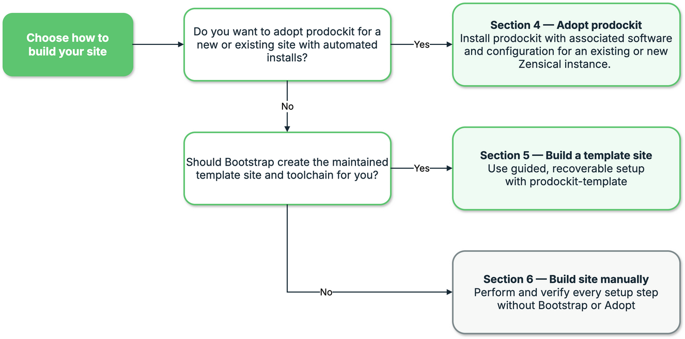

{{ heading_counter_reset(page) }}

# Choosing your install and features

Prodockit supports three installation paths. Choose the one that matches the
document and level of automation you have; the paths are alternatives rather
than stages to complete in sequence.

## Choose an installation path

\ref{fig-installation-approaches} follows the decision from an existing
document or a new template project to Adoption, Bootstrap or Manual
installation.

<!-- Reused from prodockit-userguide/docs/images/installing-prodockit-decision-tree-components.png. The canonical editable source is the installing-prodockit-decision-tree-components page in prodockit-userguide/tools/documentation-diagrams/site-diagrams.drawio. -->
{ .documentation-diagram }
/// figure-caption
    attrs: {id: fig-installation-approaches}

Choose the Prodockit installation approach
///

\ref{tab-choose-installation-route} compares the three installation paths by
starting point and result.

| Starting point | Installation path |
|---|---|
| An existing Zensical document whose working environment is already established | [Adoption](adopt.md) integrates selected authoring components without replacing the document's design, Git setup, editor, or publishing workflow |
| No existing document, or a project that should start from the maintained report template | [Bootstrap](devcons/bootstrap.md) prepares the machine, repository, build tools, and template-based project |
| A project whose author wants to perform setup directly | [Manual installation](installation.md) prepares the environment, installs the Python package, and configures extensions without running adoption or bootstrap; [Requirements and dependencies](requirements-dependencies.md) records the detailed toolchain |
/// table-caption | <
    attrs: {id: tab-choose-installation-route}

Choose an installation path
///

[Start with prodockit-template](prodockit-template.md) explains what the
template supplies and which files become part of your own project. Adoption,
bootstrap, and manual installation are alternative setup paths. Choose one as
the starting point; do not run bootstrap merely because a manually installed
or adopted project later needs a PDF.

Continue with [Installation preparation](installation.md) after choosing the
path. It establishes the supported Python and virtual environment shared by
all four following installation chapters.

## Choose your features

Prodockit separates features that change authored Markdown from tools that
build, inspect, or maintain the complete project. Start with the group that
matches the outcome you need.

### Authoring extensions

These are standard Python-Markdown extensions configured in `zensical.toml`:

\ref{tab-choose-authoring-extensions} explains the practical benefit each
extension brings to an author.

| Extension {: width="32%" } | Benefit to the author |
|:---|:---|
| [`prodockit.headings`](extensions/headings.md) | Numbers the document hierarchy consistently in the website and PDF. Sections can move without the author manually renumbering every later heading. |
| [`prodockit.refs`](extensions/refs.md) | Links prose to headings, figures and tables by identity rather than a typed number. The displayed number and title follow the target when the document is reorganised, preventing stale “see section…” references. |
| [`prodockit.citations`](extensions/citations.md) | Provides a lightweight citation and reference-list approach written entirely in Markdown. A short document can present credible evidence without requiring a separate bibliography database or processing tool. |
| [`prodockit.glossary`](extensions/glossary.md) | Defines specialist terms and acronyms once, then presents them consistently throughout the document. Readers get expansions and a shared glossary while authors avoid repeating and synchronising definitions manually. |
| [`prodockit.tables`](extensions/tables.md) | Adds widths, merged cells, grouped or rotated headings, shading and compact layout. Authors can give information the format it needs instead of struggling within basic Markdown table capabilities, with the result preserved across website and PDF. |
| [`prodockit.tree`](extensions/tree.md) | Turns a simple indented description into a readable directory hierarchy. File relationships remain clear without maintaining fragile hand-drawn ASCII connectors. |
| [`prodockit.steps`](extensions/steps.md) | Gives procedures and methods consistent numbering and visual progression. Steps can be inserted, removed or rearranged without manually repairing the sequence or layout. |
| [`prodockit.bibliography`](extensions/bibliography.md) | Uses reusable BibTeX or BibLaTeX records and a CSL style to produce citations and a bibliography. It scales to larger evidence bases and formal publication styles while keeping references consistent. |
| [`prodockit.index`](extensions/index-terms.md) | Generates a back-of-book index for the PDF from terms selected in the source. Readers can find related discussion across chapters without authors building and updating an index by hand. |
/// table-caption | <
    attrs: {id: tab-choose-authoring-extensions}

Authoring extensions
///

Every extension is independent. Start with one; add another when the document
needs it.

### Lifecycle management tooling

Prodockit provides commands that keep an installed project supportable after
its first successful build. They separate assessment, software alignment,
template updates and verification so an author can make deliberate changes
without rebuilding the project by hand.

[`prodockit adopt`](adopt.md)

:   Brings an established Zensical project onto the software combination
    supported by the installed Prodockit release, including upgrading or
    downgrading managed Python packages and Pandoc when required. The benefit
    is a repeatable route back to a tested toolchain without replacing the
    project's content, design, Git history or publishing workflow.

[`prodockit template-sync`](devcons/template-sync.md)

:   Compares a project with the template release it came from and prepares
    updates to shared workflows, configuration and other template-managed
    files. It preserves author-owned content and isolates conflicts for review,
    so fixes and lifecycle improvements can be adopted without overwriting
    deliberate project customisation.

[`prodockit pins`](devcons/pinning-drift.md)

:   Updates the version declarations spread across requirements, workflows and
    tool configuration as one reviewed change. This matters because
    independently upgraded or downgraded tools may still install successfully
    while producing different website or PDF output; Pins returns the project
    to a combination tested together.

[`pdk diag`](devcons/diagnostics.md)

:   Checks the active interpreter, installed distributions, project
    configuration, required renderers and version drift without changing the
    project. It tells the author what is wrong and what evidence supports that
    conclusion, reducing lifecycle maintenance from trial-and-error reinstalls
    to a targeted remediation.

[`prodockit sync-repo`](devcons/repo-metadata.md)

:   Keeps repository links, badges, icons and related metadata consistent with
    the configured Git remote. It prevents a cloned, renamed or transferred
    project from continuing to publish stale ownership and repository
    information.

[`prodockit update-dates`](update-dates.md)

:   Derives page modification dates from Git history and records them for
    publication. Readers can judge how current the material is without
    requiring authors to maintain dates manually.

[`prodockit.testing`](devcons/testing.md)

:   Checks the built website and PDF, including links, headings and required
    content. Lifecycle changes are useful only when the delivered artifacts
    still work, so these tests turn a successful command into evidence that
    the publication remains usable.

### Publishing outputs

[`prodockit pdf`](pdf.md) builds a standalone printable document from the same
navigation and source as the website, while [`prodockit
source-bundle`](pdf.md#bundling-source-into-a-pdf) packages the underlying
Markdown and configuration for disclosure or submission. The
[`prodockit.zensical_macros`](macros.md) integration adds reusable project,
repository and document values to website templates without duplicating them
throughout the source.

Go to the [Authoring reference](authoring.md) when you want to add document
features, use website macros, build a PDF, or look up a command. Go to
[Publish a document](publishing.md) when you are ready to update a
template-derived project or publish with continuous integration. The
[command-line reference](command-line.md) says which commands change files and
which only report.
