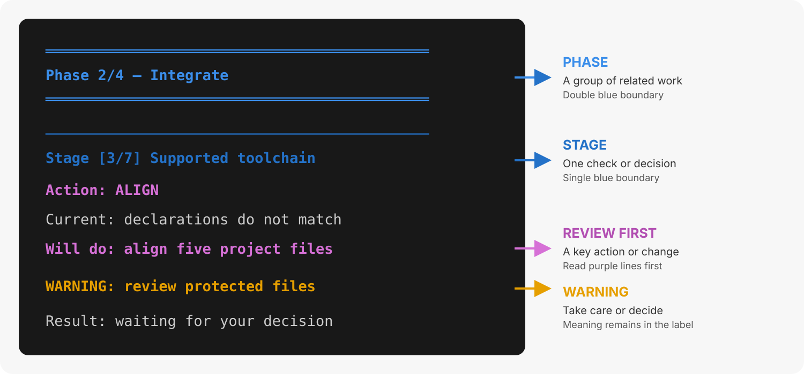

{{ heading_counter_reset(page) }}

# `pdk adopt`

`pdk adopt` adds selected Prodockit components and the supported toolchain to
an existing Zensical document. Its final apply phase offers separately confirmed
site details and optional Git/remote setup. It does not configure SSH, editors
or Pages, and it never commits or pushes.

Use the [Adopt task guide](../adopt.md) for the preparation and review workflow.

### Build workflow protection

Adopt compares the SHA-256 hash of `.github/workflows/docs.yml` with a verified
Zensical starter from its upstream repository. An exact match can be updated
in place. Modified or unknown files are preserved, with proposed instructions
written to `pdk.yml` in the project root instead. Existing proposal files are
also preserved so rerunning Adopt does not overwrite review work.

For an existing `.gitlab-ci.yml`, Adopt writes `.gitlab-pdk.yml`. There is no
verified GitLab starter in the pinned Zensical source, so Adopt does not
overwrite GitLab pipelines. Both proposals are inactive until you manually
merge the relevant instructions into your build file. They cover website
building, not PDF generation. Missing build files are not created automatically.

See [Stage 7b — Review the project changes](../getting-started.md#stage-7-review-the-project-changes)
for the manual merge and review steps.

## Recover interrupted repository setup

If sign-in times out, completed installation work is retained. Follow the
printed sign-in command to start a fresh login, complete its browser prompts
promptly, then rerun `pdk adopt --apply`.

A hosting tool can report failure after creating a repository. Adopt checks
the exact repository address and requested visibility once without retrying
creation. If verified, it asks whether to finish the local connection. If it
cannot verify both, it leaves the connection unchanged and asks you to check
the hosting service. On a later run, answer **Yes** to the existing-repository
question if the repository is already there. Existing origin remotes are never
replaced, and no files are committed or pushed.

## Synopsis {: #cmd-adopt-synopsis }

Use the assessment form first, then choose configuration, preview, or apply.

```text
pdk adopt [OPTIONS]
pdk adopt --configure
pdk adopt --dry-run
pdk adopt --apply
```

With no mode option, Adopt assesses the project and reports outstanding activities.

## Working directory {: #cmd-adopt-working-directory }

Run Adopt from the **root of the existing project**, where its Zensical
configuration and `.venv` are located. Adopt has no project-path option because
its safety checks and changes are intentionally scoped to the current project.

If the current directory holds one or more project repositories, Adopt refuses
to start and names them:

```text
Error: C:\path\to\workspace holds projects rather than being one (report-student).
Open a terminal in the project you want adopted, or cd into it.
```

In another wrong directory, the first assessment reports `Existing
documentation project — no Zensical configuration is here` and tells you to
run the command from the directory containing the configuration. Stop there
and change directory; do not create a configuration merely to satisfy Adopt.

## Options {: #cmd-adopt-options }

\ref{tab-cmd-adopt-options} lists the available project-integration controls.

| Option {: width="34%" } | Behaviour |
|---|---|
| `--configure` | Choose optional components and save them in `.prodockit-components.toml`. |
| `-n`, `--dry-run` | Show activities, files, and changes without writing or installing. |
| `-a`, `--apply` | Apply required activities, asking before each change. |
| `--offline` | Use only the configured wheelhouse and validated native cache. |
| `--mermaid`, `--no-mermaid` | Select or omit project-local Mermaid rendering. |
| `--maths`, `--no-maths` | Select or omit MathJax rendering. |
| `-v`, `--verbose` | Show the files and commands behind each activity summary. |
| `-h`, `--help` | Show installed help and exit. |
/// table-caption | <
    attrs: {id: tab-cmd-adopt-options}

Adopt options
///

## Output {: #cmd-adopt-output }

\ref{fig-cmd-adopt-output} shows the output structure. Use [section 28.1, Scan
phases and activities](output.md#command-output-structure) for the complete
explanation of the phase, activity, action, warning, and decision language:

{ .documentation-diagram }
/// figure-caption
    attrs: {id: fig-cmd-adopt-output}

Adopt output structure
///

## Effects and ownership {: #cmd-adopt-effects-and-ownership }

Adopt can install, upgrade, or downgrade software in the active project
environment to the combination supported by the installed Prodockit release.
It can also align version declarations, enable the standard extensions, install
the managed `pdk.css`, `pdk-pdf.css`, and `pdk.js` files; create missing
user-managed `extra.css`, `print.css`, and `extra.js` files without replacing
their contents; record the stylesheet and JavaScript cascades; save component
choices; provision the supported
configured citation style when it is missing, and initialise selected
project-local renderers.
For selected renderers, a separate Node.js and npm activity uses Bootstrap's
runtime installation policy on macOS, Ubuntu and Windows. It reuses an adequate
runtime, installs a missing one, or upgrades/repairs an unsupported one. Node
and npm follow Bootstrap's minimum supported versions; the renderer packages
themselves use the installed release's exact lockfile.
The system package manager may request administrator approval. Adopt refreshes
its own PATH after installation and verifies both commands before continuing.
It cannot rewrite the parent terminal's environment: if the verification still
fails, an uppercase restart message includes the platform's activation command.
On Windows, a missing WinGet is registered or installed using Microsoft's
`Microsoft.WinGet.Client` repair workflow in current-user scope, before the
runtime installer runs. It does not change PowerShell execution policy.
Homebrew is the agreed manual prerequisite on macOS: install it from
[the Homebrew website](https://brew.sh), complete its shell setup instructions,
then reopen the terminal, activate the project's environment and rerun Adopt.
Adopt installs the required runtime packages once Homebrew is available.
An offline run cannot
provision a missing package manager. Git, SSH and editors are not part of this
runtime activity. Windows package-manager provisioning still requires native
acceptance testing before issue 782 can be considered complete.

The native PDF activity installs or repairs Pango and the required PDF fonts.
It reuses Bootstrap's Homebrew, Ubuntu and architecture-aware Windows MSYS2
recipes without changing Adopt's separately pinned Pandoc installation.
On macOS it preserves the Homebrew library path in the active virtual
environment's activation script. On Windows it refreshes the current process
from the persistent library/PATH settings. Verification generates a small PDF
and checks that Inter and JetBrains Mono are available rather than accepting
fallback fonts. A failed verification leaves the activity incomplete.

Existing citation styles are preserved; an unknown custom filename receives
manual guidance rather than a guessed download.

`.prodockit-components.toml` belongs to the project. When it is missing, Adopt
detects existing project-local renderer installations, including partial installs.
Otherwise Mermaid and maths default off: Zensical's capable starter configuration
alone is not an author choice. Run `pdk adopt --configure` or use
explicit flags to select them. Template projects ship the component file with
both enabled.

## Result {: #cmd-adopt-result }

Adopt records its template-setting review separately from the checks that verify
the project's current configuration and installed software.

### Selected renderer versions and backups

Normal output explains why a change is needed and what Adopt will change.
Healthy checks are kept short. Run `pdk adopt --dry-run --verbose` to include
the file lists, installer commands and technical checks. Version-change details,
warnings and recovery instructions remain visible without `--verbose`.

After setup, run `pdk diag` and the displayed build command to check your
project. Setup being complete does not mean that the website has been built
or published.

Adopt stops if the project's managed declarations require a newer Prodockit
than the command currently running. Activate the project's environment and
install that release (or a compatible newer release) before trying again.
This prevents an older Adopt from replacing files supplied by a newer template
sync. Once Prodockit is compatible, Adopt can still upgrade or downgrade its
dependencies to the supported combination.

Mermaid needs a browser; MathJax does not. On Ubuntu, Adopt reuses a detected
browser or installs the system Chromium package, which selects the machine's
architecture. It disables npm's automatic Puppeteer browser download so ARM64
hosts do not receive an incompatible Chrome build. On macOS and Windows it
reuses an available browser or invokes the already installed, locked Puppeteer
CLI to download its matching browser. The browser download has bounded retries;
timeouts stop with recovery guidance rather than starting another installer.

During installation, Adopt reports elapsed progress. After a completed failed
renderer installation it removes the incomplete `node_modules` directory before
retrying, or before returning the final error. Your configuration, lockfiles and
source files are retained. Partial Pandoc downloads are also discarded rather
than reused. System packages are recovered through their package manager, not
by deleting system directories.

If an installer times out or you interrupt it, Adopt attempts to stop its process
tree. It does not automatically retry or delete files that a detached installer
could still be using; check the recovery message before running Adopt again.

Offline use requires an existing system browser or, on macOS/Windows, a usable
Puppeteer cache. A missing explicitly configured `PUPPETEER_EXECUTABLE_PATH` is
reported rather than silently replaced. Browser-file detection is only a
prerequisite: the final Mermaid check must actually generate an SVG diagram.

For selected Mermaid and maths components, Adopt aligns `tools/mermaid` and
`tools/mathjax` with the renderer files shipped in the installed Prodockit
release. It installs from that release's lockfile, allowing both upgrades and
downgrades. A renderer that still works but has the wrong version is not
reported as aligned. Unselected renderers are left alone.

The activity lists the tool files it may change. Before replacing existing
manifests, lockfiles or the MathJax conversion script, Adopt saves their original
contents under `.prodockit-adopt-backups/renderers`. This includes customised
copies: selecting Adopt's supported renderer replaces those tool files, not
just their version numbers. Your documentation and user-managed website assets
are not replaced by this operation. Backups are excluded from Git; retain them
until you have checked the result. Restoring a custom tool file will make the
next assessment request alignment again.

If writing a backup fails, no renderer files in that component are replaced.
If a later file write or npm install fails, rerun Adopt: the backups remain and
it will check the actual files and renderer health again. Existing Windows line
endings alone do not cause a replacement.

### Template settings and the review ledger

For a `zensical.toml` project, Adopt also checks the template for settings it has
not reviewed before. It reads the public template over HTTPS; Git, SSH and a
GitHub account are not required. Downloads use bounded requests: temporary
network failures are retried twice, with visible warnings and waits of two and
five seconds. Permanent HTTP errors and invalid
responses are not retried. A compatible cached snapshot can be used if the
download still fails. The configuration and version declaration come
from the same immutable commit. A template requiring a newer Prodockit release
is not used automatically. Known defaults still come from the **installed
Prodockit release**, not from the template's values.

- Existing project values are preserved.
- Missing settings recognised by Adopt use its existing configuration rules.
- New, unrecognised settings are added as **commented examples**, never enabled
  just because they appeared in the template. Merge a reviewed example into
  its named table; do not create a duplicate table or key.
- Site identity, navigation, theme/branding, repository details, template-only
  plugin configuration, custom template icons and PDF copyright are excluded.
  `template.css` is not introduced. Existing user-owned settings are not removed.

Adopt records each full setting path and its outcome in
`.prodockit-adopt.toml`: `added`, `commented`, `excluded` or `already present`.
This is separate from `.prodockit-components.toml`, which saves the Mermaid and
maths choices. Commit the review ledger if the team should share this history.
Later runs review only unseen template keys; changes to the value of an already
reviewed template key do not overwrite the project or its examples.

To reset the template review, delete **only `.prodockit-adopt.toml`**, then run
`pdk adopt --dry-run` and `pdk adopt --apply`. Existing active settings and
generated examples are preserved, and generated examples are not duplicated.
Deleting the ledger does not uninstall software or clear component choices.

The ledger controls template-setting import, **not readiness checks**. Required
known configuration, software versions and renderer health are still checked;
an installation record is never accepted as proof that a tool currently works.
Configuration and ledger edits use TOML Kit to preserve comments and layout,
with a separate TOML parse validation before atomic file replacement. The ledger
is saved after the configuration, so an interrupted write can be retried safely.

#### Offline or locally supplied template

A successful settings application caches the downloaded snapshot for the
installed Prodockit version. `--offline` uses that cache without contacting
GitHub. A failed online lookup can also use this cache; the command identifies
the cached source. If neither a usable online snapshot nor cache is available,
Adopt stops with recovery guidance before starting installation activities.

You can supply a compatible template configuration directly, including offline:

```sh
pdk adopt --dry-run --template-config /path/to/template/zensical.toml
pdk adopt --apply --template-config /path/to/template/zensical.toml
```

Choose a configuration compatible with your installed release when using this
explicit override. A local override is not saved into the global download cache.
Assessment/dry-run does not write the project, ledger or snapshot cache. The
template ledger currently applies to TOML projects; existing YAML adoption
continues to use its standard configuration handlers.

### Completion checks

Assessment and dry-run modes report the number of activities needing work. Apply
mode reassesses the resulting configuration and names the strict local build
command. It reports an incomplete result if required work remains; configuration
verification does not replace a successful build. A blocking project or environment
check stops the integration.

Adopt is independent of Bootstrap. If a virtual environment is active and the
project has its own `.venv`, they must match; otherwise Adopt stops before
configuration or package changes. An intentionally named environment is accepted
when the project has no `.venv`. With no active virtual environment, Adopt warns
that package changes will affect the running Python installation. Create and
activate an environment first unless that is intentional.

## Related commands {: #cmd-adopt-related-commands }

Use these commands before or after Adopt for their separate responsibilities:

- [`pdk diag`](diag.md) reports when Adopt integration remains and verifies the
  result.
- [`pdk pins`](pins.md) makes an explicit version-selection decision across
  declarations.
- [`pdk template-sync`](template-sync.md) invokes Adopt as a prerequisite but
  separately owns template files and review branches.
