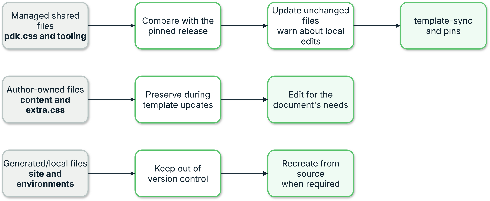

{{ heading_counter_reset(page) }}

# Build a template site {: #bootstrap-machine-bootstrap }

\index{commands!`prodockit bootstrap`} prepares a machine to create or resume a
project based on `prodockit-template`. It is not a general Zensical installer:
use [adoption](../adopt.md) to add selected prodockit components to an existing
document that uses its own template, or follow the [manual installation
route](../installation.md) when you want to choose every component yourself.

Bootstrap turns the User Guide's install sequence into a list of stages that
can be checked individually and repaired one at a time, rather than followed
top to bottom and hoped over. It reports how many there are;
\ref{tab-bootstrap-stages} names them.

The install is long, sequential, and easy to get half-right in ways that
only surface much later - a missing Pango that looks fine until the first
`prodockit pdf`, a Node without `npm` that fails in an apparently
unrelated step two sections on. Every stage here answers "is this
actually set up?", which is the question a written instruction cannot
answer for its reader.

## Start with prodockit-template {: #bootstrap-template }

The \index{`prodockit-template`} project ([GitHub
repository](https://github.com/buckwem/prodockit-template)) is a ready-made
Zensical project for coursework, assignments, and professional reports. Its
central promise is **one source, two outputs**: write the report as Markdown
under `docs/`, then build both a browsable website and a single PDF from the
same pages and navigation.

Use the template when you want the publishing structure supplied for you. It
does not prescribe the subject or wording of the report, and it does not turn
your project into a live copy of the template.

The template is maintained on GitHub. Its Surrey GitLab repository is a
student-facing mirror of that source, not a separate edition with an
independent set of fixes. Surrey students clone the nearby mirror; other
projects normally clone GitHub.

### See what the template provides {: #bootstrap-template-contents }

The starter repository already connects authoring, rendering, testing, and
deployment:

/// tree
docs/ - content and appearance
  index.md - report cover
  1-originality.md - originality and AI-use statement
  2-executive-summary.md - starter executive summary
  3-requirements.md - requirements section
  4-solution-architecture.md - solution architecture section
  5-goverance.md - governance section
  6-operations.md - operations section
  7-examples.md - extension examples
  acronyms.md - acronym list
  glossary.md - glossary
  bibliography.md - generated bibliography page
  references.md - formatted reference list
  assets/ - cover, branding, and report images
  javascripts/ - website behaviour
  stylesheets/ - template, managed, and author styles
zensical.toml - site, navigation, extensions, and PDF settings
requirements.txt - Python build dependencies
.python-version - supported project Python
.prodockit-shared-files.toml - managed shared-file checksums
.gitignore - generated and local files excluded from Git
README.md - project summary and publishing badges
bibliography.bib - example bibliography source
references.bib - example hand-written reference source
tools/ - pinned Mermaid and MathJax Node tooling
overrides/ - Zensical theme customisations
macros.py - shared macros and Surrey environment detection
.github/ - GitHub repository configuration
  workflows/ - GitHub Actions workflows
    docs.yml - GitHub Pages build and deployment
    release-redeploy.yml - rebuild after a template release
.gitlab-ci.yml - GitLab Pages build and deployment
///

This is the useful project-facing structure rather than every file in the
source repository. Template Sync reads the release's
`.prodockit-template.toml` manifest for the authoritative managed, shared,
project-owned, and excluded sets. The sample pages demonstrate the enabled
Prodockit extensions. Replace their starter prose and headings with your
report; keep the publishing files until you have a specific reason to
customise them.

### Adapt one template to its host {: #bootstrap-template-host }

The project-specific `macros.py` defines an \index{`is_surrey`} value. It
becomes true when the build sees the Surrey GitLab CI host, a Surrey `origin`
remote, or a Surrey address in the Zensical environment. The template uses
that value to select the Surrey cover and Surrey logos; otherwise it renders
the generic cover and logos.

```jinja title="The choice made in the template cover"

    Surrey cover and branding

    Generic cover and branding

```

This keeps the report structure, extensions, build commands, and workflows the
same on both hosts. Branding is enabled by where the project is built rather
than by asking students to maintain a second configuration file.

## Install with bootstrap {: #bootstrap-quick-start }

The seven steps below prepare the setup environment, install Prodockit into it, and
continue from the first read-only assessment to the completed site. If you
open a new terminal, reactivate and verify that environment as described in
section 3.1. Each command is safe to repeat: bootstrap checks before it changes
anything, and a completed stage is left alone.

/// steps

//// step | Prepare Python and the setup environment

Complete section 3.1 in the parent directory that holds your repositories:

[Open section 3.1 to prepare your environment](../installation.md#installation-preparation){ .md-button .md-button--primary target="_blank" rel="noopener" }

Return here with that setup environment active. Bootstrap later creates a
separate build environment inside the cloned project.

////

//// step | Install Prodockit into the active environment

With the setup `.venv` activated, upgrade pip and install Prodockit using the
commands for your operating system. The `pip` or `pip3` command must belong to
that active environment:

=== ":material-apple: macOS"

    ```bash
    pip3 install --upgrade pip
    pip3 install --upgrade prodockit
    ```

=== ":fontawesome-brands-windows: Windows"

    ```powershell
    pip install --upgrade pip
    pip install --upgrade prodockit
    ```

=== ":material-linux: Linux (Ubuntu)"

    ```bash
    pip install --upgrade pip
    pip install --upgrade prodockit
    ```

!!! note "If pip or pip3 does not work"

    If `pip` does not work, try `pip3`; if `pip3` does not work, try `pip`.
    Keep the intended virtual environment active and check that the alternative
    command belongs to it before installing packages.

Confirm both the installed version and the command selected by the shell:

=== ":material-apple: macOS"

    ```bash
    prodockit --version
    command -v prodockit
    ```

=== ":fontawesome-brands-windows: Windows"

    ```powershell
    prodockit --version
    Get-Command prodockit
    ```

=== ":material-linux: Linux (Ubuntu)"

    ```bash
    prodockit --version
    command -v prodockit
    ```

The command path must be inside the setup `.venv`. An older Prodockit command
from another Python can otherwise shadow the package just installed while
`pip` still reports success. Do not run the complete `pdk diag` here: it is a
project-scoped command, so a setup directory which holds project repositories
is refused before diagnostics start. Step 6 runs it from the completed project
and its separate environment.

////

//// step | Check what needs doing
```bash
pdk boot
```

The first run asks what it needs and saves the answers beside the project
as `.pdkboot.toml`. Then it stops, so what it tells you to note
down stays on the screen - run it again to see the stages.

On `gitlab.surrey.ac.uk` that is seven questions: your name, the ID you
log in with, your course code, and whether the work is assessed. Assessed
work is then asked which stage - first attempt, SRA or LSA - and which
year the module starts in, and its group and repository name follow from
those. Unassessed work is asked for its group and its repository name
instead, each offered as your own.

On any other host it is eight, since none of that can be derived there.

`pdk` is `prodockit` and `boot` is `bootstrap`, so
`prodockit bootstrap` is the same command typed in full.
////

//// step | Read the commands first
```bash
pdk boot --dry-run
```

Every command it would run, and every step it would ask you to do
yourself, without running any of them. Worth one read on a machine you
care about.

\ref{fig-bootstrap-dry-run-output} is a short visual guide to the dry-run
output. Use [section 28.1, Scan phases and
stages](../commands/output.md#command-output-structure) for the complete
explanation of its phases, stages, actions, warnings, and decisions:

{ .documentation-diagram }
/// figure-caption
    attrs: {id: fig-bootstrap-dry-run-output}

Reading Bootstrap's dry-run output
///
////

//// step | Apply it
```bash
pdk boot --apply
```

It asks before each stage and shows the commands first. Two steps need a
browser - uploading your SSH key, and creating the project on the host -
and those ask you to type `yes` when you have done them, because
pressing Enter through a browser step is how a run finishes with a stage
that never happened.

Stop whenever you like. The next run picks up from wherever it got to.
////

//// step | Confirm
```bash
pdk boot
```

!!! warning "Complete the manual step before confirming"

    If Bootstrap reaches a prompt where you must type `yes`, you should have
    completed the manual step it describes at that point. Type `yes` only after
    checking that the action succeeded; the confirmation tells Bootstrap to
    continue, but cannot perform or verify the action for you.

Every stage `ok`, and the last one names the address your site is
published at. If a stage still reports work to do, its line says what
and why - and running `--apply` again does only that stage.

<span id="bootstrap-windows-restart"></span>

!!! warning "Windows only — skip this step on macOS and Linux"

    Windows installers change settings inherited when the terminal application
    starts. A new tab or reactivating the virtual environment can retain the
    old settings, so complete this step before checking the project.

=== ":fontawesome-brands-windows: Windows"

    Fully close Windows Terminal or VS Code, then reopen PowerShell. Bootstrap
    displays this amber message; Template Sync displays it if its environment
    refresh cannot recover the required commands:

    <pre style="color: #E69F00; background: #181818; padding: 1em; white-space: pre-wrap;">============================================================
    RESTART YOUR TERMINAL — WINDOWS SETTINGS HAVE CHANGED
    ============================================================
    Fully close Windows Terminal or VS Code, then reopen it.
    Open PowerShell in your project directory:
    C:\path\to\your-project
    Set-ExecutionPolicy -Scope CurrentUser -ExecutionPolicy RemoteSigned
    .\.venv\Scripts\Activate.ps1
    pdk diag
    ============================================================</pre>

    The project path is replaced with your actual path. If Template Sync cannot
    continue, the banner also says: `Template Sync cannot continue in this
    terminal.` Continue with the next step in the newly opened PowerShell.

////

//// step | Activate the project and check the installation

<span id="bootstrap-project-checks"></span>

Leave the setup environment, enter the project directory named by Bootstrap,
and activate the project environment created in stage 16. Changing directory
while the prompt already says `(.venv)` does not switch environments.
Stage 16 also installs and verifies Pandoc **3.10.1** inside that environment,
even if the system has a newer Pandoc. It leaves the system installation alone.
Bootstrap also records Mermaid and maths as the project's selected components
in `.prodockit-components.toml`. A later `pdk adopt` can therefore repair their
installed software without asking you to configure those choices first.

=== ":material-apple: macOS"

    ```bash
    deactivate
    cd /path/to/your-project
    source .venv/bin/activate
    python -c "import sys; print(sys.prefix)"
    pdk diag
    pdk template-sync
    ```

=== ":fontawesome-brands-windows: Windows"

    In the fresh PowerShell opened in the previous step, run the following
    commands; there is no active environment to deactivate:

    ```powershell
    cd C:\path\to\your-project
    Set-ExecutionPolicy -Scope CurrentUser -ExecutionPolicy RemoteSigned
    .\.venv\Scripts\Activate.ps1
    python -c "import sys; print(sys.prefix)"
    pdk diag
    pdk template-sync
    ```

=== ":material-linux: Linux (Ubuntu)"

    ```bash
    deactivate
    cd /path/to/your-project
    source .venv/bin/activate
    python -c "import sys; print(sys.prefix)"
    pdk diag
    pdk template-sync
    ```

The printed Python prefix must end in your project's `.venv`, not the parent
GitHub/GitLab directory's `.venv`. These checks apply to both new and pre-existing
repositories, on every host. If Diagnostics reports a failure, stop and resolve
it before continuing to Template Sync; do not apply an update from the wrong
environment. Template Sync here is a preview, not an installation or an apply.

The `Project` line must name the clone rather than its parent setup directory.
Add `--verbose` for resolved evidence or `--json` when attaching the report to
a support request.
////

///

## What it covers {: #bootstrap-stages }

The six installation steps above describe what you do.
\ref{tab-bootstrap-stages} is about the
[`--apply` phase](#bootstrap-apply), which is discussed later: Bootstrap groups
its 23 setup stages into seven phases while it sets up the machine and project.

| Phase {: width="18%" } | # {: width="3rem" } | Stage | Automated? {: width="22%" } |
| --- | --- | --- | --- |
| 1. Preflight | 1 | prodockit runs in an environment of its own | yes, after a step of your own |
| 2. Core tools {: rowspan=2 } | 2 | Visual Studio Code | yes, after a step of your own |
| | 3 | Git, installed **and** configured | yes |
| 3. Git and host {: rowspan=4 } | 4 | SSH keypair | yes, after a step of your own |
| | 5 | SSH config points at the key | yes |
| | 6 | Key loaded into the ssh agent | yes, after a step of your own |
| | 7 | SSH key on the host | **guide and verify** |
| 4. Project {: rowspan=7 } | 8 | Your own project on the host | **guide and verify** |
| | 9 | Pages switched on | **guide and verify** |
| | 10 | Where the project comes from | **a choice** |
| | 11 | Project cloned | yes |
| | 12 | A history of your own | yes |
| | 13 | Clone pointed at your project | yes |
| | 14 | Commit identity in the project | yes |
| 5. Build toolchain {: rowspan=3 } | 15 | Pandoc, and the libraries WeasyPrint needs | yes |
| | 16 | Project environment, dependencies and Adoption component choices | yes |
| | 17 | Node.js and the render toolchains | yes |
| 6. Editor and project {: rowspan=4 } | 18 | VS Code extensions | yes |
| | 19 | VS Code settings for the project | yes |
| | 20 | Citation style for the first build | yes |
| | 21 | MathJax for the website | yes |
| 7. Publish {: rowspan=2 } | 22 | First commit pushed | yes, after a step of your own |
| | 23 | Documentation site published | **guide and verify** |
/// table-caption | <
    attrs: {id: tab-bootstrap-stages}

Bootstrap stages grouped into the seven apply phases
///

In \ref{tab-bootstrap-stages}, stages 8 to 14, 18, 19, 21 and 23 do the same
thing on every operating
system - they are about your project and your host rather than about the
machine. The rest differ, because installing software does.

The stages deliberately separate checks, automated plans, and actions that need
a signed-in person. The fresh-history stage removes only the template's Git
history and requires explicit confirmation; uploading an SSH key and creating
the remote project are guided and then verified.

The editor stage uses VS Code Marketplace first. If that client exhausts its
bounded retries after a transient service failure or truncated archive,
Bootstrap can use Open VSX for the four reviewed extension identifiers only.
It requests the exact supported version, requires the reviewed licence and a
verified publisher, validates the identity and version in both VSIX manifests,
and caches only the validated archive under the extension, version and platform.
The apply output records the selected registry and whether that cache was hit.

On Windows, the PDF-library stage selects `clangarm64` for ARM64 Python and
`ucrt64` for x64 Python. This is read from `python.exe` itself rather than the
host CPU, because an ARM64 Windows computer can run x64 Python under emulation.
It checks `libpango-1.0-0.dll` and the owning pacman
package, conditionally reinstalls that exact package when either check fails,
and updates `WEASYPRINT_DLL_DIRECTORIES` both persistently and for the running
Bootstrap process. A fresh child process loads the DLL immediately; the later
project-environment stage imports WeasyPrint, so no terminal restart is needed.

Use `--dry-run` before `--apply` to see which stages are outstanding and
which commands will run. Use only one of `--check`, `--dry-run`, `--apply`, or
`--configure` in an invocation; conflicting modes are rejected before
configuration is read or any host is contacted. Contributors changing stage
ordering, check/plan behaviour, subprocess prompting, or destructive-action
safeguards should read [Bootstrap design](bootstrap-internals.md).

## Checking without changing anything {: #bootstrap-check }

Checking is what you get by default - run it with no options at all:

```bash
prodockit bootstrap
```

`--check` is accepted too, and does the same thing. The read-only
behaviour is the default deliberately: the alternative, once applying is
implemented, is a command that starts installing software because
somebody typed it to see what it did.

```text
 1  ok    prodockit runs in an environment of its own
 2  MISS  Visual Studio Code - VS Code is not installed
 3  ok    Git, installed and configured - Ada Lovelace <al01234@surrey.ac.uk>
 4  ok    SSH keypair - /Users/al01234/.ssh/id_ed25519_gitlab
 5  ok    SSH config points at the key - gitlab.surrey.ac.uk uses id_ed25519_gitlab
 6  ok    Key loaded into the ssh agent - id_ed25519_gitlab is loaded
 7  WAIT  SSH key on the host - the SSH keypair is not ready yet
 ...
5 of 23 stages need work.
```

Six states, and the difference between them matters:

\ref{tab-devcons-bootstrap-checking-without-changing-anything} explains the six stage states reported by a read-only bootstrap check.

| | Meaning |
| --- | --- |
| `ok` | Set up correctly. A rerun leaves it alone. |
| `WARN` | Usable, but a prerequisite's version could not be verified. The stage is not changed automatically, and the message names the minimum version and the risk of continuing. |
| `MISS` | Not there at all. |
| `WRONG` | Present but not usable - git installed with no `user.email`, Node installed without `npm`. **Not** the same as missing, and telling you to install something you already have would send you the wrong way. |
| `?` | Cannot be judged yet, because it needs a configuration answer you have not given. |
| `WAIT` | Cannot be checked until an earlier stage is complete. |
/// table-caption | <
    attrs: {id: tab-devcons-bootstrap-checking-without-changing-anything}

Checking without changing anything
///

Exits non-zero when anything needs work, so it is usable as a check in a
script - the same convention as
[`prodockit sync-repo --check`](repo-metadata.md#sync-repo-in-ci) and
`prodockit pins --check`.

Bootstrap checks minimum supported versions for every versioned prerequisite
it installs: VS Code and its required extensions, Git, Pandoc, Pango, Node.js,
npm, and Ubuntu's system Chromium. Python's minimum is enforced when the wheel
is installed. A confirmed older version is work to do and produces an explicit
upgrade plan. If a program is present but does not expose a readable version,
bootstrap leaves it in place and prints `WARN` with the minimum and the risk of
continuing rather than claiming it is known to work.

## Seeing what it would do {: #bootstrap-dry-run }

Use the dry run to inspect every outstanding command and manual action without
changing the machine:

```bash
prodockit bootstrap --dry-run
```

Prints the exact commands each unsatisfied stage would run, and the
instructions for the two that need you. Nothing is executed.

This is worth running before trusting any install tool with your machine,
and it is also how a stage is reviewed here: the commands are the thing
under test.

## Setting it up {: #bootstrap-apply }

Configuration records the project choices; apply then works through only the
stages that still need attention:

```bash
prodockit bootstrap --configure   # answer the questions, then stop
prodockit bootstrap --apply       # set up what needs it, asking first
```

`--apply` walks the stages in \ref{tab-bootstrap-stages} that need work,
showing what it will run before it runs it, and asks each time. The defaults
differ by state, and deliberately:

\ref{tab-devcons-bootstrap-setting-it-up} shows which proposed changes are accepted by default and which require an explicit decision.

| What the plan does | Prompt |
| --- | --- |
| Anything that can be undone | `Apply? [Y/n]` |
| Anything that cannot - stage 8, and only stage 8 | `Apply? [y/N]` |
/// table-caption | <
    attrs: {id: tab-devcons-bootstrap-setting-it-up}

Setting it up
///

The two prompts in \ref{tab-devcons-bootstrap-setting-it-up} make one rule
visible. The default used to follow the *check's
status* - `MISS` meant yes, `WRONG` meant no - which is a rule you cannot
see from the prompt, so the same key press meant different things at
different stages for reasons that were never on screen.

Now a plan says whether it destroys something, and only one does.

**Every stage is re-checked after it is applied.** A command exiting zero
says the installer ran, not that the thing it installed works - which is
the distinction behind most of the failures this project has had. If a
stage runs but still does not check out, bootstrap says so and stops
rather than continuing on a broken foundation.

A failing command stops the run too. Later commands in a plan generally
depend on earlier ones, so pressing on turns one clear failure into
several confusing ones.

### Where your part comes in the order {: #bootstrap-manual-order }

Some stages are part automated and part yours, and *when* your part
happens is not cosmetic - it is whether the stage can work at all:

\ref{tab-devcons-bootstrap-where-your-part-comes-in-the-order} places each manual action before or after the automated work that depends on it.

| | Example |
| --- | --- |
| **Before** the commands, because they depend on you | The keypair stage: the advice on choosing a passphrase is no use once `ssh-keygen` has already asked for one. |
| **After** them, because it depends on the commands | No current guided stage requires this. Bootstrap now adds macOS's application-owned `code` command to `.zprofile` automatically after installing VS Code. |
/// table-caption | <
    attrs: {id: tab-devcons-bootstrap-where-your-part-comes-in-the-order}

Where your part comes in the order
///

Both orderings in \ref{tab-devcons-bootstrap-where-your-part-comes-in-the-order}
have been wrong in a shipped release - the install
skipped entirely in one direction (#230), and the run stopped dead at the
SSH key stage in the other (#234) - so each stage now states which it
needs rather than leaving it to be inferred.

The two guide-and-verify stages are wholly yours, and their verification
is the stage's own check rather than a command in the plan. That
distinction is what stopped the run in #234: a check is allowed to say
"not yet" and be asked again, whereas a command that exits non-zero is a
failure and ends the run - and `ssh -T` exits non-zero even when it
succeeds.

## Which repository gets cloned {: #bootstrap-source }

The source template depends on the selected host:

=== "GitHub"

    Bootstrap clones `github.com/buckwem/prodockit-template`, then points
    `origin` at the empty repository you create in your account or
    organisation.

=== "GitLab.com"

    Bootstrap uses the GitHub template as its public source, then points
    `origin` at your GitLab namespace. Your finished project and Pages site
    remain on GitLab.

=== "University of Surrey GitLab"

    Bootstrap clones the synchronised Surrey student mirror at
    `gitlab.surrey.ac.uk/mb0105/prodockit-template`. A GitHub account is not
    required. The `is_surrey` macro detects that remote and enables the Surrey
    presentation automatically.

If you have already been given a repository - a taught module usually
issues one per student - put its URL in `source_url` and that is cloned
instead:

```toml
source_url = "git@gitlab.surrey.ac.uk:comm058-2026/report-al01234.git"
```

The later stages follow on their own: a clone made from `source_url`
already has the right `origin`, so the repoint stage reports `ok` and
does nothing.

## Know what becomes yours {: #bootstrap-template-ownership }

After creation, the repository is your project. The template manifest,
`.prodockit-template.toml`, classifies files so a later
`prodockit template-sync` can update shared publishing infrastructure without
guessing about ownership.

\ref{fig-template-file-ownership} separates the repository into managed or
shared files, author-owned content, and generated local output. Follow the
first group through Template Sync; the other two remain under the author's or
the build's control.

{ .documentation-diagram }
/// figure-caption
    attrs: {id: fig-template-file-ownership}

Template file ownership
///

\ref{tab-prodockit-template-know-what-becomes-yours} gives concrete file
examples and explains how a later template update treats each classification.

| Classification | Examples | Later template update |
|---|---|---|
| **Project-owned** | Markdown and assets under `docs/`, bibliography files, licence, editor and prose-lint choices | Never read for comparison and never written |
| **Template-owned** | Pages workflows, `.gitlab-ci.yml`, styles, JavaScript, `macros.py`, `overrides/`, and `tools/` | Updated when the project has not edited the file; a local edit is kept for review |
| **Shared** | `zensical.toml`, requirements files, `.gitignore`, and `README.md` | Merged by setting or delegated to the command that owns that content |
| **Excluded** | Template changelog, contributor files, issue templates, and the template's sample regression suite | Not delivered to generated projects |
/// table-caption | <
    attrs: {id: tab-prodockit-template-know-what-becomes-yours}

Know what becomes yours
///

For shared files, the merge is deliberately narrow. Template extension and
PDF settings can arrive in `zensical.toml`, but project content such as the
author's PDF copyright is not replaced. Dependency versions are left to
`prodockit pins`; repository badges are left to `prodockit sync-repo`.

## Configuration {: #bootstrap-configuration }

Bootstrap normally stores answers in `.pdkboot.toml` in the directory
where you run it. The file is kept out of Git when that directory is already a
repository. An older per-user bootstrap file is still read when no local file
exists, so existing setups continue to work.

Pass `--config PATH` when you deliberately want to read and write a different
file:

```bash
prodockit bootstrap --config path/to/bootstrap.toml
```

You should not normally need to open the file. When a run finds an answer
missing it offers to ask for it, and only for the ones actually blank:

```text
Some details are not set yet: project_name, project_dir.
Answer them now? [Y/n]:
```

`prodockit bootstrap --configure` re-asks everything, with each current
value as the default, so pressing Enter through confirms an unchanged
setup.

**The host is the first question**, and deliberately so. Everything else
is shaped by it: which URLs the browser steps send you to, which key file
is looked for, whether the thing you are creating is called a project or
a repository. Answering it sixth would mean five questions about a setup
that might not be buildable at all.

It is selected from a numbered menu of the three supported services. The
stored value is still the **hostname** - the thing in your address bar -
rather than a nickname:

```text
1/8 The git host your project lives on
  1. gitlab.surrey.ac.uk
  2. github.com
  3. gitlab.com

  Select a git service [1]:
```

Surrey GitLab remains the default; press Enter to keep it. Type `2` for
GitHub.com or `3` for GitLab.com. A different number is rejected at the
menu, so an unsupported host cannot be stored accidentally.

The selected service is then checked: *does it answer?*

```text
  Select a git service [1]:
  could not reach gitlab.surrey.ac.uk on port 22 - Operation timed out.
  If this host is only reachable from your university network, connect
  the VPN and press Enter to try again.
```

That last one earns its place. Without it the first sign of an
unreachable host is stage 6 reporting that your key was rejected - after
you have made a key and pasted it into a web page - and "I cannot reach
this server" looks nothing like "this server refused you". These stages
have produced that confusion three times already (#234, #239, #246), so
it is worth one connection attempt to tell the two apart at the point the
host is named.

Re-asking with the same answer is a real retry, not a loop: connect the
VPN, press Enter, and the second attempt succeeds.

Port 22 rather than 443, because every URL bootstrap builds is
`git@host:path`, which is ssh.

A configuration written before hostname support stored a key - `host = "surrey"` -
and those files are on real machines, so they still resolve. The prompt
stores a hostname from now on.

A piped or scripted run never prompts - it reports what is missing and
carries on, rather than blocking on a question nobody is there to
answer.

The file is stored per **directory**, beside whatever is being set up:

\ref{tab-devcons-bootstrap-configuration} lists the configuration files stored in a setup directory and the purpose of each one.

| Where | Path |
| --- | --- |
| This directory | `./.pdkboot.toml` |
| Older, per user (macOS / Linux) | `~/.config/prodockit/bootstrap.toml` |
| Older, per user (Windows) | `%APPDATA%\prodockit\bootstrap.toml` |
/// table-caption | <
    attrs: {id: tab-devcons-bootstrap-configuration}

Configuration
///

One config per directory is one per project. There was a single file per
user until 0.32.1, so setting up a second project overwrote the answers
for the first - its namespace, its name, the directory it lives in - and
the original could not be re-checked without answering everything again.

The per-user file is still read where a directory has none of its own, so
a setup already answered keeps working and nothing has to be moved. It is
never written to once a local file is possible.

Where the directory is a git repository, `.pdkboot.toml` is added
to `.gitignore`: it holds your name, email and username, and the first
push commits everything else in the project.

```toml
full_name    = "Ada Lovelace"
email        = "al01234@surrey.ac.uk"
username     = "al01234"
host         = "surrey"
namespace    = "comm058-2026"
project_name = "report-al01234"
project_dir  = "~/gitlab/report-al01234"
source_url   = ""
```

!!! danger "Never put a secret in this file"
    There is no field here for a password, token or passphrase, and that
    is a design constraint rather than an oversight - the guide-and-verify
    approach means bootstrap never needs one. A plain file in a synced
    home directory is the wrong place for a credential, so if a future
    version ever needs API access, the token belongs in your operating
    system's keychain and this file holds at most a reference to it.

A malformed line is an error naming the file and line number, not a
setting silently ignored - a config that quietly reverted to defaults
would re-prompt for everything with no explanation of why.

## Hosts {: #bootstrap-hosts }

Bootstrap supports the University of Surrey's GitLab
(`gitlab.surrey.ac.uk`), GitHub.com, and GitLab.com. The completed manual
end-to-end platform matrix covers Surrey GitLab and GitHub.com. GitLab.com is
implemented and tested at command level, but has not yet received the same
reported manual coverage across Ubuntu, Windows, and macOS.

Everything host-specific is a *value* rather than a branch: the hostname,
the greeting `ssh -T` prints on success, the settings and new-project
URLs, and the vocabulary (GitLab's *project* in a *group*, GitHub's
*repository* in an *organisation*).

## Keep the project current {: #bootstrap-template-updates }

A generated project does not change when the source template changes. Check
periodically and before a final publication:

```bash
prodockit template-sync
```

The first run is a report. If an update is useful, the [Template Sync
guide](template-sync.md) explains how to apply it on a branch, compare
protected files, build both outputs, and publish through the normal review
gate.

The template version you started from is not a Prodockit package version.
Template releases describe starter files; Prodockit releases describe the
installed extensions and commands. The two can move independently.

## Status {: #bootstrap-status }

Checking, `--dry-run`, `--configure`, and `--apply` are covered by the automated
test suite. Beyond that command-level coverage, bootstrap has completed manual
end-to-end testing on Ubuntu Linux, Windows, and macOS with both Surrey GitLab
and GitHub.com.

The manual testing covered two starting points:

1. **A new document repository:** bootstrap prepared the machine and the
   workflow continued through creating a new hosted document repository to a
   usable local build.
2. **An existing online repository:** bootstrap prepared the machine and the
   workflow continued through installing the existing repository locally to a
   usable local build.

This is a stronger level of evidence than unit tests alone: it exercises real
package managers, shells, SSH configuration, repository hosts, clones, and
local project setup as one connected workflow. It remains point-in-time manual
integration coverage, not an automated cross-platform regression matrix.
Linux runs the complete automated suite in hosted CI for every push and pull
request. The full test suite is also run locally on macOS, but macOS does not
currently have an equivalent hosted pull-request job. Windows has neither a
hosted full-suite job nor the same locally repeated regression coverage.

Platform-specific manual stages still remain where the operating system
requires them. On Windows, the `ssh-agent` service needs an Administrator
window and the PDF fonts have no package-manager installation path. Bootstrap
guides those steps and verifies their outcome rather than treating an
instruction as proof that it was completed.
