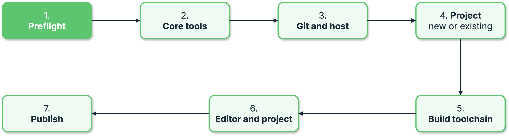

{{ heading_counter_reset(page) }}

# Machine bootstrap {: #bootstrap-machine-bootstrap }

\index{commands!`prodockit bootstrap`} prepares a machine to create or resume a
project based on `prodockit-template`. It is not a general Zensical installer:
use [adoption](../adopt.md) to add selected prodockit components to an existing
document that uses its own template, or follow the [manual installation
route](../installation.md) when you want to choose every component yourself.

Bootstrap turns the User Guide's install sequence into a list of stages that
can be checked individually and repaired one at a time, rather than followed
top to bottom and hoped over. It reports how many there are; the table below
names them.

The install is long, sequential, and easy to get half-right in ways that
only surface much later - a missing Pango that looks fine until the first
`prodockit pdf`, a Node without `npm` that fails in an apparently
unrelated step two sections on. Every stage here answers "is this
actually set up?", which is the question a written instruction cannot
answer for its reader.

## Before you start {: #bootstrap-prerequisites }

!!! warning "This cannot be the first thing you run"
    `prodockit bootstrap` is a prodockit subcommand, so Python and
    `pip install prodockit` necessarily come first - it cannot install the
    interpreter it is running on. That is the boundary: **you** install
    Python, **bootstrap** does the rest.

Which is three steps, on any platform: install Python, make a virtual
environment, install prodockit into it.

The virtual environment is not optional on macOS and increasingly not on
Linux either. A Python installed by a package manager is marked
\index{PEP 668} *externally managed*, and `pip install` outside a virtual
environment is refused outright:

```text
error: externally-managed-environment
× This environment is externally managed
```

That message is correct and unhelpful in equal measure - it explains what
it will not do without saying what to do instead. A virtual environment
is what to do instead.

=== "macOS"

    Install [Homebrew](https://brew.sh) if you do not have it, then:

    ```bash
    brew install python
    ```

    Change to the directory you want to keep your projects in - the one
    you will later point bootstrap's `project_dir` at - and create the
    environment there:

    ```bash
    cd ~/GitLab
    /opt/homebrew/bin/python3 -m venv .venv
    source .venv/bin/activate
    pip3 install prodockit
    ```

    Homebrew's `python3` is named by its full path deliberately. macOS
    ships a `python3` of its own, and which one a bare `python3` finds
    depends on `PATH` ordering you did not choose - naming it explicitly
    makes the environment reproducible rather than dependent on how the
    shell happened to be configured. On an Intel Mac the prefix is
    `/usr/local` rather than `/opt/homebrew`; `brew --prefix` prints
    yours.

=== "Windows"

    Install Python from
    [python.org/downloads](https://www.python.org/downloads/), and on the
    installer's screens:

    - Tick **Add python.exe to PATH** on the first screen. Without it,
      `python` is not a command and nothing below works.
    - Click **Disable path length limit** on the final screen. Node's
      render toolchains in stage 14 nest deeply enough to hit the 260
      character limit.

    Then allow PowerShell to run scripts. Windows blocks all of them by
    default, and activating a virtual environment *is* a script - so
    without this the very next step fails:

    ```powershell
    Set-ExecutionPolicy -Scope CurrentUser -ExecutionPolicy RemoteSigned
    ```

    Depending on your PowerShell version it may ask you to confirm;
    answer `Y`. Often it simply returns to the prompt, which means it
    worked.

    !!! info "What this changes, and what it does not"
        Without it, activating the environment fails with `... cannot be
        loaded because running scripts is disabled on this system` -
        which names the script rather than the policy blocking it, so it
        reads as a broken file. `RemoteSigned` allows scripts you wrote
        locally while still requiring a signature on anything downloaded;
        `-Scope CurrentUser` limits the change to your own account, so it
        needs no Administrator window and is done once.

        Rather not change it at all? Use classic **CMD** instead of
        PowerShell and run `.\.venv\Scripts\activate.bat` - `.bat`
        files are not covered by execution policy.

    Then, in PowerShell, in the directory you want to keep your projects
    in:

    ```powershell
    cd ~\GitLab
    python -m venv .venv
    .\.venv\Scripts\Activate.ps1
    pip install prodockit
    ```

    !!! warning "Windows ships a `python` that is not Python"
        Typing `python` on a machine without it installed opens the
        Microsoft Store rather than reporting that nothing is there.
        That placeholder is still ahead of a real Python on `PATH` in
        some installs, so if `python --version` opens a shop window, the
        install did not take - repeat it with **Add python.exe to PATH**
        ticked.

=== "Ubuntu"

    ```bash
    sudo apt install python3 python3-venv python3-pip
    ```

    `python3-venv` is a separate package on Debian and Ubuntu, and its
    absence does not show up until `python3 -m venv` fails - by which
    point the error looks like a broken Python rather than a missing
    package.

    Then, in the directory you want to keep your projects in:

    ```bash
    cd ~/GitLab
    python3 -m venv .venv
    source .venv/bin/activate
    pip install prodockit
    ```

### Every new terminal needs the environment activated again {: #bootstrap-reactivate }

A virtual environment lasts as long as the shell it was activated in.
Open a new terminal window - or come back tomorrow - and `prodockit` is
an unknown command again until you activate it.

A new terminal also starts in your home directory, so **change to the
directory holding `.venv` first** - the path below is relative to it, and
from anywhere else it simply is not there:

=== "macOS / Ubuntu"

    ```bash
    cd ~/GitLab
    source .venv/bin/activate
    ```

=== "Windows"

    ```powershell
    cd ~\GitLab
    .\.venv\Scripts\Activate.ps1
    ```

    Fails with `running scripts is disabled on this system`? The
    execution policy has not been set on this account - see
    [Before you start](#bootstrap-prerequisites).

Use whichever directory you made the environment in - `~/GitLab` here,
matching [Before you start](#bootstrap-prerequisites) above.

You can tell it worked because the prompt gains a `(.venv)` prefix. If it
is not there, nothing you install or run is going where you think it is.

### Check what you actually got {: #bootstrap-verify-install }

```bash
prodockit --version
which prodockit          # `where prodockit` on Windows
```

Worth the two seconds, because the failure this catches is silent. An
older `prodockit` already on `PATH` from a different Python shadows a
newer one completely: `pip install` reports success, `prodockit
--version` reports a version from two releases ago, and `prodockit
bootstrap` fails as an unknown command with nothing to suggest why. If
the version is not the one you just installed, `which` will show you
which Python is winning.

!!! tip "`pipx` is the other reasonable answer"
    For a command-line tool used across several projects rather than a
    library imported by one, [`pipx`](https://pipx.pypa.io/) is arguably
    the better fit - it gives each tool its own environment and puts the
    command on `PATH` without an activation step, so there is no
    `(.venv)` to forget. It is one more thing to install, which is why it
    is not the route above, but if you already have it,
    `pipx install prodockit` works and skips this whole section.

## Quick start {: #bootstrap-quick-start }

Six steps from a machine with nothing on it to a published site. Each one
is safe to repeat: bootstrap checks before it changes anything, and a
stage already done is left alone.

/// steps

//// step | Install Python
prodockit is a Python program, so this is the one thing that cannot be
automated - there is nothing to run it with yet. Any version from 3.10
works; 3.14 is what the template's CI uses.

=== "macOS"

    Install [Homebrew](https://brew.sh) if you do not have it, then:

    ```bash
    brew install python@3.14
    python3 --version
    ```

=== "Windows"

    ```powershell
    winget install --id Python.Python.3.14 -e
    py --version
    ```

    [python.org](https://www.python.org/downloads/) works equally well.
    Avoid the Microsoft Store build: it is a stub that cannot always
    create the virtual environment the next step needs.

=== "Ubuntu"

    `python3-venv` is a separate package on Debian and Ubuntu, and the
    next step will not work without it.

    ```bash
    sudo apt install python3 python3-venv
    python3 --version
    ```
////

//// step | Install prodockit in an environment of its own
In the directory you want to keep your projects in - the one you will
later point bootstrap's `project_dir` at - creating it if it is not there
yet. Not alongside your system Python: Debian and Ubuntu refuse
`pip install` outside a virtual environment, and the first stage checks
this before anything else, because the project's own environment is
built by whichever Python is running bootstrap.

=== "macOS"

    ```bash
    mkdir -p ~/GitLab
    cd ~/GitLab
    python3 -m venv .venv
    source .venv/bin/activate
    pip install prodockit
    ```

=== "Windows"

    ```powershell
    New-Item -ItemType Directory -Force ~\GitLab | Out-Null
    cd ~\GitLab
    python -m venv .venv
    .\.venv\Scripts\Activate.ps1
    pip install prodockit
    ```

=== "Ubuntu"

    ```bash
    mkdir -p ~/GitLab
    cd ~/GitLab
    python3 -m venv .venv
    source .venv/bin/activate
    pip install prodockit
    ```

`(.venv)` in your prompt means it is active. Every command below is run
from here, with it active - see [Before you start](#bootstrap-prerequisites)
for the longer version, including what to do when PowerShell refuses to
run the activation script.
////

//// step | Check what needs doing
```bash
pdk boot
```

The first run asks what it needs and saves the answers beside the project
as `.pdk-bootstrap.toml`. Then it stops, so what it tells you to note
down stays on the screen - run it again to see the stages.

On `gitlab.surrey.ac.uk` that is seven questions: your name, the ID you
log in with, your course code, and whether the work is assessed. Assessed
work is then asked which stage - first attempt, SRA or LSA - and which
year the module starts in, and its group and repository name follow from
those. Unassessed work is asked for its group and its repository name
instead, each offered as your own.

On any other host it is eight, since none of that can be derived there.

`pdk` is `prodockit` and `boot` is `bootstrap`, so
`prodockit bootstrap` is the same command typed in full.
////

//// step | Read the commands first
```bash
pdk boot --dry-run
```

Every command it would run, and every step it would ask you to do
yourself, without running any of them. Worth one read on a machine you
care about.
////

//// step | Apply it
```bash
pdk boot --apply
```

It asks before each stage and shows the commands first. Two steps need a
browser - uploading your SSH key, and creating the project on the host -
and those ask you to type `yes` when you have done them, because
pressing Enter through a browser step is how a run finishes with a stage
that never happened.

Stop whenever you like. The next run picks up from wherever it got to.
////

//// step | Confirm
```bash
pdk boot
```

Every stage `ok`, and the last one names the address your site is
published at. If a stage still reports work to do, its line says what
and why - and running `--apply` again does only that stage.
////

///

## What it covers {: #bootstrap-stages }

The six quick-start steps above describe what you do. Bootstrap itself groups
its 23 setup stages into the seven phases shown below.

{ .documentation-diagram }
/// figure-caption
    attrs: {id: fig-bootstrap-journey}

The seven phases that group Prodockit's 23 bootstrap stages
///

| Phase {: width="18%" } | # {: width="5%" } | Stage | Automated? {: width="22%" } |
| --- | --- | --- | --- |
| 1. Preflight | 1 | prodockit runs in an environment of its own | yes, after a step of your own |
| 2. Core tools {: rowspan=2 } | 2 | Visual Studio Code | yes, after a step of your own |
| | 3 | Git, installed **and** configured | yes |
| 3. Git and host {: rowspan=4 } | 4 | SSH keypair | yes, after a step of your own |
| | 5 | SSH config points at the key | yes |
| | 6 | Key loaded into the ssh agent | yes, after a step of your own |
| | 7 | SSH key on the host | **guide and verify** |
| 4. Project {: rowspan=7 } | 8 | Where the project comes from | **a choice** |
| | 9 | Project cloned | yes |
| | 10 | A history of your own | yes |
| | 11 | Your own project on the host | **guide and verify** |
| | 12 | Pages switched on | **guide and verify** |
| | 13 | Clone pointed at your project | yes |
| | 14 | Commit identity in the project | yes |
| 5. Build toolchain {: rowspan=3 } | 15 | Pandoc, and the libraries WeasyPrint needs | yes |
| | 16 | Project environment and its dependencies | yes |
| | 17 | Node.js and the render toolchains | yes |
| 6. Editor and project {: rowspan=4 } | 18 | VS Code extensions | yes |
| | 19 | VS Code settings for the project | yes |
| | 20 | Citation style for the first build | yes |
| | 21 | MathJax for the website | yes |
| 7. Publish {: rowspan=2 } | 22 | First commit pushed | yes, after a step of your own |
| | 23 | Documentation site published | **guide and verify** |

Stages 8 to 14, 18, 19, 21 and 23 do the same thing on every operating
system - they are about your project and your host rather than about the
machine. The rest differ, because installing software does.

The stages deliberately separate checks, automated plans, and actions that need
a signed-in person. The fresh-history stage removes only the template's Git
history and requires explicit confirmation; uploading an SSH key and creating
the remote project are guided and then verified.

Use `--dry-run` before `--apply` to see which stages are outstanding and
which commands will run. Use only one of `--check`, `--dry-run`, `--apply`, or
`--configure` in an invocation; conflicting modes are rejected before
configuration is read or any host is contacted. Contributors changing stage
ordering, check/plan behaviour, subprocess prompting, or destructive-action
safeguards should read [Bootstrap design](bootstrap-internals.md).

## Checking without changing anything {: #bootstrap-check }

Checking is what you get by default - run it with no options at all:

```bash
prodockit bootstrap
```

`--check` is accepted too, and does the same thing. The read-only
behaviour is the default deliberately: the alternative, once applying is
implemented, is a command that starts installing software because
somebody typed it to see what it did.

```text
 1  MISS  Visual Studio Code - the `code` command is not on PATH
 2  ok    Git, installed and configured - Ada Lovelace <al01234@surrey.ac.uk>
 3  ok    SSH keypair - /Users/al01234/.ssh/id_ed25519_gitlab
 4  ok    SSH config points at the key - gitlab.surrey.ac.uk uses id_ed25519_gitlab
 5  ok    Key loaded into the ssh agent - id_ed25519_gitlab is loaded
 6  ok    SSH key on the host - authenticated to gitlab.surrey.ac.uk
 7  ?     Template cloned - needs project_name
 ...
5 of 18 stages need work.
```

Four states, and the difference between them matters:

| | Meaning |
| --- | --- |
| `ok` | Set up correctly. A rerun leaves it alone. |
| `MISS` | Not there at all. |
| `WRONG` | Present but not usable - git installed with no `user.email`, Node installed without `npm`. **Not** the same as missing, and telling you to install something you already have would send you the wrong way. |
| `?` | Cannot be judged yet, because it needs a configuration answer you have not given. |

Exits non-zero when anything needs work, so it is usable as a check in a
script - the same convention as
[`prodockit sync-repo --check`](repo-metadata.md#sync-repo-in-ci) and
`prodockit pins --check`.

## Seeing what it would do {: #bootstrap-dry-run }

```bash
prodockit bootstrap --dry-run
```

Prints the exact commands each unsatisfied stage would run, and the
instructions for the two that need you. Nothing is executed.

This is worth running before trusting any install tool with your machine,
and it is also how a stage is reviewed here: the commands are the thing
under test.

## Setting it up {: #bootstrap-apply }

```bash
prodockit bootstrap --configure   # answer the questions, then stop
prodockit bootstrap --apply       # set up what needs it, asking first
```

`--apply` walks the stages that need work, showing what it will run
before it runs it, and asks each time. The defaults differ by state, and
deliberately:

| What the plan does | Prompt |
| --- | --- |
| Anything that can be undone | `Apply? [Y/n]` |
| Anything that cannot - stage 8, and only stage 8 | `Apply? [y/N]` |

One rule, and a visible one. The default used to follow the *check's
status* - `MISS` meant yes, `WRONG` meant no - which is a rule you cannot
see from the prompt, so the same key press meant different things at
different stages for reasons that were never on screen.

Now a plan says whether it destroys something, and only one does.

**Every stage is re-checked after it is applied.** A command exiting zero
says the installer ran, not that the thing it installed works - which is
the distinction behind most of the failures this project has had. If a
stage runs but still does not check out, bootstrap says so and stops
rather than continuing on a broken foundation.

A failing command stops the run too. Later commands in a plan generally
depend on earlier ones, so pressing on turns one clear failure into
several confusing ones.

### Where your part comes in the order {: #bootstrap-manual-order }

Some stages are part automated and part yours, and *when* your part
happens is not cosmetic - it is whether the stage can work at all:

| | Example |
| --- | --- |
| **Before** the commands, because they depend on you | The keypair stage: the advice on choosing a passphrase is no use once `ssh-keygen` has already asked for one. |
| **After** them, because it depends on the commands | macOS's VS Code: the Command Palette you are asked to open belongs to the application `brew install` has just put there. |

Both orderings have been wrong in a shipped release - the install
skipped entirely in one direction (#230), and the run stopped dead at the
SSH key stage in the other (#234) - so each stage now states which it
needs rather than leaving it to be inferred.

The two guide-and-verify stages are wholly yours, and their verification
is the stage's own check rather than a command in the plan. That
distinction is what stopped the run in #234: a check is allowed to say
"not yet" and be asked again, whereas a command that exits non-zero is a
failure and ends the run - and `ssh -T` exits non-zero even when it
succeeds.

## Which repository gets cloned {: #bootstrap-source }

By default, this host's copy of the template - for Surrey that is
`gitlab.surrey.ac.uk:mb0105/prodockit-template.git`, its own mirror,
so you never need a GitHub account to start.

If you have already been given a repository - a taught module usually
issues one per student - put its URL in `source_url` and that is cloned
instead:

```toml
source_url = "git@gitlab.surrey.ac.uk:comm058-2026/report-al01234.git"
```

The later stages follow on their own: a clone made from `source_url`
already has the right `origin`, so the repoint stage reports `ok` and
does nothing.

## Configuration {: #bootstrap-configuration }

Bootstrap normally stores answers in `.pdk-bootstrap.toml` in the directory
where you run it. The file is kept out of Git when that directory is already a
repository. An older per-user bootstrap file is still read when no local file
exists, so existing setups continue to work.

Pass `--config PATH` when you deliberately want to read and write a different
file:

```bash
prodockit bootstrap --config path/to/bootstrap.toml
```

You should not normally need to open the file. When a run finds an answer
missing it offers to ask for it, and only for the ones actually blank:

```text
Some details are not set yet: project_name, project_dir.
Answer them now? [Y/n]:
```

`prodockit bootstrap --configure` re-asks everything, with each current
value as the default, so pressing Enter through confirms an unchanged
setup.

**The host is the first question**, and deliberately so. Everything else
is shaped by it: which URLs the browser steps send you to, which key file
is looked for, whether the thing you are creating is called a project or
a repository. Answering it sixth would mean five questions about a setup
that might not be buildable at all.

It is selected from a numbered menu of the three supported services. The
stored value is still the **hostname** - the thing in your address bar -
rather than a nickname:

```text
1/8 The git host your project lives on
  1. gitlab.surrey.ac.uk
  2. github.com
  3. gitlab.com

  Select a git service [1]:
```

Surrey GitLab remains the default; press Enter to keep it. Type `2` for
GitHub.com or `3` for GitLab.com. A different number is rejected at the
menu, so an unsupported host cannot be stored accidentally.

The selected service is then checked: *does it answer?*

```text
  Select a git service [1]:
  could not reach gitlab.surrey.ac.uk on port 22 - Operation timed out.
  If this host is only reachable from your university network, connect
  the VPN and press Enter to try again.
```

That last one earns its place. Without it the first sign of an
unreachable host is stage 6 reporting that your key was rejected - after
you have made a key and pasted it into a web page - and "I cannot reach
this server" looks nothing like "this server refused you". These stages
have produced that confusion three times already (#234, #239, #246), so
it is worth one connection attempt to tell the two apart at the point the
host is named.

Re-asking with the same answer is a real retry, not a loop: connect the
VPN, press Enter, and the second attempt succeeds.

Port 22 rather than 443, because every URL bootstrap builds is
`git@host:path`, which is ssh.

A configuration written before hostname support stored a key - `host = "surrey"` -
and those files are on real machines, so they still resolve. The prompt
stores a hostname from now on.

A piped or scripted run never prompts - it reports what is missing and
carries on, rather than blocking on a question nobody is there to
answer.

The file is stored per **directory**, beside whatever is being set up:

| Where | Path |
| --- | --- |
| This directory | `./.pdk-bootstrap.toml` |
| Older, per user (macOS / Linux) | `~/.config/prodockit/bootstrap.toml` |
| Older, per user (Windows) | `%APPDATA%\prodockit\bootstrap.toml` |

One config per directory is one per project. There was a single file per
user until 0.32.1, so setting up a second project overwrote the answers
for the first - its namespace, its name, the directory it lives in - and
the original could not be re-checked without answering everything again.

The per-user file is still read where a directory has none of its own, so
a setup already answered keeps working and nothing has to be moved. It is
never written to once a local file is possible.

Where the directory is a git repository, `.pdk-bootstrap.toml` is added
to `.gitignore`: it holds your name, email and username, and the first
push commits everything else in the project.

```toml
full_name    = "Ada Lovelace"
email        = "al01234@surrey.ac.uk"
username     = "al01234"
host         = "surrey"
namespace    = "comm058-2026"
project_name = "report-al01234"
project_dir  = "~/GitLab/report-al01234"
source_url   = ""
```

!!! danger "Never put a secret in this file"
    There is no field here for a password, token or passphrase, and that
    is a design constraint rather than an oversight - the guide-and-verify
    approach means bootstrap never needs one. A plain file in a synced
    home directory is the wrong place for a credential, so if a future
    version ever needs API access, the token belongs in your operating
    system's keychain and this file holds at most a reference to it.

A malformed line is an error naming the file and line number, not a
setting silently ignored - a config that quietly reverted to defaults
would re-prompt for everything with no explanation of why.

## Hosts {: #bootstrap-hosts }

Bootstrap supports the University of Surrey's GitLab
(`gitlab.surrey.ac.uk`), GitHub.com, and GitLab.com. The completed manual
end-to-end platform matrix covers Surrey GitLab and GitHub.com. GitLab.com is
implemented and tested at command level, but has not yet received the same
reported manual coverage across Ubuntu, Windows, and macOS.

Everything host-specific is a *value* rather than a branch: the hostname,
the greeting `ssh -T` prints on success, the settings and new-project
URLs, and the vocabulary (GitLab's *project* in a *group*, GitHub's
*repository* in an *organisation*).

## Status {: #bootstrap-status }

Checking, `--dry-run`, `--configure`, and `--apply` are covered by the automated
test suite. Beyond that command-level coverage, bootstrap has completed manual
end-to-end testing on Ubuntu Linux, Windows, and macOS with both Surrey GitLab
and GitHub.com.

The manual testing covered two starting points:

1. **A new document repository:** bootstrap prepared the machine and the
   workflow continued through creating a new hosted document repository to a
   usable local build.
2. **An existing online repository:** bootstrap prepared the machine and the
   workflow continued through installing the existing repository locally to a
   usable local build.

This is a stronger level of evidence than unit tests alone: it exercises real
package managers, shells, SSH configuration, repository hosts, clones, and
local project setup as one connected workflow. It remains point-in-time manual
integration coverage, not an automated cross-platform regression matrix.
Linux runs the complete automated suite in hosted CI for every push and pull
request. The full test suite is also run locally on macOS, but macOS does not
currently have an equivalent hosted pull-request job. Windows has neither a
hosted full-suite job nor the same locally repeated regression coverage.

Platform-specific manual stages still remain where the operating system
requires them. On Windows, the `ssh-agent` service needs an Administrator
window and the PDF fonts have no package-manager installation path. Bootstrap
guides those steps and verifies their outcome rather than treating an
instruction as proof that it was completed.
