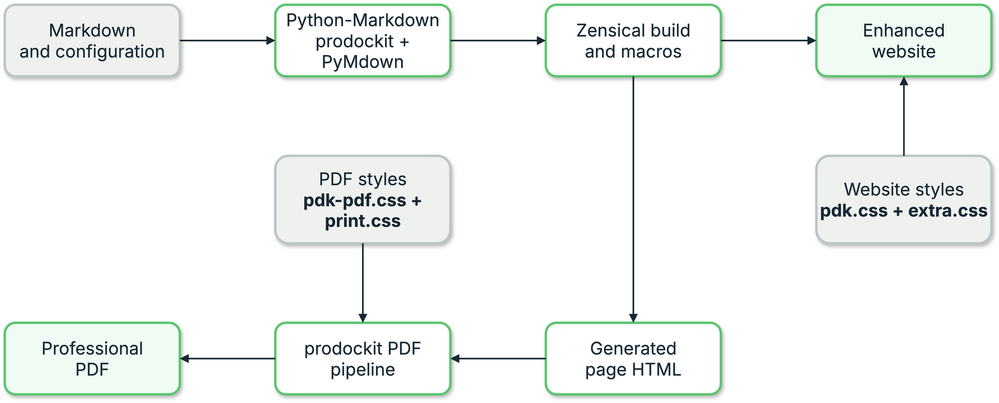
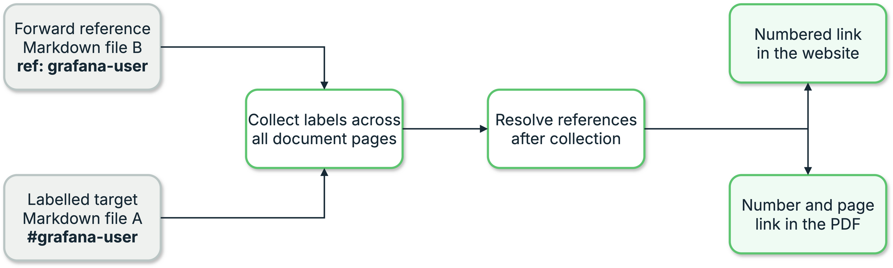
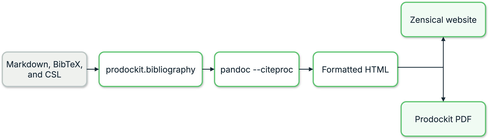

{{ heading_counter_reset(page) }}

# Extension integration

The Authoring reference documents Markdown syntax and `zensical.toml` options.
This page explains the integration machinery used when changing an extension
or embedding it in a renderer other than Zensical.

{ .documentation-diagram }
/// figure-caption
    attrs: {id: fig-extension-integration-flow}

Extension integration flow
///

## Share definitions across pages {: #share-definitions-across-pages }

Headings, references, citations, and glossary terms need build-wide state:

| Extension | Shared object | Registered content |
|---|---|---|
| `prodockit.headings` and `prodockit.refs` | `IdRegistry` | Heading, figure, and table ids, labels, and destinations |
| `prodockit.citations` | `CitationRegistry` | Citation keys and authored reference text |
| `prodockit.glossary` | `GlossaryRegistry` | Term ids, display text, and definitions |

Zensical creates a fresh Python-Markdown instance per page. Prodockit detects
the Zensical page context, derives a `source` path, and shares the appropriate
registry across the build. A pre-scan reads definitions from every navigation
page before conversion so a page can refer forward to a definition rendered
later.

{ .documentation-diagram }
/// figure-caption
    attrs: {id: fig-cross-reference-resolution}

Cross-file reference resolution
///

Outside Zensical, the caller supplies the registry and source explicitly:

```python
import markdown
from prodockit.headings import HeadingsExtension
from prodockit.refs import RefsExtension
from prodockit.util import IdRegistry

registry = IdRegistry()

for path, text in pages:
    html = markdown.markdown(
        text,
        extensions=[
            HeadingsExtension(registry=registry, source=path),
            RefsExtension(registry=registry, source=path),
        ],
    )
```

The equivalent constructors accept `CitationRegistry` and `GlossaryRegistry`.
A manually shared registry raises `DuplicateIdError` for a collision between
different sources. Zensical's best-effort automatic integration warns and
keeps the first registration, so public guides require explicit ids for
repeated headings such as “Overview”.

`prodockit.headings.prescan()` exposes the same continuous-numbering scan to
template macros and other build tooling. It returns page-keyed starting counts
and appendix letters while a Zensical build is active.

## Delegate bibliography formatting

`prodockit.bibliography` does not implement CSL sorting, localisation, or
disambiguation. It passes each distinct citation or reference-list request to
`pandoc --citeproc` with the configured `.bib` and `.csl` files, then memoizes
the formatted HTML for the rest of the build.

{ .documentation-diagram }
/// figure-caption
    attrs: {id: fig-bibliography-pipeline}

Bibliography formatting pipeline
///

Pandoc formats only the requested citation or list. Zensical still renders the
surrounding page.

## Generate an index after layout

Index markers exist before pagination, but their page numbers do not. The PDF
pipeline therefore uses two PDF passes: the first locates every marked term;
the second adds the sorted, deduplicated index with resolved page numbers.
`prodockit.pdf.index` owns extraction and index construction.

## Preserve website and PDF block behaviour

`prodockit.steps` follows the PyMdown Blocks API. Its `start` option emits both
HTML `<ol start="9">` and CSS `counter-reset: list-item 8`. Browsers honour the
HTML attribute while WeasyPrint needs the CSS counter-reset. Removing either
representation makes continued numbering disagree between outputs.

Tree and steps blocks expose stable class names for author styles. Their
parser and output details can change only with matching website, PDF, and
built-output tests.

## Preserve table layout contracts {: #table-layout-contracts }

`prodockit.tables` runs after Python-Markdown's table extension and changes the
generated HTML. Widths create a `<colgroup>` and mark the table with
`.prodockit-table-sized`; compact tables use `.prodockit-table-compact`.
Additional header rows move into `<thead>`, span placeholders are removed, and
rotated headings use a transform because WeasyPrint does not reliably support
`writing-mode`.

These transformations have consequences outside the extension. Zensical's
theme styles many tables through `.md-typeset table:not([class])`, so adding a
class means the project stylesheet must restore the normal border, padding,
background, and dark-mode colours. Rotation also needs an explicit width
because CSS transforms do not participate in layout. Keep website and PDF
fixture coverage together when changing any of these contracts.

## Maintain the stylesheet contract

The public [Stylesheets](../stylesheets.md) page explains the author-facing
cascade. Contributors must preserve the implementation behind it:

1. `pdk.css` supplies managed component defaults shared by the website and
   PDF. `pdk-pdf.css` supplies managed PDF-only presentation defaults.
2. `extra.css` and `print.css` belong to the document author. They must never
   be packaged as shared files or replaced by `template-sync`.
3. The effective order remains renderer or theme foundations → `pdk.css` →
   `extra.css` → `pdk-pdf.css` → `print.css`. The PDF's final structural guard
   may protect the page canvas, but must not become a second presentation
   stylesheet that authors cannot override.

The canonical managed files live in `docs/stylesheets/`. Hatch's
`force-include` mappings package them as `prodockit/assets/` resources in the
wheel, while `src/prodockit/shared_files.py` exposes only those finite resource
names to `pins` and `shared-files`. Keep those mappings and their tests aligned
when adding or renaming a managed file.

The [stylesheet delivery code map](development.md#stylesheet-delivery-code-map)
lists every source, packaging, update, rendering, and test boundary involved.

A managed stylesheet change is not complete until the same release has been
cascaded to `prodockit-template` and `prodockit-userguide`. Check both
repositories with `prodockit pins --check`; do not copy `extra.css` or
`print.css` between them because those files intentionally hold each site's
own choices.

## Preserve inline index content

The index inline processor runs early enough to retain nested Markdown such as
emphasis, code, and links inside `\\index{...}`. The PDF stage later uses
BeautifulSoup text extraction so the filing term is plain text even when the
visible term contains nested HTML.

An `attr_list` placed after a linked index marker attaches to the outer index
span, not the nested link. The author guide therefore recommends raw `<a>`
markup when a linked term needs attributes. A parser change must cover this
processor ordering and brace handling explicitly.

## Preserve temporary attributes and public CSS hooks

The references, citations, and glossary extensions use temporary `data-*`
attributes while resolving definitions. Strip those attributes from the final
HTML, while retaining the documented public classes for resolved and
unresolved output. The PDF then adds page-number text to resolved
`\autoref{}` links with CSS `target-counter()`.

The index is different: `data-index-term` and `data-index-code` remain in the
rendered HTML because the PDF index stage consumes them after page layout.
Treat those attributes as pipeline data rather than author styling hooks; the
public styling hook is `.index`.
