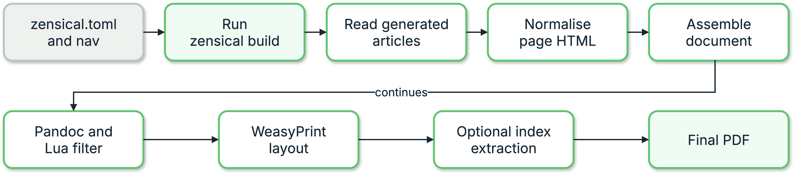

{{ heading_counter_reset(page) }}

# PDF pipeline and API

This \index{PDF pipeline} page is for contributors changing `prodockit.pdf` or calling its Python
API directly. Document authors should use [Generate a PDF](../pdf.md).

## Follow the pipeline

The PDF build starts only after Zensical has produced a complete website.
Prodockit reads those generated articles in navigation order, removes
website-only structure, and assembles one HTML document. Pandoc and the Lua
filter then prepare that document for WeasyPrint, which lays out the pages;
the optional final step extracts the index before the PDF is written.

\ref{fig-pdf-pipeline} shows this sequence across the top row and then the
bottom row. Each box names either the form of the document at that point or
the component responsible for the next change.

{ .documentation-diagram }
/// figure-caption
    attrs: {id: fig-pdf-pipeline}

PDF generation pipeline
///

The public `prodockit pdf` command validates the completed Zensical site, reads
each navigation page's generated article, and constructs `Page` objects from
that output. It then pre-renders diagrams and maths and calls the lower-level
builder. A generated index adds a second layout pass after term pages are
known.

The command never invokes Zensical or cleans the configured `site_dir`.
Passing `--markdown-file` narrows only the pages assembled into the PDF; the
requested article must already exist in the completed site. This keeps a
single-page PDF quick without allowing it to conceal an incomplete website
build.

The former renderer remains available only through the hidden
`prodockit pdf-legacy` rollback command. It imports undocumented Zensical
Python interfaces and is not an author-facing command.

## Use the public Python surface

Choose the public entry point that matches the caller's available input from
\ref{tab-devcons-pdf-internals-use-the-public-python-surface}.

| API {: width="42%" } | Purpose |
|---|---|
| `build_pdf_from_built_site()` | High-level build using navigation, settings, and the completed Zensical site |
| `build_pdf()` | Lower-level build from prepared `Page` objects |
| `Page` | One rendered source page plus its path, appendix, index, and running-header metadata |
| `PdfBuildError` | Build failure carrying the underlying command output |
| `build_source_bundle_from_zensical_config()` | High-level Markdown/configuration source-bundle build |
/// table-caption | <
    attrs: {id: tab-devcons-pdf-internals-use-the-public-python-surface}

Use the public Python surface
///

Of the entry points in
\ref{tab-devcons-pdf-internals-use-the-public-python-surface}, prefer
`build_pdf_from_built_site()` when a caller already has a Zensical
project. Use `build_pdf()` only when the caller owns page rendering and can
supply complete HTML and metadata. The older
`build_pdf_from_zensical_config()` entry point exists for the hidden legacy
command, not for new integrations.

```python
from prodockit.pdf.config import build_pdf_from_built_site

output = build_pdf_from_built_site("zensical.toml")
print(output)
```

The CLI wraps these functions with progress reporting, captured diagnostics,
and non-zero exit status; the functions return paths or raise exceptions.

## Know the internal modules

\ref{tab-devcons-pdf-internals-know-the-internal-modules} maps each internal
module to the transformation it owns.

| Module {: width="36%" } | Responsibility |
|---|---|
| `prodockit.project_config` | Direct TOML/YAML reading for the settings Prodockit consumes |
| `prodockit.pdf.site` | Completed-site validation and generated-page extraction |
| `prodockit.pdf.config` | Navigation, metadata, optional renderers, and high-level entry points |
| `prodockit.pdf.build` | Pipeline orchestration and external-command execution |
| `prodockit.pdf.html` | Page fix-ups, front matter, web/PDF-only content, and heading structure |
| `prodockit.pdf.lua` | Pandoc Lua filter generation |
| `prodockit.pdf.css` | Renderer foundations, dynamic page settings, running headers/footers, and duplex layout |
| `docs/stylesheets/pdk-pdf.css` | Managed PDF presentation defaults that authors can override in `print.css` |
| `prodockit.pdf.icons` | Project icon discovery and SVG recovery from built CSS |
| `prodockit.pdf.mermaid` | Mermaid CLI invocation and diagram assets |
| `prodockit.pdf.source_bundle` | Markdown/configuration source PDF |
| `prodockit.pdf.index` | Marker extraction, term-page mapping, and generated index |
| `prodockit.pdf.release` | Host release lookup for cover markers |
| `prodockit.pdf.runtime_config` | Strict project-root `pdk-pdf.toml` policy and supported defaults |
| `prodockit.pdf.runtime_store` | Project-local locks, archive validation, smoke tests, atomic activation, and fallback state |
| `prodockit.pdf.runtime_prepare` | Provider-gated `pdk pdf --prepare` orchestration |
/// table-caption | <
    attrs: {id: tab-devcons-pdf-internals-know-the-internal-modules}

Know the internal modules
///

Use \ref{tab-devcons-pdf-internals-know-the-internal-modules} to locate the
owner of a transformation before changing it. Keep transformation stages
narrow. A change to HTML normalisation, CSS, the
Lua filter, or an external tool can affect every page, so verify the complete
PDF and built-output tests rather than relying on a unit test of the changed
module alone.

### Preserve source-bundle boundaries

The `prodockit source-bundle` command includes root `README.md`, Markdown below
`docs_dir`, and the active Zensical config. Root-level generated Markdown such
as changelog, contribution, and licence files stays outside that boundary. It
is intentionally separate from the rendered-document
pipeline: it discovers files with git, writes a self-contained HTML document,
and calls WeasyPrint without Pandoc. The lower-level source-bundle API can
discover every non-ignored text file for a specialised caller, but that is not
the command-line default.

### Preserve real footer markup

Copyright text can contain links and line breaks, so it cannot be flattened
into a CSS string. The PDF pipeline writes it as an HTML element and places it
in the repeated footer with CSS Paged Media's `position: running()` and
`content: element()`. Check the finished PDF when changing this path;
intermediate HTML alone does not prove that links or line breaks survived.

## Preserve the runtime trust boundary {: #pdf-runtime-trust-boundary }

`pdk-pdf.toml` contains committed intent only. Machine-specific resolved
state belongs below `.prodockit/cache/pdf/`, rooted beside the selected
Zensical configuration so separate projects and virtual environments never
share an active runtime accidentally.

Providers may resolve an approved artifact and copy it into a requested
staging path. They do not choose its activation path or extract it themselves.
The common store verifies the exact SHA-256, rejects traversal, links,
duplicate paths, encrypted ZIP members, special TAR members, excessive entry
counts and excessive expansion, checks required content, then runs the
provider's fresh-runtime probe. Only that validated staging directory can be
atomically activated. A failure retains and reports the current or previous
known-good runtime.

The first G1 dependency baseline was measured on the development macOS ARM64
environment on 19 September 2026. These are installed-file sizes rather than
download sizes and are evidence for later optionalisation, not release
budgets. \ref{tab-pdf-runtime-baseline} records that starting point.

| Base distribution | Resolved version | Installed files | Installed bytes |
|---|---:|---:|---:|
| `pypdf` | 6.18.0 | 124 | 3,990,895 |
| `mermaidx` | 0.9.5 | 48 | 5,364,347 |
| `quickjs-ng` | 0.16.2.1 | 9 | 1,249,527 |
/// table-caption | <
    attrs: {id: tab-pdf-runtime-baseline}

G1 base dependency baseline
///

Importing `prodockit.cli` did not import any of those three distributions;
the measured wall time was 0.36 seconds on that host. Repeat the installed
size and cold-import measurement in G5 before removing the PDF-only packages
from the base dependency set.

## Preserve actionable errors

`PdfBuildError` reports which external command failed and retains its captured
output. `BuiltSiteError` identifies a failed Zensical command, a missing
generated article, or a generated HTML layout that no longer exposes the
expected article. The legacy wrapper separately names a changed private
Zensical render-result shape. Do not replace these with an unlabelled
subprocess status or raw selector failure; callers need to know which boundary
changed.
