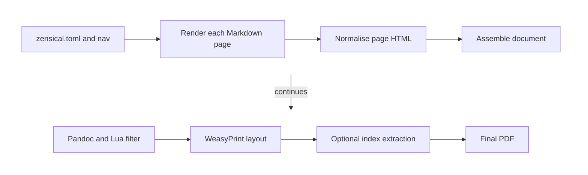

# PDF pipeline and API

This \index{PDF pipeline} page is for contributors changing `prodockit.pdf` or calling its Python
API directly. Document authors should use [Generate a PDF](../pdf.md).

## Follow the pipeline



The configuration wrapper reads Zensical settings, renders each navigation
page through Zensical, constructs `Page` objects, pre-renders diagrams and
maths, and calls the lower-level builder. A generated index adds a second
layout pass after term pages are known.

## Use the public Python surface

| API | Purpose |
|---|---|
| `build_pdf_from_zensical_config()` | High-level build using navigation and settings from `zensical.toml` |
| `build_pdf()` | Lower-level build from prepared `Page` objects |
| `Page` | One rendered source page plus its path, appendix, index, and running-header metadata |
| `PdfBuildError` | Build failure carrying the underlying command output |
| `build_source_bundle_from_zensical_config()` | High-level Markdown/configuration source-bundle build |

Prefer `build_pdf_from_zensical_config()` when a caller already has a
Zensical project. Use `build_pdf()` only when the caller owns page rendering
and can supply complete HTML and metadata.

```python
from prodockit.pdf.config import build_pdf_from_zensical_config

output = build_pdf_from_zensical_config("zensical.toml")
print(output)
```

The CLI wraps these functions with progress reporting, captured diagnostics,
and non-zero exit status; the functions return paths or raise exceptions.

## Know the internal modules

| Module | Responsibility |
|---|---|
| `prodockit.pdf.config` | Zensical configuration, navigation flattening, page rendering, and high-level entry points |
| `prodockit.pdf.build` | Pipeline orchestration and external-command execution |
| `prodockit.pdf.html` | Page fix-ups, front matter, web/PDF-only content, and heading structure |
| `prodockit.pdf.lua` | Pandoc Lua filter generation |
| `prodockit.pdf.css` | Page size, margins, running headers/footers, duplex layout, and shared presentation |
| `prodockit.pdf.icons` | Icon discovery and SVG resolution |
| `prodockit.pdf.mermaid` | Mermaid CLI invocation and diagram assets |
| `prodockit.pdf.source_bundle` | Markdown/configuration source PDF |
| `prodockit.pdf.index` | Marker extraction, term-page mapping, and generated index |
| `prodockit.pdf.release` | Host release lookup for cover markers |

Keep transformation stages narrow. A change to HTML normalisation, CSS, the
Lua filter, or an external tool can affect every page, so verify the complete
PDF and built-output tests rather than relying on a unit test of the changed
module alone.

### Preserve source-bundle boundaries

The `prodockit source-bundle` command includes root `README.md`, Markdown below
`docs_dir`, and the active Zensical config. Root-level generated Markdown such
as changelog, contribution, and licence files stays outside that boundary. It
is intentionally separate from the rendered-document
pipeline: it discovers files with git, writes a self-contained HTML document,
and calls WeasyPrint without Pandoc. The lower-level source-bundle API can
discover every non-ignored text file for a specialised caller, but that is not
the command-line default.

### Preserve real footer markup

Copyright text can contain links and line breaks, so it cannot be flattened
into a CSS string. The PDF pipeline writes it as an HTML element and places it
in the repeated footer with CSS Paged Media's `position: running()` and
`content: element()`. Check the finished PDF when changing this path;
intermediate HTML alone does not prove that links or line breaks survived.

## Preserve actionable errors

`PdfBuildError` reports which external command failed and retains its captured
output. Configuration wrappers also guard Zensical result-shape changes with a
message naming the installed version and affected page. Do not replace these
with an unlabelled subprocess status or raw `KeyError`; callers need to know
which boundary changed.
