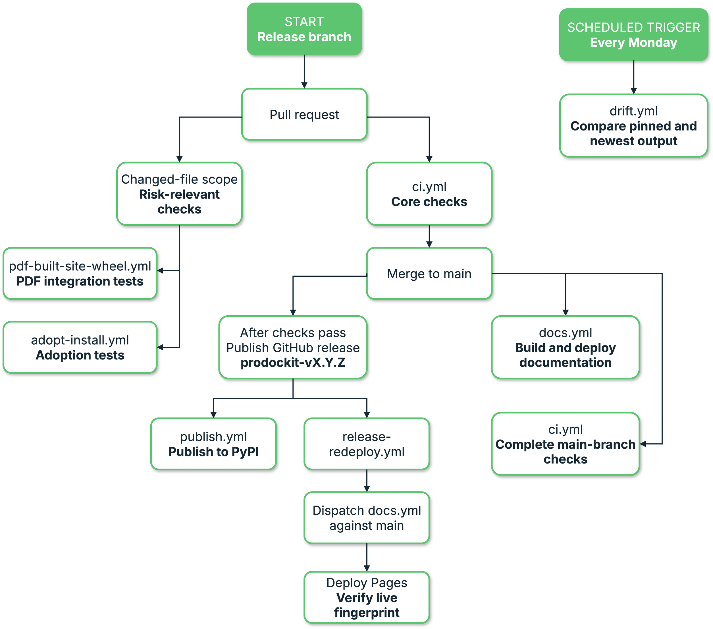
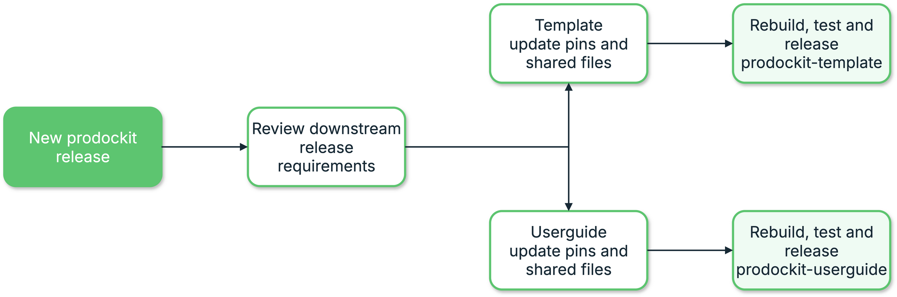

{{ heading_counter_reset(page) }}

# Build and release

This page documents the \index{release process} for taking prodockit from an accepted
change to a package on PyPI and a documentation site that shows the same
release. It describes this repository's real GitHub Actions workflows rather
than a generic Python release.

A release is deliberately split in two:

1. A pull request changes and validates the source.
2. A published GitHub release creates the tag and authorises publishing.

Do not publish a GitHub release from an unmerged branch. `publish.yml` builds
the tagged source, while the documentation redeploy is deliberately run from
`main`; both must describe the same commit.

## Understand the workflow chain

Two independent events start the automation. A release branch opens the pull
request path: scoped and core checks run before the branch is merged, after
which the package and documentation are published from `main`. A weekly timer
starts only the drift comparison and never publishes a release.

\ref{fig-release-workflow} shows those entry points in solid green. Follow the
release branch down the centre and left of the diagram; the separate scheduled
path is on the right.

{ .documentation-diagram .release-workflow-diagram }
/// figure-caption
    attrs: {id: fig-release-workflow}

Release and continuous-integration workflow
///

The solid green boxes are entry points: a maintainer starts the release path
from a release branch, while GitHub starts the drift path on its weekly
schedule. The other boxes are actions or workflow stages that follow.

\ref{tab-devcons-releasing-understand-the-workflow-chain} maps each workflow file to its trigger and responsibility.

| Workflow {: width="42%" } | Trigger | Responsibility |
|---|---|---|
| [`adopt-install.yml`](https://github.com/buckwem/prodockit-extensions/blob/main/.github/workflows/adopt-install.yml) | Relevant pull requests and pushes to `main`; weekly schedule; manual dispatch | Build and install the wheel on Ubuntu and Windows x64, plus Ubuntu, Windows and macOS ARM64. Both Windows architectures run one complete TOML scenario with Mermaid and maths; Ubuntu and macOS retain the wider TOML/YAML option coverage. Canonical npm lockfiles and the hosted cache avoid resolving and downloading the same Node packages afresh on every run. |
| [`bootstrap-install.yml`](https://github.com/buckwem/prodockit-extensions/blob/main/.github/workflows/bootstrap-install.yml) | Relevant pull requests and pushes to `main`; weekly schedule; manual dispatch | Build and install the wheel on the same five native runners, then exercise the new- and existing-repository routes for Surrey GitLab and public GitHub against hermetic local Git remotes. A version-changing release pull request also removes the runner's existing tools and executes Bootstrap's real VS Code, Git, Pandoc/Pango/font, Python-environment, Node/toolchain and editor-extension installs on all five runners. |
| [`bootstrap-live-provider-github.yml`](https://github.com/buckwem/prodockit-extensions/blob/main/.github/workflows/bootstrap-live-provider-github.yml) | Protected manual dispatch for one exact `main` commit | Run the shadow GitHub live-provider gate in three fresh jobs: a user-authorised reset, the two Bootstrap paths with only the destination deploy key, and an independently authenticated seal that removes the test repository before accepting the result. The shadow result does not yet authorise publication. |
| [`bootstrap-live-provider-surrey-connectivity.yml`](https://github.com/buckwem/prodockit-extensions/blob/main/.github/workflows/bootstrap-live-provider-surrey-connectivity.yml) | Manual dispatch without secrets | Prove that GitHub-hosted Ubuntu and macOS runners can reach the Surrey API and SSH service and observe the independently reviewed SSH fingerprint before any Surrey credential is stored in GitHub. |
| [`bootstrap-live-provider-surrey.yml`](https://github.com/buckwem/prodockit-extensions/blob/main/.github/workflows/bootstrap-live-provider-surrey.yml) | Protected manual dispatch for one exact `main` commit | Run the Surrey GitLab live-provider gate from three fresh GitHub-hosted jobs. Reset and seal receive the isolated-group token; the candidate receives only the fixed repository key. A successful seal retains closed state for the next exact reset. |
| [`bootstrap-live-provider-surrey-recovery.yml`](https://github.com/buckwem/prodockit-extensions/blob/main/.github/workflows/bootstrap-live-provider-surrey-recovery.yml) | Protected manual dispatch after an interrupted Surrey run | Validate the exact unsuccessful workflow, use its reset handoff when available, then remove the fixed reviewed destination deploy key. It cannot delete the project or produce release evidence. |
| [`.gitlab-ci.yml`](https://github.com/buckwem/prodockit-extensions/blob/main/.gitlab-ci.yml) | Protected manual pipeline in the fixed Surrey mirror for one exact public GitHub `main` commit | Hold one non-cancelling lifecycle lock while a child pipeline runs three credential-separated jobs: a group-token reset, both Bootstrap paths with only the Surrey deploy key, and a fresh group-token seal. The pipeline fetches the exact public source rather than assuming that the mirror is current. Its shadow result does not yet authorise publication. |
| [`release-gate.yml`](https://github.com/buckwem/prodockit-extensions/blob/main/.github/workflows/release-gate.yml) | Protected manual dispatch after both live-provider runs | Resolve both immutable GitHub Actions provider runs through the GitHub API, require the six ordinary release workflows and any active protected-main status checks, rebuild the wheel, compare canonical contents and retain public-safe combined evidence. This remains a shadow and cannot publish. |
| [`pdf-built-site-wheel.yml`](https://github.com/buckwem/prodockit-extensions/blob/main/.github/workflows/pdf-built-site-wheel.yml) | Relevant pull requests and pushes to `main`; weekly schedule; manual dispatch | Build and install the wheel on the same x64 and ARM64 operating-system matrix, exercise the renderer used by public `prodockit pdf` through Zensical's documented clean build, and verify it can consume navigation, rendered extensions and page metadata without a Git host |
| [`ci.yml`](https://github.com/buckwem/prodockit-extensions/blob/main/.github/workflows/ci.yml) | Pull requests and pushes to `main`; weekly schedule; manual dispatch | Test Python 3.14 for every change, add the oldest supported Python when executable code can change, and select Python 3.10–3.14 for dependency, workflow and classifier changes. Weekly and manual runs always use the complete version matrix. Lint, type-check, verify pins and collect coverage once, strictly build the site, and validate both package artifacts on every run. |
| [`diag-repair.yml`](https://github.com/buckwem/prodockit-extensions/blob/main/.github/workflows/diag-repair.yml) | Pull requests, merge groups, pushes to `main`, and manual dispatch | Build the candidate wheel independently in six environments: x64 and ARM64 Ubuntu, Windows, and macOS. Each environment creates one project with all six repairable diagnostic checks failing, confirms every action separately, and verifies the repaired state and recovery manifests. Separate upgrade and downgrade wheel jobs on all six environments start from unmodified published artifacts, align the supported toolchain, verify that installed code changed, verify Diagnostics and Pins, repeat the run for idempotence, and retain failure reports. The upgrade installs real previous Python packages and Pandoc; because the supported Python pins are already the newest publications, the genuine downgrade installs the adjacent newer Pandoc release. |
| [`docs.yml`](https://github.com/buckwem/prodockit-extensions/blob/main/.github/workflows/docs.yml) | Pushes to `main`; manual dispatch | Build the complete PDF and selected single-page PDFs, strictly build the website, run built-output tests, deploy Pages, then verify the live page matches the uploaded artifact |
| [`drift.yml`](https://github.com/buckwem/prodockit-extensions/blob/main/.github/workflows/drift.yml) | Monday schedule; manual dispatch | Build with pinned and newest rendering dependencies, compare artifacts, run checks against the newer build, and open or update an issue rather than failing for mere availability |
| [`publish.yml`](https://github.com/buckwem/prodockit-extensions/blob/main/.github/workflows/publish.yml) | Published GitHub release | Build source and wheel artifacts from the release tag, validate their metadata and rendered README with Twine, then publish them to PyPI through \index{PyPI!Trusted Publishing} |
| [`release-redeploy.yml`](https://github.com/buckwem/prodockit-extensions/blob/main/.github/workflows/release-redeploy.yml) | Published GitHub release; manual dispatch | Start `docs.yml` against `main` after the new tag exists, so the cover and macros can show the new release without deploying from a tag ref |
/// table-caption | <
    attrs: {id: tab-devcons-releasing-understand-the-workflow-chain}

Understand the workflow chain
///

The workflow roles in \ref{tab-devcons-releasing-understand-the-workflow-chain}
overlap intentionally. `ci.yml` gives quick pull-request feedback and keeps a
scope-aware post-merge check. One repository-owned classifier calculates a
complete Git change range and selects expensive checks conservatively: an
unknown implementation file, an unreadable range, or a manually applied
`full-ci` label selects everything. `adopt-install.yml`,
`bootstrap-install.yml`, and `pdf-built-site-wheel.yml` test their installed
wheel independently on x64 and ARM64 runners across Ubuntu, Windows, and
macOS only when their owned code can change. Unit-test-only changes do not
start native runners. Weekly and manual runs remain comprehensive, which is
the safety net for an ownership rule that proves incomplete. `docs.yml` proves and publishes the complete artifacts;
`publish.yml` has the narrow permission needed for PyPI; the redeploy fixes
release-tag timing; and `drift.yml` observes future upgrades without changing
the current release.

The Bootstrap workflow deliberately has two levels. Its fast hermetic routes
run for relevant implementation changes and retain complete GitLab/GitHub
decision coverage without depending on outside services. The slower real
installer matrix runs when the package version changes, when that matrix's own
implementation changes, or when requested manually. It crosses the live
package-manager and download boundary on disposable runners, but still uses no
GitHub or GitLab user account. A release therefore detects installer-source,
download, architecture and native-library failures before publication without
making every ordinary pull request wait for five fresh machine installations.

The separate live-provider workflows are protected shadow controls rather
than pull-request tests. They are not a step in the normal package-release
procedure and publishing a release does not require or start them. Run one
only for a deliberate live-provider validation exercise. Each dispatch now
requires the operator to type its complete fixed destination before any job
can reach a credential-bearing environment; this prevents a release commit or
an unrelated workflow choice from being mistaken for authorisation to mutate
a provider.

The GitHub workflow mutates only the fixed private
repository `buckwem/bootstrap-release-gate`. The GitHub App installation token
originally designed for this control cannot create a repository in a personal
namespace: GitHub supports that endpoint with a fine-grained personal token or
a GitHub App user token, but not an installation token. The lifecycle token is
therefore stored only in the manually approved reset and seal environments,
checked against the `buckwem` account at runtime, and constrained in code to the
single fixed repository. It creates that repository immediately before the test
and deletes it during the seal, including after a rejected candidate. This token
has wider account scope than the deploy key, so the candidate receives only the
fixed repository's deploy key.

Configure `PRODOCKIT_LIVE_GITHUB_LIFECYCLE_TOKEN` as an environment secret in
both `bootstrap-live-github-reset` and `bootstrap-live-github-seal`. For a
fine-grained personal token, select `buckwem` as the resource owner, grant
access to all repositories so the token can create the currently absent fixed
repository, grant repository Administration read and write, and grant Pages
and Webhooks read-only access. Grant Contents read-only access so the reset and
seal controllers can compare the destination's branches with the candidate
record. Do not expose this token as a repository-wide secret or to the candidate
environment.

GitHub retains deleted repositories for recovery, including their deploy-key
registrations. A fixed deploy key therefore cannot be attached when the same
test repository is recreated. The reset job instead generates a new Ed25519
deploy key for every run. It registers the public half and encrypts the private
half before passing it through the workflow artifact boundary. The reset job
removes its plaintext copy immediately after encryption. The candidate can
decrypt the artifact, while the artifact itself and the seal job cannot provide
Git access. The sealer revokes the run-scoped key and removes the repository.

The fixture keeps GitHub Actions and Pages disabled throughout the candidate
run. Bootstrap's Pages stage is therefore deferred only in this harness: an
empty private repository cannot expose that setting to the candidate, and
enabling it would allow untrusted candidate content to execute or publish. The
ordinary Bootstrap tests continue to cover the user-facing Pages decision;
the live-provider run remains focused on authenticated repository reads, the
single permitted push, the existing-repository path and cleanup.

Create one 4096-bit RSA wrapping pair on a trusted computer. Keep the private
file outside the repository:

```console
umask 077
openssl genpkey -algorithm RSA -pkeyopt rsa_keygen_bits:4096 \
    -out prodockit-live-github-wrap-private.pem
openssl pkey -in prodockit-live-github-wrap-private.pem -pubout \
    -out prodockit-live-github-wrap-public.pem
```

Store the complete public PEM as
`PRODOCKIT_LIVE_GITHUB_KEY_WRAP_PUBLIC_KEY` in
`bootstrap-live-github-reset`. Store the complete private PEM as
`PRODOCKIT_LIVE_GITHUB_KEY_WRAP_PRIVATE_KEY` only in
`bootstrap-live-github-candidate`. Store GitHub's reviewed SSH host-key record
as `PRODOCKIT_LIVE_GITHUB_KNOWN_HOSTS` in the candidate environment as well.
The encrypted deploy-key artifact is bound to the public-key fingerprint in the
reset handoff before the candidate loads it. Delete the obsolete
`PRODOCKIT_LIVE_GITHUB_DEPLOY_PUBLIC_KEY` and
`PRODOCKIT_LIVE_GITHUB_DEPLOY_PRIVATE_KEY` secrets after this change is live.

Restrict all three environments to `main`. Never put the lifecycle token or RSA
wrapping private key in the same environment. The wrapping private key cannot
access GitHub: it can only decrypt the one-time repository credential generated
inside a reviewed workflow run.

For a deliberate GitHub exercise, dispatch **Bootstrap live provider — GitHub
shadow** with the full commit currently at protected `main` and type
`buckwem/bootstrap-release-gate` in the live target confirmation field. Do not
use this workflow merely because the same commit is being released.

The Surrey pipeline mutates only
`assessment-liveprovider-2026/report-liveprovider-2026-mb0105` and runs from
the fixed `mb0105/prodockit-extensions` mirror. Each provider separates reset,
candidate, and seal into protected jobs so no job can receive both a lifecycle
credential and a repository deploy private key. A successful seal retains the
verified private project as closed state after removing its write key. The
protected release-gate shadow resolves both GitHub Actions
run IDs through the GitHub API, requires the six ordinary release
workflows for that exact commit plus any active protected-main status checks,
rebuilds the candidate wheel and compares canonical contents before it
retains combined public-safe evidence. Until the dual-provider shadow
acceptance criteria have passed, these workflows supply evidence only:
`publish.yml` remains unchanged and cannot treat a provider or coordinator
result as release approval.

The protected GitLab pipeline has the same deliberate-dispatch boundary. Set
`PRODOCKIT_LIVE_CONFIRM_TARGET` to
`assessment-liveprovider-2026/report-liveprovider-2026-mb0105`; leave it blank
for every ordinary pipeline and release.

The Phase 5 migration also makes the Surrey test available as a protected
GitHub Actions workflow. Run **Bootstrap live provider — Surrey connectivity**
before configuring credentials. It performs only DNS, TLS, port and public
host-key observations. A failed probe means the hosted-runner design is not
usable on the current Surrey network; do not weaken SSH verification or expose
the service more widely to make the test pass.

Create the GitHub Environments listed in
\ref{tab-devcons-releasing-surrey-github-environments}, restrict each to
protected `main`, and store the named values as environment secrets.

| Environment | Secrets |
|---|---|
| `bootstrap-live-surrey-reset` | `PRODOCKIT_LIVE_SURREY_GROUP_TOKEN`, `PRODOCKIT_LIVE_SURREY_FIXTURE_JSON`, `PRODOCKIT_LIVE_SURREY_DEPLOY_PUBLIC_KEY` |
| `bootstrap-live-surrey-candidate` | `PRODOCKIT_LIVE_SURREY_DEPLOY_PRIVATE_KEY`, `PRODOCKIT_LIVE_SURREY_KNOWN_HOSTS` |
| `bootstrap-live-surrey-seal` | `PRODOCKIT_LIVE_SURREY_GROUP_TOKEN`, `PRODOCKIT_LIVE_SURREY_FIXTURE_JSON` |
/// table-caption | <
    attrs: {id: tab-devcons-releasing-surrey-github-environments}

Separate the Surrey GitHub workflow credentials
///

The reset environment is the one human approval boundary. Do not require a
second approval for candidate or seal: a waiting seal could leave repository
write access active. The group token must be restricted to the otherwise empty
`assessment-liveprovider-2026` test group. The candidate key must be dedicated
to this fixture and usable non-interactively on a disposable runner; never use
a personal SSH key or export a 1Password-managed identity. Enter the group
token separately in reset and seal so the candidate environment cannot resolve
it. Disable administrator bypass where the repository settings permit it.

Normally dispatch **Bootstrap live provider — Surrey GitLab** with only the
full commit currently at protected GitHub `main`, then type
`assessment-liveprovider-2026/report-liveprovider-2026-mb0105` in the live
target confirmation field. It discovers the newest
valid sealed state from earlier runs. The optional prior-run field is for an
authorised recovery from artifact-discovery failure and still accepts only a
successful earlier run of this exact workflow. If a run is cancelled after
reset, dispatch **Bootstrap live provider — Surrey recovery seal** with that
failed run ID and its release commit. Recovery only revokes the exact key; it
does not make the failed run releasable.

Leave the controlled candidate-failure and stale-main exercise options off
during an ordinary run. They are maintainer tests for the fail-closed paths and
deliberately finish with a failed workflow after repository access is revoked.

Keep the GitLab pipeline as the inactive rollback route until the GitHub-hosted
workflow has passed absent-project, repeated retained-project, candidate
failure, stale-commit and cancellation-recovery exercises. Never run both
Surrey lifecycle controllers at the same time because their concurrency locks
belong to different providers.

This is the deliberate balance between time and maintenance complexity. The
native matrices remain complete once selected rather than introducing a
second layer of partial platform scenarios. All four workflows expose one
stable result job for branch protection, while their detailed jobs may be
selected or skipped. Post-merge validation remains enabled until those stable
result checks are required by the repository ruleset; removing it sooner
would save time by relying on a protection that had not yet been enforced.

## 1. Choose the release version

Use semantic versioning as a decision aid:

\ref{tab-devcons-releasing-1-choose-the-release-version} maps patch, minor, and major versions to the kind of change being released.

| Change | Version |
|---|---|
| Backward-compatible fixes or documentation corrections | Patch |
| New backward-compatible commands, options, or extension features | Minor |
| An intentional incompatible public change | Major—or the repository's agreed pre-1.0 policy |
/// table-caption | <
    attrs: {id: tab-devcons-releasing-1-choose-the-release-version}

1. Choose the release version
///

Use \ref{tab-devcons-releasing-1-choose-the-release-version} to translate the
reviewed change into a version increment. Read every change since the previous
`prodockit-v...` tag. The Git history is
the complete record; the website release notes intentionally contain only
short changes that matter to package users:

```bash
git fetch --tags origin
git log --oneline prodockit-v0.41.0..origin/main
```

The tag prefix matters. Historic tags named only `vX.Y.Z` exist, but current
package releases use `prodockit-vX.Y.Z`, such as `prodockit-v0.41.0`.

## 2. Prepare the release branch

Create the release metadata on a branch based on the latest `main`, then let
the repository checks validate that exact change.

/// steps

//// step | Start from current main

```bash
git switch main
git pull --ff-only
git switch -c release/0.42.0
```

Replace `0.42.0` throughout this page with the version being prepared.

////

//// step | Update both code version sources

The package version is declared twice:

```toml title="pyproject.toml"
[project]
version = "0.42.0"
```

```python title="src/prodockit/__init__.py"
__version__ = "0.42.0"
```

They serve different readers: build metadata supplies the wheel and PyPI;
`prodockit.__version__` supplies Python callers and `prodockit --version`.
Leaving either behind publishes two answers about one release.

////

//// step | Finish the release notes

In `docs/about/changelog.md`, replace the one `## Unreleased` heading with:

```markdown
## 0.42.0 (2026-08-22)
```

Review every merged change since the previous tag. Add missing entries and
write short bullets for a user deciding whether to upgrade: added or changed
behaviour and any action required. Do not reproduce defects, pull-request
detail, or commit subjects; Git commits, issues, pull requests, tags, and
GitHub Releases retain that history.

The changelog tests enforce one Unreleased section at most, its position,
newest-first released versions, and its website-only policy. They do not know
whether a user-relevant change was omitted, so the comparison with `git log`
is still required.

////

//// step | Check descriptions exposed outside the guide

If the release changes the public capability set, update the places a reader
sees before opening the full documentation:

- `README.md`, rendered on GitHub and PyPI;
- the `[project].description` in `pyproject.toml`, used as PyPI's summary;
- the package docstring in `src/prodockit/__init__.py`, shown by Python help.

Tests guard extension inventories, but prose describing a changed command or
capability still needs review.

////

///

## 3. Run the local release gates

Activate the development environment first. On Apple Silicon macOS, expose
Homebrew's Pango libraries in the same terminal that will run the gates:

```bash
export DYLD_FALLBACK_LIBRARY_PATH=/opt/homebrew/lib
```

Use `/usr/local/lib` on an Intel Mac. If this is missing, the PDF-backed tests
typically fail with `cannot load library 'libgobject-2.0-0'` even though
`brew install pango` has completed. This is a loader-path problem, not evidence
of a code regression or a missing Python package.

Run the same logical gates as `ci.yml`:

```bash
ruff check .
mypy src
prodockit pins --check --offline
pytest
zensical build --clean --strict
```

Because this repository publishes a PDF as part of its documentation, build
the strict website first and then let the PDF command consume it:

```bash
zensical build --clean --strict
prodockit pdf
python -m pytest tests/test_built_docs.py -m built -v
```

Then verify the release identity directly:

```bash
python -m pip install "twine==7.0.0"
python -m build
python -m twine check --strict dist/*.whl dist/*.tar.gz
python -m zipfile --list dist/prodockit-0.42.0-py3-none-any.whl
prodockit --version
```

Twine validates the metadata and renders the `README.md` description from both
the wheel and source distribution using PyPI's rules. `--strict` turns a
rendering warning into a failed release gate. Twine is installed only for this
package check; it is not a dependency for authors using Prodockit.

The wheel filename and command output should both say `0.42.0`. Do not upload
the locally built `dist/`; `publish.yml` rebuilds from the immutable release
tag and publishes that artifact.

## 4. Open and merge the release pull request

Review the release diff before committing:

```bash
git diff --check
git status --short
git diff -- pyproject.toml src/prodockit/__init__.py docs/about/changelog.md
```

Commit, push, and open the pull request:

```bash
git add pyproject.toml src/prodockit/__init__.py docs/about/changelog.md
git commit -m "Release 0.42.0"
git push -u origin release/0.42.0
gh pr create --title "Release 0.42.0"
```

Only add files actually changed and reviewed; the command above is a checklist,
not permission to commit unrelated work.

On the release pull request, `ci.yml` runs:

- the oldest and newest supported Python versions, because package metadata
  changed;
- the real Pandoc and WeasyPrint stack on Python 3.14;
- Ruff and mypy once;
- `prodockit pins --check --offline`;
- the ordinary test suite on both selected interpreters, with coverage
  collected once;
- a separate strict documentation build.

Changing `pyproject.toml` also selects both installed-wheel workflows, so a
release candidate still crosses every reviewed operating-system and processor
architecture. A writing-only pull request does not pay for those matrices.

Merge only after all required checks pass. After merging, wait for the new
`main` run of `ci.yml`—including Python 3.10–3.14 and both complete
installed-wheel matrices—and the first `docs.yml` deployment to succeed. That
first documentation build may still show the previous release because the new
tag does not exist yet; the release-triggered redeploy corrects it.

## 5. Publish the GitHub release

Create a release targeting the merged `main` commit. Publishing—not merely
saving a draft—is the event that starts PyPI publishing and the documentation
redeploy:

```bash
gh release create prodockit-v0.42.0 \
  --repo buckwem/prodockit-extensions \
  --target main \
  --title "prodockit 0.42.0" \
  --generate-notes
```

Before confirming, check:

- the tag is exactly `prodockit-v0.42.0`;
- the target is the merged release commit on `main`;
- the release title is `prodockit 0.42.0`;
- the notes describe the same release as `docs/about/changelog.md`.

A tag with the right name on the wrong commit is still the wrong package.
Do not delete and recreate tags casually once an artifact may have reached
PyPI; package versions there are immutable.

## 6. Follow the release workflows

Two workflows start from the published release.

### PyPI: `publish.yml`

The `build` job checks out the tag, installs `build` and the reviewed Twine
version, and runs `python -m build`. Before anything can be uploaded, Twine
strictly validates both the wheel and source distribution, including how
PyPI will render `README.md`. The job then uploads `dist/` as a workflow
artifact. The `publish` job downloads that exact artifact in the protected
`pypi` environment and uses PyPI Trusted Publishing (`id-token: write`), so no
long-lived API token is stored in the repository.

Watch it with:

```bash
gh run list --workflow publish.yml --limit 5
```

After success, verify the public package rather than relying only on the green
workflow:

```bash
python -m pip index versions prodockit
```

### Documentation: `release-redeploy.yml` → `docs.yml` {: #release-documentation-redeploy }

The release event itself runs against a tag ref. GitHub Pages deployments from
that ref previously reported success while the public site kept serving the
old build. `release-redeploy.yml` therefore builds nothing: it dispatches
`docs.yml --ref main` with `actions: write` permission.

`docs.yml` then:

1. checks out full history so `git describe` can see tags;
2. installs pinned system, Python, Mermaid, and MathJax inputs;
3. builds the complete PDF and selected single-page PDFs;
4. strictly builds the website after the PDF;
5. runs the built-output tests;
6. uploads and deploys `site/`;
7. fingerprints the uploaded `index.html` and polls the public Pages URL until
   it serves those exact bytes.

The single-page builds come from `.github/docs-single-page-pdfs.toml`. Every
navigated page is either a representative build or explicitly mapped to one;
`tests/test_docs_pdf_matrix.py` rejects an unclassified new page. All nine
authoring extensions and each audience overview are representatives, while
pages with the same material shape reuse one build to keep renderer work
bounded.

The workflow uses a `pages` concurrency group with cancellation disabled. A
queued later deployment must wait and supersede the earlier one; cancelling it
could leave the pre-release-tag build live.

Watch both workflows:

```bash
gh run list --workflow release-redeploy.yml --limit 5
gh run list --workflow docs.yml --limit 5
```

## 7. Verify the release as a user

Automation has separate success conditions, so perform separate public checks:

\ref{tab-devcons-releasing-7-verify-the-release-as-a-user} separates package, documentation, and PDF checks so each public artifact is verified.

| Check | What it proves |
|---|---|
| GitHub release page shows `prodockit-v0.42.0` | The release and tag are public |
| PyPI lists `0.42.0` and both wheel/source files | Trusted Publishing completed |
| A clean environment installs `prodockit==0.42.0` | Package metadata and dependencies resolve for a user |
| `prodockit --version` prints `0.42.0` | The installed code agrees with package metadata |
| Documentation cover shows the new release | The post-release main-branch redeploy completed |
| `docs.yml` verify job passes | The public Pages URL serves the artifact built by that run |
/// table-caption | <
    attrs: {id: tab-devcons-releasing-7-verify-the-release-as-a-user}

7. Verify the release as a user
///

The public checks in
\ref{tab-devcons-releasing-7-verify-the-release-as-a-user} prove different
parts of the release. A clean installation check can use a temporary virtual
environment:

```bash
python -m venv /tmp/prodockit-release-check
/tmp/prodockit-release-check/bin/python -m pip install "prodockit==0.42.0"
/tmp/prodockit-release-check/bin/prodockit --version
```

Use the platform's corresponding activation or executable path on Windows.

## Recover from a failed stage

Use \ref{tab-devcons-releasing-recover-from-a-failed-stage} to resume from the
last completed boundary without repeating publication work unnecessarily.

| Failure | Resume from |
|---|---|
| Pull-request CI fails | Fix the release branch; do not publish the release |
| `publish.yml` build job fails | Fix through a new commit and release version; the tag is the source of truth |
| PyPI publish job fails before upload | Correct the environment/Trusted Publishing problem and rerun the failed job |
| PyPI already contains the version | Never overwrite it; determine whether the existing files are correct and release a new version if code must change |
| `release-redeploy.yml` fails | Manually run `gh workflow run docs.yml --ref main` after fixing permissions or workflow availability |
| Pages deploy succeeds but verify fails | Inspect the response headers and rerun `docs.yml`; do not assume successful upload means successful delivery |
| Drift issue opens after release | Triage it as future maintenance; it does not invalidate the pinned release that just shipped |
/// table-caption | <
    attrs: {id: tab-devcons-releasing-recover-from-a-failed-stage}

Recover from a failed stage
///

## After release

Return to ordinary development by creating a new `## Unreleased` section when
the next user-visible change is made. Do not create an empty section merely as
release ceremony; the changelog test permits it to be absent between releases.

Downstream repositories that pin prodockit—especially `prodockit-template`
and the userguide—should update deliberately, rebuild their own site and PDF,
and use their own tests before adopting the release.

\ref{fig-downstream-release-cascade} shows the downstream sequence. Each
repository first updates its version pin and shared files, then builds and
tests its own outputs before making a separate release. A successful prodockit
release starts this review; it does not bypass it.

{ .documentation-diagram }
/// figure-caption
    attrs: {id: fig-downstream-release-cascade}

Downstream release cascade
///
