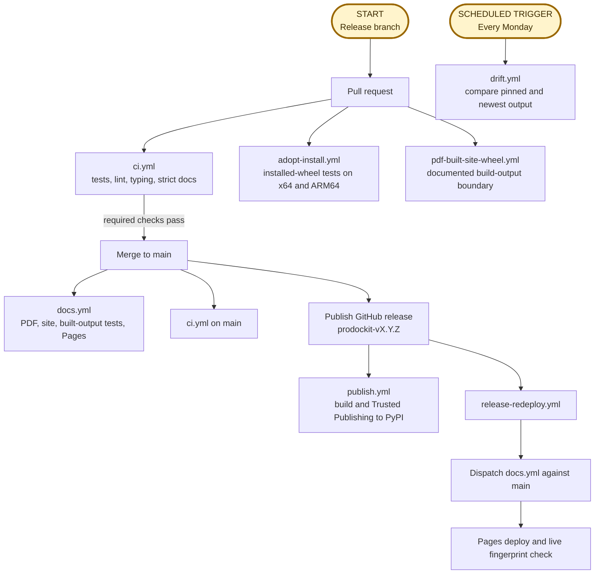

{{ heading_counter_reset(page) }}

# Build and release

This page documents the \index{release process} for taking prodockit from an accepted
change to a package on PyPI and a documentation site that shows the same
release. It describes this repository's real GitHub Actions workflows rather
than a generic Python release.

A release is deliberately split in two:

1. A pull request changes and validates the source.
2. A published GitHub release creates the tag and authorises publishing.

Do not publish a GitHub release from an unmerged branch. `publish.yml` builds
the tagged source, while the documentation redeploy is deliberately run from
`main`; both must describe the same commit.

## Understand the workflow chain



The rounded gold boxes are entry points: a maintainer starts the release path
from a release branch, while GitHub starts the drift path on its weekly
schedule. Rectangular boxes are actions or workflow stages that follow.

| Workflow | Trigger | Responsibility |
|---|---|---|
| [`adopt-install.yml`](https://github.com/buckwem/prodockit-extensions/blob/main/.github/workflows/adopt-install.yml) | Pull requests; pushes to `main`; manual dispatch | Build and install the wheel on Ubuntu and Windows x64, plus Ubuntu, Windows and macOS ARM64, then exercise TOML and YAML adoption with the optional Mermaid and maths paths |
| [`pdf-built-site-wheel.yml`](https://github.com/buckwem/prodockit-extensions/blob/main/.github/workflows/pdf-built-site-wheel.yml) | Pull requests; pushes to `main`; manual dispatch | Build and install the wheel on the same x64 and ARM64 operating-system matrix, exercise the renderer used by public `prodockit pdf` through Zensical's documented clean build, and verify it can consume navigation, rendered extensions and page metadata without a Git host |
| [`ci.yml`](https://github.com/buckwem/prodockit-extensions/blob/main/.github/workflows/ci.yml) | Pull requests; pushes to `main` | Test Python 3.10–3.14, lint, type-check, verify pins, run the suite, and strictly build the site |
| [`docs.yml`](https://github.com/buckwem/prodockit-extensions/blob/main/.github/workflows/docs.yml) | Pushes to `main`; manual dispatch | Build the complete PDF and selected single-page PDFs, strictly build the website, run built-output tests, deploy Pages, then verify the live page matches the uploaded artifact |
| [`drift.yml`](https://github.com/buckwem/prodockit-extensions/blob/main/.github/workflows/drift.yml) | Monday schedule; manual dispatch | Build with pinned and newest rendering dependencies, compare artifacts, run checks against the newer build, and open or update an issue rather than failing for mere availability |
| [`publish.yml`](https://github.com/buckwem/prodockit-extensions/blob/main/.github/workflows/publish.yml) | Published GitHub release | Build source and wheel artifacts from the release tag, then publish them to PyPI through \index{PyPI!Trusted Publishing} |
| [`release-redeploy.yml`](https://github.com/buckwem/prodockit-extensions/blob/main/.github/workflows/release-redeploy.yml) | Published GitHub release; manual dispatch | Start `docs.yml` against `main` after the new tag exists, so the cover and macros can show the new release without deploying from a tag ref |

The seven workflows overlap intentionally. `ci.yml` gives quick pull-request
feedback; `adopt-install.yml` tests the installed wheel independently on x64
and ARM64 runners across Ubuntu, Windows and macOS;
`pdf-built-site-wheel.yml` exercises the public PDF renderer from an installed
wheel without relying on Zensical's private Python interfaces; `docs.yml`
proves and publishes the complete artifacts;
`publish.yml` has the narrow permission needed for PyPI; the redeploy fixes
release-tag timing; and `drift.yml` observes future upgrades without changing
the current release.

## 1. Choose the release version

Use semantic versioning as a decision aid:

| Change | Version |
|---|---|
| Backward-compatible fixes or documentation corrections | Patch |
| New backward-compatible commands, options, or extension features | Minor |
| An intentional incompatible public change | Major—or the repository's agreed pre-1.0 policy |

Read every change since the previous `prodockit-v...` tag, not only the pull
requests carrying a changelog entry:

```bash
git fetch --tags origin
git log --oneline prodockit-v0.41.0..origin/main
```

The tag prefix matters. Historic tags named only `vX.Y.Z` exist, but current
package releases use `prodockit-vX.Y.Z`, such as `prodockit-v0.41.0`.

## 2. Prepare the release branch

/// steps

//// step | Start from current main

```bash
git switch main
git pull --ff-only
git switch -c release/0.42.0
```

Replace `0.42.0` throughout this page with the version being prepared.

////

//// step | Update both code version sources

The package version is declared twice:

```toml title="pyproject.toml"
[project]
version = "0.42.0"
```

```python title="src/prodockit/__init__.py"
__version__ = "0.42.0"
```

They serve different readers: build metadata supplies the wheel and PyPI;
`prodockit.__version__` supplies Python callers and `prodockit --version`.
Leaving either behind publishes two answers about one release.

////

//// step | Finish the release notes

In `docs/about/changelog.md`, replace the one `## Unreleased` heading with:

```markdown
## 0.42.0 (2026-08-22)
```

Review every merged change since the previous tag. Add missing entries and
write for a user deciding whether to upgrade: what changed, why it matters,
and any action required. Do not paste commit subjects without context.

The changelog tests enforce one Unreleased section at most, its position, and
newest-first released versions. They do not know whether a human-readable
change was omitted, so the comparison with `git log` is still required.

////

//// step | Check descriptions exposed outside the guide

If the release changes the public capability set, update the places a reader
sees before opening the full documentation:

- `README.md`, rendered on GitHub and PyPI;
- the `[project].description` in `pyproject.toml`, used as PyPI's summary;
- the package docstring in `src/prodockit/__init__.py`, shown by Python help.

Tests guard extension inventories, but prose describing a changed command or
capability still needs review.

////

///

## 3. Run the local release gates

Activate the development environment first. On Apple Silicon macOS, expose
Homebrew's Pango libraries in the same terminal that will run the gates:

```bash
export DYLD_FALLBACK_LIBRARY_PATH=/opt/homebrew/lib
```

Use `/usr/local/lib` on an Intel Mac. If this is missing, the PDF-backed tests
typically fail with `cannot load library 'libgobject-2.0-0'` even though
`brew install pango` has completed. This is a loader-path problem, not evidence
of a code regression or a missing Python package.

Run the same logical gates as `ci.yml`:

```bash
ruff check .
mypy src
prodockit pins --check --offline
pytest
zensical build --clean --strict
```

Because this repository publishes a PDF as part of its documentation, also
build it before the strict website build:

```bash
prodockit pdf
zensical build --clean --strict
python -m pytest tests/test_built_docs.py -m built -v
```

Then verify the release identity directly:

```bash
python -m build
python -m zipfile --list dist/prodockit-0.42.0-py3-none-any.whl
prodockit --version
```

The wheel filename and command output should both say `0.42.0`. Do not upload
the locally built `dist/`; `publish.yml` rebuilds from the immutable release
tag and publishes that artifact.

## 4. Open and merge the release pull request

Review the release diff before committing:

```bash
git diff --check
git status --short
git diff -- pyproject.toml src/prodockit/__init__.py docs/about/changelog.md
```

Commit, push, and open the pull request:

```bash
git add pyproject.toml src/prodockit/__init__.py docs/about/changelog.md
git commit -m "Release 0.42.0"
git push -u origin release/0.42.0
gh pr create --title "Release 0.42.0"
```

Only add files actually changed and reviewed; the command above is a checklist,
not permission to commit unrelated work.

On the pull request, `ci.yml` runs:

- the supported-Python matrix with the real Pandoc and WeasyPrint stack;
- Ruff and mypy;
- `prodockit pins --check --offline`;
- the full ordinary test suite;
- a separate strict documentation build.

Merge only after all required checks pass. After merging, wait for the new
`main` run of `ci.yml` and the first `docs.yml` deployment to succeed. That
first documentation build may still show the previous release because the new
tag does not exist yet; the release-triggered redeploy corrects it.

## 5. Publish the GitHub release

Create a release targeting the merged `main` commit. Publishing—not merely
saving a draft—is the event that starts PyPI publishing and the documentation
redeploy:

```bash
gh release create prodockit-v0.42.0 \
  --repo buckwem/prodockit-extensions \
  --target main \
  --title "prodockit 0.42.0" \
  --generate-notes
```

Before confirming, check:

- the tag is exactly `prodockit-v0.42.0`;
- the target is the merged release commit on `main`;
- the release title is `prodockit 0.42.0`;
- the notes describe the same release as `docs/about/changelog.md`.

A tag with the right name on the wrong commit is still the wrong package.
Do not delete and recreate tags casually once an artifact may have reached
PyPI; package versions there are immutable.

## 6. Follow the release workflows

Two workflows start from the published release.

### PyPI: `publish.yml`

The `build` job checks out the tag, installs `build`, runs `python -m build`,
and uploads `dist/` as a workflow artifact. The `publish` job downloads that
exact artifact in the protected `pypi` environment and uses PyPI Trusted
Publishing (`id-token: write`), so no long-lived API token is stored in the
repository.

Watch it with:

```bash
gh run list --workflow publish.yml --limit 5
```

After success, verify the public package rather than relying only on the green
workflow:

```bash
python -m pip index versions prodockit
```

### Documentation: `release-redeploy.yml` → `docs.yml` {: #release-documentation-redeploy }

The release event itself runs against a tag ref. GitHub Pages deployments from
that ref previously reported success while the public site kept serving the
old build. `release-redeploy.yml` therefore builds nothing: it dispatches
`docs.yml --ref main` with `actions: write` permission.

`docs.yml` then:

1. checks out full history so `git describe` can see tags;
2. installs pinned system, Python, Mermaid, and MathJax inputs;
3. builds the complete PDF and selected single-page PDFs;
4. strictly builds the website after the PDF;
5. runs the built-output tests;
6. uploads and deploys `site/`;
7. fingerprints the uploaded `index.html` and polls the public Pages URL until
   it serves those exact bytes.

The single-page builds come from `.github/docs-single-page-pdfs.toml`. Every
navigated page is either a representative build or explicitly mapped to one;
`tests/test_docs_pdf_matrix.py` rejects an unclassified new page. All nine
authoring extensions and each audience overview are representatives, while
pages with the same material shape reuse one build to keep renderer work
bounded.

The workflow uses a `pages` concurrency group with cancellation disabled. A
queued later deployment must wait and supersede the earlier one; cancelling it
could leave the pre-release-tag build live.

Watch both workflows:

```bash
gh run list --workflow release-redeploy.yml --limit 5
gh run list --workflow docs.yml --limit 5
```

## 7. Verify the release as a user

Automation has separate success conditions, so perform separate public checks:

| Check | What it proves |
|---|---|
| GitHub release page shows `prodockit-v0.42.0` | The release and tag are public |
| PyPI lists `0.42.0` and both wheel/source files | Trusted Publishing completed |
| A clean environment installs `prodockit==0.42.0` | Package metadata and dependencies resolve for a user |
| `prodockit --version` prints `0.42.0` | The installed code agrees with package metadata |
| Documentation cover shows the new release | The post-release main-branch redeploy completed |
| `docs.yml` verify job passes | The public Pages URL serves the artifact built by that run |

A clean installation check can use a temporary virtual environment:

```bash
python -m venv /tmp/prodockit-release-check
/tmp/prodockit-release-check/bin/python -m pip install "prodockit==0.42.0"
/tmp/prodockit-release-check/bin/prodockit --version
```

Use the platform's corresponding activation or executable path on Windows.

## Recover from a failed stage

| Failure | Resume from |
|---|---|
| Pull-request CI fails | Fix the release branch; do not publish the release |
| `publish.yml` build job fails | Fix through a new commit and release version; the tag is the source of truth |
| PyPI publish job fails before upload | Correct the environment/Trusted Publishing problem and rerun the failed job |
| PyPI already contains the version | Never overwrite it; determine whether the existing files are correct and release a new version if code must change |
| `release-redeploy.yml` fails | Manually run `gh workflow run docs.yml --ref main` after fixing permissions or workflow availability |
| Pages deploy succeeds but verify fails | Inspect the response headers and rerun `docs.yml`; do not assume successful upload means successful delivery |
| Drift issue opens after release | Triage it as future maintenance; it does not invalidate the pinned release that just shipped |

## After release

Return to ordinary development by creating a new `## Unreleased` section when
the next user-visible change is made. Do not create an empty section merely as
release ceremony; the changelog test permits it to be absent between releases.

Downstream repositories that pin prodockit—especially `prodockit-template`
and the userguide—should update deliberately, rebuild their own site and PDF,
and use their own tests before adopting the release.
