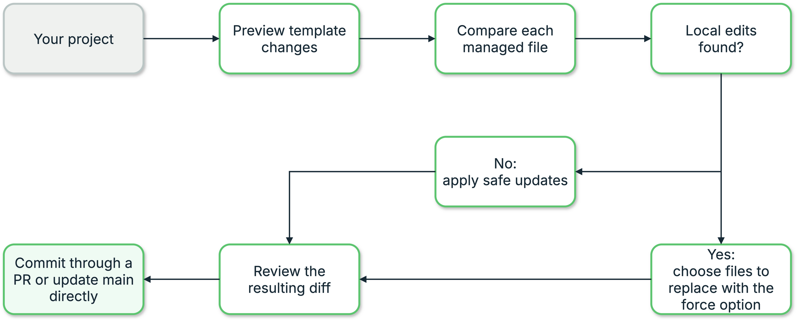

{{ heading_counter_reset(page) }}

# Staying in step with the template {: #tsync-staying-in-step }

A project generated from `prodockit-template` is a copy, not a link. The
moment it is created it starts to age: the template gains a CI fix, a
stylesheet rule, a newer Node pin, and the copy keeps the version it was
born with. Nothing tells you, because nothing breaks - the site still
builds, the PDF still renders, and the difference only shows up as a
document that looks slightly unlike everyone else's.

The \index{commands!`prodockit template-sync`} command closes that gap without touching a word of your
writing.

\ref{fig-template-sync-decision} follows each managed file from the preview to
the default review workflow. An unchanged local file takes the safe-update
path; a file with local edits is preserved unless the author explicitly
chooses the template copy with `--force`. Both paths rejoin as one consistent
update, which `--apply` commits to a separate branch and sends for review.

{ .documentation-diagram }
/// figure-caption
    attrs: {id: fig-template-sync-decision}

Template-sync decision flow
///

Use it periodically while a project is active and before a final release. A
long gap is supported, but it produces a larger change that is harder to
review and more likely to combine a CI migration with a visual change.

## Choose how far the command should go

The progression from preview to a pushed update is shown in
\ref{tab-devcons-template-sync-choose-how-far-the-command-should-go}.

| Command {: width="52%" } | What it does | When to use it |
|:---|:---|:---|
| `prodockit template-sync` | Shows what needs updating, without changing the project | Start here |
| `prodockit template-sync --verbose` | Shows the same preview with technical details and file paths | You are investigating a particular file or reporting a problem |
| `prodockit template-sync --apply` | Makes and saves the changes on a separate branch, sends it to the host, and creates a GitLab merge request | Your project uses a pull request (GitHub) or merge request (GitLab) |
| `prodockit template-sync --apply --push` | Makes the changes and, after asking you, updates `main` directly | Your usual practice is to update `main` without a pull or merge request |
| `prodockit template-sync --apply --local-only` | Applies and stages the changes without committing or sending them | You are comfortable finishing the Git workflow yourself |
| `prodockit template-sync --apply --force FILE-PATH` | Also replaces the named file even though it differs from the template | You have checked that file and want the template's complete version |
/// table-caption | <
    attrs: {id: tab-devcons-template-sync-choose-how-far-the-command-should-go}

Choose how far the command should go
///

If you are unsure, use the first command in
\ref{tab-devcons-template-sync-choose-how-far-the-command-should-go}. It is only
a preview. The output tells
you whether an update is available and which command to run next.

The preview also checks the version of prodockit installed in the activated
project environment against the latest release on PyPI and the minimum needed
by the template. If a newer version is needed, it shows the installed and
available versions and the exact `python -m pip install --upgrade ...` command
to run. This is advice rather than an automatic package installation, so you
remain in control of the project's environment. An apply that needs the newer
version stops before changing anything: this prevents an older installed
package from supplying styles that do not belong with the incoming template.
If PyPI cannot be reached, the template check continues and only the
latest-release part of the package check is omitted.

The same preview checks every Prodockit and Zensical declaration in the
project. During apply, requirements files and build workflows are moved to the
same version while keeping their existing operators and extras. A project
already using a newer compatible version is never downgraded. Files declared
in `.prodockit-shared-files.toml`, including the managed website and PDF
stylesheets, are refreshed from the installed Prodockit release and included
in the same review request. The MR therefore contains a complete, internally
consistent update rather than only the files copied directly from the
template.

The same check maintains the `extra_css`, `extra_javascript`, and
`pdf_extra_css` lists in `zensical.toml`. Missing template entries are restored
in cascade order, cache-key changes replace the older form of the same path,
and additional project entries are retained. If `extra.css`, `print.css`, or
`extra.js` is missing, the template's starter copy is added. Once present,
those three files belong to the author and `template-sync` never replaces
their contents, including in projects made from an older template manifest.
Managed PDK assets follow the shared-file rule instead: a
missing or outdated copy is refreshed from the installed Prodockit release.

Use `--apply` on its own when changes normally reach `main` through a pull
request or merge request. On GitLab, the merge request is created for you; you
only need to review and approve it. On GitHub, the branch is sent and the
command gives you the page that opens the pull request. Use `--apply --push`
only when your usual practice is to update `main` directly. It cannot bypass a
protected branch.

## Complete a template update

Work from the project environment, preview what changed upstream, and resolve
each author-edited file before rebuilding and publishing.

/// steps

//// step | Open the project and activate its environment

<div class="pdf-keep-tab-pages" markdown="1">

=== ":material-apple: macOS / :material-linux: Linux"

    ```bash
    cd path/to/your-project
    source .venv/bin/activate
    ```

=== ":fontawesome-brands-windows: Windows"

    In PowerShell:

    ```powershell
    cd path\to\your-project
    .\.venv\Scripts\Activate.ps1
    ```

</div>

Replace `path/to/your-project` with the folder containing your project. The
folder must be the top level of the project, where the `.git` directory,
`.venv` directory, and `zensical.toml` file are located. The prompt normally
starts with `(.venv)` after activation.

////

//// step | Check the project and preview the update

```bash
git status --short
prodockit template-sync
```

Run `template-sync` from the activated project environment. This uses the
version of prodockit installed for that project and keeps the command aligned
with the project's other build tools.

You can have unfinished writing in your chapters. The command will stop only if
a file supplied by the template has uncommitted changes, because updating that
file could hide work you have not saved in Git. Read the short summary and pay
particular attention to any files described as "your edited files".

////

//// step | Resolve any protected files

If the preview lists an edited template file, decide whether to keep your copy
or replace it. To replace it, add the `--force FILE-PATH` shown by the preview
to the apply command. The normal apply route stops before changing anything
until every such file has a decision, so the resulting request is ready to
approve rather than containing unresolved `.new` files.

////

//// step | Apply and send the update for approval

```bash
prodockit template-sync --apply
```

The command makes a separate `template-update-...` branch, applies the changes,
saves them as one commit, and sends the branch to GitHub or GitLab. On GitLab it
also creates the merge request. It prints a link to the review page, and no Git
commands are needed.

////

//// step | Review, test, and approve

```bash
zensical build --clean --strict
prodockit pdf
```

Use the printed link to open the pull request or merge request. Review the file
changes and wait for its automated checks. If you also test locally, run the
commands above from the update branch. When the results are satisfactory,
approve and merge the request in the website.

If your project deliberately updates `main` directly without review, use this
alternative apply command instead:

```bash
prodockit template-sync --apply --push
```

It shows the commit, merge, and push it proposes and asks before doing them.

////

//// step | Confirm the next run is clean

After the update reaches `main`:

```bash
prodockit template-sync
```

“Your project is already up to date with the template” is the verification. If
changes are still shown, check for an unresolved `.new` file or an edited file
you deliberately kept.

////

///

### When only prodockit needs upgrading {: #tsync-package-only }

Sometimes a release changes the prodockit package but none of the files owned
by the template. In that case the preview says that no template files need
changing and gives you the package upgrade command. There is no template
change to commit or push.

After upgrading, start the **Pages** or **documentation** pipeline in GitHub or
GitLab. This manual rebuild is still necessary: it republishes the website and
PDF using the newer prodockit package. A successful local upgrade alone does
not replace outputs that were already published.

## What it will and will not write {: #tsync-what-it-writes }

The split is decided by a **manifest** that lives in the template, not by
the command, and every file the template ships is classified in it. A file
that is in neither list stops the run rather than being guessed at.

\ref{tab-devcons-template-sync-what-it-will-and-will-not-write} explains how template-sync treats managed, author-owned, generated, and unclassified files.

| Group | Examples | What happens |
| --- | --- | --- |
| Template-owned | `.github/workflows/`, `docs/stylesheets/template.css`, `macros.py`, `tools/` | Replaced, unless you have edited it |
| Project-owned | `docs/*.md`, `docs/assets/`, `docs/stylesheets/extra.css`, `docs/stylesheets/print.css`, `docs/javascripts/extra.js`, `bibliography.bib` | Missing starter assets are created once; existing files are never replaced |
| Seeds | `.vale.ini`, starter pages | Written only if absent |
| Shared | `.gitignore`, `zensical.toml`, dependency declarations, packaged stylesheets | Settings and asset lists are merged; Prodockit and Zensical versions are aligned across requirements and CI; declared shared files are refreshed from the installed release |
| Excluded | `CONTRIBUTING.md`, issue templates | Not delivered at all |
/// table-caption | <
    attrs: {id: tab-devcons-template-sync-what-it-will-and-will-not-write}

What it will and will not write
///

The ownership groups in
\ref{tab-devcons-template-sync-what-it-will-and-will-not-write} set the write
boundary. Within the shared `zensical.toml`, an existing `project.extra.pdf_*`
value is
author-owned. Template sync adds a PDF parameter introduced by a newer
template when the project does not have it, but never overwrites an existing
page size, margin, duplex-layout, header/footer, stylesheet, output-path, or
future PDF setting. Those values describe the document the author intends to
publish; restoring defaults such as A4 paper and 2 cm margins would be a
content-changing operation, not maintenance.

!!! warning "Your writing is not in scope"
    The report, its figures and its bibliography are never written, and
    never even read for comparison. A sync cannot lose your work because
    it never opens it.

## Running it {: #tsync-running-it }

Run it from the project's activated virtual environment and from the root of
the project - the directory containing `.venv` and `.git`. It refuses to run
from another directory rather than half-working, because every path it writes
is relative to where it started. The first step in
[Complete a template update](#complete-a-template-update) shows both commands
for macOS, Linux, and Windows.

```bash
prodockit template-sync
```

That is a preview: it applies no template change. It only updates the ignored
diagnostic log described below. Read the report, then:

```bash
prodockit template-sync --apply
```

`--apply` makes the changes on a separate branch, saves them as one commit, and
sends them for review. GitLab creates the merge request automatically. GitHub
receives the branch and the command prints the page for opening its pull
request. In either case the author does not need to enter Git commands.

Experienced Git users can preserve the old local-only stopping point:

```bash
prodockit template-sync --apply --local-only
```

This applies and stages the files but does not commit or send them.

### Showing technical detail with `--verbose` {: #tsync-verbose }

The normal report is intentionally short. It gives the number of files to add
or update and names only edited files that need your decision.

Add `--verbose` when you need to see how the result was reached:

```bash
prodockit template-sync --verbose
```

The detailed report includes the template source, the version used for the
comparison, how every template file is managed, every file to add or update,
and older template files that will be left alone. `--verbose` does not change
the project and can be combined with `--apply` if you want the same detail
while making the update.

Every run writes this full detail to `.prodockit-template.log`, even when you
do not use `--verbose`. If you need help with a run, share that log rather than
running the command again solely to collect the detail.

### The branch it works on {: #tsync-the-branch }

The branch is named after the template version you are moving from, so a
second run against the same version continues on the branch the first one
made rather than starting again.

That name outlives the run, though, and a branch left over from months ago
will not contain anything you have committed since. Continuing on it would
sync your project against older files and report success, so a leftover
branch that does not contain the commit you are on is refused:

```text
Error: the branch template-update-6fbbbbeb8 already exists and does not
contain the commit you are on, so continuing would run this against older
work. Merge it, or delete it with `git branch -D template-update-6fbbbbeb8`,
and run this again
```

You are left on the branch you were already on, with nothing written.

A follow-up run can also make a *second* branch, and that surprises
people. The name comes from the baseline you are moving from, so once a
run has recorded a stamp, the next one is moving from a different place
and branches accordingly - a `--force` run straight after an ordinary one
lands on `template-update-<new baseline>` rather than back on the first
branch.

Nothing is lost or duplicated: the second branch is made *from* the first,
so it contains it, and one merge picks up both. Merging them separately
just makes the first look like it did nothing.

### Updating `main` directly {: #tsync-push }

Use this route only if your normal practice is to update `main` without a
pull request or merge request:

```bash
prodockit template-sync --apply --push
```

The command applies the template changes on its separate branch, commits them,
merges them into `main`, and sends the updated `main` branch to GitHub or
GitLab. Sending `main` starts the automated build that republishes the site.

Before doing that, it shows a final summary and asks you to confirm:

```text
Ready to update the main project directly:
  Save this update as one commit (9 files).
  Add it to main.
  Send main to GitHub or GitLab, which starts the site build.
  This does not create a pull request or merge request.

Update the main project now? [y/N]:
```

Answer `y` to continue. Any other answer stops safely: the changes remain on
the separate branch and nothing is sent to GitHub or GitLab.

If your project normally uses a pull request or merge request, do **not** use
`--push`. Run `prodockit template-sync --apply`; it publishes the separate
`template-update-...` branch and prepares the review route for you.

!!! note "Uncommitted writing is fine"
    You do not have to commit your chapters first. A project being
    written always has work in progress, and it travels across the branch
    switch untouched. Only uncommitted changes to *template-owned* files
    stop a run, and those are refused earlier, before anything is written.

#### Updating `main` by hand {: #tsync-finish-by-hand }

If direct updates to `main` are allowed but you prefer to enter the Git
commands yourself, first use `--apply --local-only`, then enter these commands:

```bash
git commit -m "Sync with the template"
```

```bash
git checkout main && git merge --no-ff template-update-6fbbbbeb8
```

```bash
git push
```

Replace the example branch name with the branch printed by your run. The site
is rebuilt only after the updated `main` branch is pushed. Committing locally,
or pushing only the `template-update-...` branch, does not republish it.

!!! warning "This merges straight into your default branch"
    `--push` does not create a pull request or merge request and does not add a
    review or approval step. Use it only when direct updates are the normal
    practice for your project. If `main` is protected, the push will be
    rejected; use `--apply` on its own and open a pull request or merge request
    instead.

### A file you have edited {: #tsync-edited-files }

A template-owned file you have changed is *kept*, and the template's
version is written beside it as `<name>.new` for you to compare. Nothing
is overwritten silently.

If either managed stylesheet differs, the report adds a separate
**“Warning - managed stylesheet changes found”** message. [Stylesheets](../stylesheets.md)
explains the managed and author-owned files and their loading order. Move
deliberate website rules from `pdk.css` to `extra.css`, and deliberate PDF-only
rules from `pdk-pdf.css` to `print.css`. You can then use `--force` for each
managed file to restore Prodockit's current version without losing the rules
you moved.

**"Edited" does not always mean you changed it.** A file counts as edited
when it does not match the baseline the run settled on - which is equally
true of a file you customised and one you simply never received an update
for. The tool cannot tell those apart, and you usually can, at a glance:

```bash
diff .gitlab-ci.yml .gitlab-ci.yml.new
```

If the differences are all yours - your module code, your group, your
wording - keep what you have. If they are all *the template's own
history* - newer pins, a step you have never seen, a comment referring to
an issue you did not raise - then you are simply behind, and taking the
template's version is right.

!!! example "What that looks like in practice"
    Syncing a real assignment repository, both files reported as edited
    turned out to contain nothing project-specific whatsoever. One was a
    `.gitlab-ci.yml` still pinning `prodockit==0.21.0` against the
    template's `0.39.0`, missing a `prodockit init-mathjax` step added
    months earlier - so every page that pipeline had built showed raw TeX
    instead of maths. Neither file had been edited at all; both had just
    never been updated.

#### Taking the template's version {: #tsync-force }

Use `--force` only for files whose local contents should be replaced completely
by the template copy:

```bash
prodockit template-sync --apply --force .gitlab-ci.yml --force .github/workflows/docs.yml
```

Three things to know about `--force`:

- **Exact paths, one flag each.** No globs, and no bare `--force` meaning
  "everything". That friction is the point: this is the only option that
  can overwrite your own work, so each file is named deliberately.
- **Paths are as the report prints them**, relative to the project root. A
  leading `./` is tolerated; anything else will not match.
- **A `--force` that matches nothing is ignored**, not warned about. Check the
  summary: the file should move from “Your edited files to keep” to “Your
  edited files to replace”.

#### Then delete the sidecars {: #tsync-sidecars }

Once you have taken the template's version, the `.new` file beside it is
byte-identical to the real one and has no further use. **The tool will not
remove it** - it never deletes anything from your project - so it lingers,
and gets committed:

```bash
git rm .gitlab-ci.yml.new .github/workflows/docs.yml.new
```

If you decided to keep *your* version instead, delete the sidecar just the
same once you have read it. Leaving it behind means the next reader cannot
tell whether it is a decision you made or one you have not got to yet.

### Where the template comes from {: #tsync-template-source }

By default it follows your `origin`: a project on Surrey's GitLab tracks
the Surrey mirror, because a student there may have no GitHub access at
all. Everything else tracks the canonical GitHub copy. Override it with
`--github` or `--surrey`, bare for that host's usual template or with a
`group/repo` to name another.

You do not need a copy of the template yourself. The first run clones it
into a cache - `~/Library/Caches/prodockit` on macOS, `~/.cache/prodockit`
on Linux, `%LOCALAPPDATA%\prodockit\cache` on Windows, or wherever
`PRODOCKIT_CACHE` points - and later runs bring that copy up to date. Each
host and namespace gets its own entry, so the Surrey and GitHub templates
never stand in for one another.

The line under the remote says which of three things happened:

\ref{tab-devcons-template-sync-where-the-template-comes-from} explains the three possible sources reported for the template checkout.

| | |
| --- | --- |
| `fetched just now` | first run - the template was cloned |
| `fetched, up to date` | the cached copy was brought current |
| `cached copy - could not reach the host…` | the host was unreachable; the run continued on what was already cached |
/// table-caption | <
    attrs: {id: tab-devcons-template-sync-where-the-template-comes-from}

Where the template comes from
///

The three source outcomes in
\ref{tab-devcons-template-sync-where-the-template-comes-from} are all real
answers. A run on a train still shows
you what your project would do - it just says plainly that the template
it compared against may be behind.

!!! note "A checkout beside your project wins"
    If a `prodockit-template` checkout sits next to the project, that is
    used instead of the cache. This is how the repositories are laid out
    during development, so a maintainer working across them gets the copy
    they are editing. `--template-path` names one outright.

## Running it through a project {: #tsync-repeatedly }

This is meant to be run repeatedly - every few weeks through a report's
development, not once at the start. Most of those runs find nothing, and
that case is the one built for.

A run with nothing to do says so and stops:

```text
Your project is already up to date with the template.
```

No branch, no staged change, nothing to commit. That matters more than it
sounds: a run that branched regardless left an empty branch behind, and
the branch name comes from the template version, so the *next* run found
it in the way.

When the template has moved on, the run branches, writes and stages as
usual. A file you have edited keeps its `.new` sidecar from the previous
run rather than being rewritten with identical bytes, so `git status` only
ever shows what genuinely changed.

!!! note "Simulated over six weeks"
    Six syncs across two template versions, with writing committed
    between each: two produced real updates and branched, four reported
    "already in step" and left the working tree clean. Two `.new`
    sidecars at the end - one per edited file, not one per run - all six
    chapters intact, and the recorded baseline moved forward with the
    template.

A template release that only reclassifies files leaves every file
identical, so nothing is written - but the recorded baseline still moves
forward, because leaving it stale would make the next run compare against
the wrong version and report unedited files as edited.

### Show the successfully applied release {: #tsync-applied-release }

The `.prodockit-template` stamp records two related values: the exact template
commit used for safe file comparison and the nearest template release tag.
Use `{{ applied_release }}` on a cover or information page
to show the latter. Bootstrap initialises it before separating a new project
from the template's Git history.

`template-sync` previews the release that would be recorded, but a preview,
failed run, or incomplete application does not advance it. A successful
`template-sync --apply` updates it alongside the managed files. The value
therefore answers which template fixes the project has successfully applied;
`{{ git.short_tag }}` answers the different question of
which tag belongs to the student's own repository.

### After a long gap {: #tsync-long-gap }

A project that has not synced for months takes every upstream release at
once. That is the point, but it is worth knowing before you look at the
result: in one real catch-up the CI pin moved from `prodockit==0.21.0` to
`0.39.0` and `zensical==0.0.53` to `0.0.55` in a single commit - eighteen
prodockit releases and two Zensical ones.

So after a large catch-up, **look at the built output**, not just at the
diff. If something in the site or the PDF renders differently, the
upstream jump is a far more likely cause than the sync itself, and
[version pinning and drift](pinning-drift.md) is the page that covers
comparing before and after.

## The log {: #tsync-the-log }

Every run - reporting or applying, succeeding or failing - appends a full
account of itself to `.prodockit-template.log`, and adds that file to
`.gitignore` if it is not already there.

```text
=== 2026-08-19T14:37:35+01:00  started  prodockit template-sync
Template source: git@gitlab.surrey.ac.uk:mb0105/prodockit-template.git

  Template-managed files: 15 (updated unless you changed them)
      .github/workflows/docs.yml
      ...
=== 2026-08-19T14:37:39+01:00  finished
```

Two things about it are deliberate:

- **It always holds the `--verbose` form**, listing every file, whatever
  the terminal was asked for. The run someone reports a problem with is
  almost always the one they ran with no flags at all.
- **It is written even when the run fails.** A run that stopped partway is
  the one most worth reading afterwards.

!!! tip "Reporting a problem"
    Send `.prodockit-template.log`. It carries the command line, both
    timestamps and the full classification, which is most of what anyone
    would otherwise have to ask you for.

Entries are appended, never overwritten, so the log is a history rather
than a snapshot. Delete it whenever you like; the next run starts a new
one.
