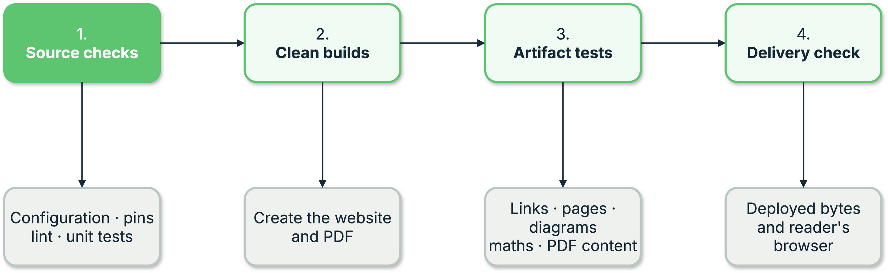

{{ heading_counter_reset(page) }}

# Test the built output {: #testing-testing-your-built-site }

\index{`prodockit.testing`} gives a project \index{pytest} fixtures pointing at its own
*built* output - the site directory and the PDF - plus checks for the
failure modes that are the same in every prodockit project.

Install it with:

```bash
pip install prodockit[testing]
```

The fixtures test artifacts that already exist; they never build anything.
Run your builds first:

```bash
prodockit pdf
zensical build --clean --strict
python -m pytest
```

{ .documentation-diagram }
/// figure-caption
    attrs: {id: fig-output-testing-layers}

Built-output testing layers
///

## Quick start {: #testing-quick-start }

No `conftest.py` wiring is needed - the fixtures register themselves
through pytest's plugin entry point:

```python
from prodockit.testing import assert_no_unrendered_mermaid, assert_no_unrendered_tex
from prodockit.testing import assert_project_integrity


def test_the_source_project_is_complete():
    assert_project_integrity()


def test_the_pdf_built(prodockit_pdf):
    assert prodockit_pdf.page_count > 5


def test_diagrams_and_maths_actually_rendered(prodockit_pdf_page_texts):
    assert_no_unrendered_mermaid(prodockit_pdf_page_texts)
    assert_no_unrendered_tex(prodockit_pdf_page_texts)
```

`assert_project_integrity()` checks the source project before a successful
build can conceal missing inputs. It verifies local website and PDF style
sheets and scripts, navigation pages, Markdown images, an explicitly selected
CSL file, configured Mermaid and maths renderers, and Prodockit syntax whose
extension has been switched off. Remote CSS, JavaScript and images are outside
this local check; URL fragments such as `#only-light` are removed before a
local image path is checked.

The same checks are available without pytest:

```bash
prodockit config --check
```

This also rejects stale, misspelled or invalid Prodockit settings. It reads the
project only; it does not build, commit or change anything.

## Why the rendering checks exist {: #testing-why-rendering-checks }

`prodockit.pdf` pre-renders Mermaid diagrams and TeX maths to static
images, because WeasyPrint has no JS engine. When a renderer isn't
installed, the content is left exactly as it is rather than failing the
build - the right default for a project using neither feature, and a
silent disaster for one that does.

Three separate projects published PDFs containing raw `flowchart LR ...`
source and literal LaTeX before anyone noticed.
[`prodockit pdf` warns about it](../pdf.md#mermaid-diagrams-and-tex-maths)
since 0.12.0, but a warning in build output is easy to scroll past. These
checks turn it into a test failure.

They are deliberately narrow about what counts as evidence. Several Mermaid
diagram types are also ordinary English words - `graph`, `pie`, `journey`,
`timeline` - and line breaks in a PDF fall wherever the text happens to
wrap. A check that flagged any line starting with one of those read "a
visual commit graph and richer history browsing" as an unrendered diagram,
passing locally and failing in CI only because different fonts there wrapped
the sentence differently. So a diagram-type keyword is only evidence when
Mermaid's own link syntax follows shortly after it.

## Fixtures {: #testing-fixtures }

All are session-scoped and prefixed `prodockit_`, so they can't collide
with names in your own `conftest.py`.

| Fixture | What it gives you |
| --- | --- |
| \index{prodockit.testing!fixtures!`prodockit_paths`} | Resolved `root`, `config_file`, `docs_dir`, `site_dir`, `pdf` |
| \index{prodockit.testing!fixtures!`prodockit_config`} | Your Zensical config as plain parsed TOML |
| \index{prodockit.testing!fixtures!`prodockit_resolved_config`} | The same, through Zensical's own loader - `nav` resolved to a tree |
| \index{prodockit.testing!fixtures!`prodockit_nav_pages`} | Every nav markdown file, `docs_dir`-relative, in nav order |
| \index{prodockit.testing!fixtures!`prodockit_pdf`} | The built PDF, opened with `pymupdf` |
| \index{prodockit.testing!fixtures!`prodockit_pdf_page_texts`} | The PDF's text, one string per page |
| \index{prodockit.testing!fixtures!`prodockit_site_dir`} | The built site directory |
| \index{prodockit.testing!fixtures!`prodockit_site_html_files`} | Every built HTML page, sorted |
| \index{prodockit.testing!fixtures!`prodockit_soup_for`} | Factory: parses one built HTML file with BeautifulSoup |
/// table-caption | <
    attrs: {id: tab-devcons-testing-fixtures}

Fixtures
///

Paths come from your config rather than an assumed layout: `site_dir`
defaults to `site` but is commonly set to `public`, and the PDF follows
`pdf_output` when you set it.

## Configuration {: #testing-configuration }

Two `pytest` ini options, both usually unnecessary:

| Option | Default | Purpose |
| --- | --- | --- |
| `prodockit_config_file` | `zensical.toml` | Your Zensical config, relative to the pytest rootdir. |
| `prodockit_pdf` | from the config | Override the PDF location. |
/// table-caption | <
    attrs: {id: tab-devcons-testing-configuration}

Configuration
///

```ini
[pytest]
prodockit_pdf = dist/report.pdf
```

!!! note "Paths resolve against pytest's rootdir"

    Not against the test file. If your tests live outside the project root,
    or you invoke `pytest` from elsewhere, set `prodockit_config_file` or
    pass `--rootdir`.

## Checks {: #testing-checks }

From `prodockit.testing`:

| Function | Purpose |
| --- | --- |
| `assert_project_integrity(config_file="zensical.toml")` | Fails once with every missing source input or disabled extension. |
| `find_project_problems(config_file="zensical.toml")` | Returns the individual project integrity problems for custom assertions. |
| `assert_no_unrendered_mermaid(page_texts)` | Fails if any page carries raw Mermaid source. |
| `assert_no_unrendered_tex(page_texts)` | Fails if any page carries raw TeX. |
| `find_unrendered_mermaid_pages(page_texts)` | The offending page indexes, for a custom message. |
| `find_unrendered_tex_pages(page_texts)` | As above, for maths. |
| `contains_unrendered_mermaid(text)` | Single-page predicate. |
| `contains_unrendered_tex(text)` | Single-page predicate. |
/// table-caption | <
    attrs: {id: tab-devcons-testing-checks}

Checks
///

Both assertions name the fix (`prodockit init-tools`) in their failure
message rather than only reporting the symptom.

Contributor guidance for keeping the automatically discovered plugin
lightweight lives under
[Development and code map](development.md#keep-the-pytest-plugin-lightweight).
