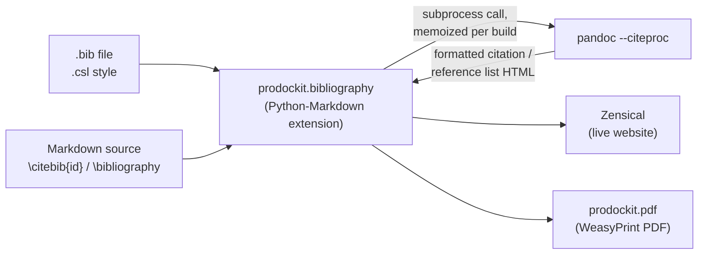

# Bibliography

`prodockit.bibliography` is an alternative to [prodockit.citations](citations.md):
define your sources once in a BibTeX/BibLaTeX `.bib` file, cite them by key
with `\citebib{id}` from anywhere in a build, and get a fully formatted,
sorted reference list generated for you - in any
[Citation Style Language (CSL)](https://citationstyles.org/) style (APA,
IEEE, Harvard, Vancouver, and hundreds more), the same open, actively-
maintained style ecosystem Zotero/Mendeley/EndNote already use.

Uses its own `\citebib{id}` syntax, deliberately distinct from
`prodockit.citations`' `\cite{id}` - the two can be enabled together in
the same build without conflict (this project's own docs do, to
demonstrate both side by side), though a typical single project only
needs one. Where `prodockit.citations` resolves a citation against a
hand-authored `data-cite-text` paragraph elsewhere in the document (you
write the formatted reference-list entry yourself, once, by hand),
`prodockit.bibliography` resolves against structured bibliographic data in
a `.bib` file and generates the formatted entry - inline citation and
reference-list entry alike - for you. See
[Comparing the two approaches](#comparing-the-two-approaches) below for the
full tradeoffs.

## Requirements {: #bibliography-requirements }

Citation/bibliography formatting is delegated entirely to
[Pandoc](https://pandoc.org/)'s own `--citeproc` (confirmed directly: a
plain `.bib` file plus a chosen `.csl` style produces correctly formatted,
sorted output with no custom code at all) rather than reimplemented here -
CSL processing (sorting, disambiguation, locale-specific formatting) is a
mature-tool-sized problem, the same reasoning
[prodockit.pdf](../pdf.md#limitations-and-workarounds) already gives for why
it feeds Pandoc real HTML instead of hand-translating every markdown
feature. This makes `pandoc` a required, on-`PATH` dependency for this
extension specifically - **including for a project that never builds a
PDF at all**, unlike every other prodockit extension, which needs nothing
beyond Python-Markdown itself:

```bash
brew install pandoc   # or see https://pandoc.org/installing.html
```

How the two tools relate: Zensical renders your site as usual, but each
time this extension resolves a `\citebib{id}` or `\bibliography` marker it
shells out to `pandoc --citeproc`, once per distinct citation and once for
the full reference list, each memoized for the rest of the build - Pandoc
never sees, and has no part in rendering, anything else on the page:



## Quick start {: #bibliography-quick-start }

Enable it in `zensical.toml`, pointing `bib_file` at your own `.bib` file
(a path relative to wherever `zensical build`/`zensical serve` is run
from - typically your project root):

```toml
[project.markdown_extensions."prodockit.bibliography"]
bib_file = "references.bib"
```

```bibtex
<!-- references.bib -->
@book{chacon2014,
  author    = {Chacon, Scott and Straub, Ben},
  title     = {Pro Git},
  edition   = {2},
  year      = {2014},
  publisher = {Apress}
}
```

Cite it from anywhere with `\citebib{id}`:

```md
Git is a distributed version control system \citebib{chacon2014}.
```

renders to (default style shown; see
[Choosing a citation style](#choosing-a-citation-style) below):

```html
<p>Git is a distributed version control system <span class="prodockit-bib-cite"><a href="references.md#ref-chacon2014">(Chacon and Straub 2014)</a></span>.</p>
```

### The reference list

Put a bare `\bibliography` marker, alone on its own paragraph, wherever
you want the complete, formatted reference list to appear - typically a
dedicated References page, kept at the end of `nav` as an appendix, the
same convention `prodockit.citations`' own hand-authored references pages
already use:

```md
# References

\bibliography
```

Every entry in `bib_file` appears, in the order your chosen CSL style
sorts them (alphabetically by default) - not just the ones actually
cited, the same way LaTeX's `\nocite{*}` includes every `.bib` entry
regardless of whether it's cited in the document. A `\citebib{id}` written
on any page links directly to its own entry here, adjusted for that page's
own directory depth - a real Zensical clean-URL link like
`prodockit.refs`/`prodockit.citations` already build, not a bare `#id`
fragment that would 404 from a different page.

### Choosing a citation style

Point `csl_style` at any `.csl` file - your institution's own house style,
or one of the thousands available from the
[Citation Style Language project](https://github.com/citation-style-language/styles)
(the same repository Zotero/Mendeley pull styles from). This project's own
docs, and `prodockit-template`/`prodockit-userguide`'s hand-authored
references, already follow Cite Them Right Harvard - `harvard-cite-them-right.csl`
reproduces that exact style automatically:

```toml
[project.markdown_extensions."prodockit.bibliography"]
bib_file = "references.bib"
csl_style = "harvard-cite-them-right.csl"
```

renders (confirmed directly against the same `.bib` file used above):

```html
<p>Git is a distributed version control system <span class="citation">(Chacon and Straub, 2014)</span>.</p>
...
<div id="ref-chacon2014" class="csl-entry">
Chacon, S. and Straub, B. (2014) <em>Pro git</em>. 2nd edn. New York: Apress. Available at: <a href="https://git-scm.com/book">https://git-scm.com/book</a>.
</div>
```

- exactly the format already hand-typed throughout this project's own
reference lists, just generated instead. Leaving `csl_style` unset uses
Pandoc's own default (a Chicago author-date style) instead. Confirmed
directly: the exact same `.bib` file, with only `csl_style` changed,
produces correctly (and very differently) formatted output - author-date
parenthetical citations and a hanging-indent reference list for APA,
numbered `[1]` citations and a numbered list for IEEE, and so on - with no
other configuration.

### Unresolved citations {: #bibliography-unresolved-citations }

A key that doesn't resolve to a `.bib` entry renders the `unresolved`
marker (`?` by default), unlinked:

```md
\citebib{does-not-exist}
```

renders `?`, with no link.

## Reference {: #bibliography-reference }

### Syntax {: #bibliography-syntax }

```
\citebib{<id>}
```

Only a single key is supported - unlike `prodockit.citations`'
`\cite{id1,id2,...}`, a multi-key citation isn't matched by this
extension's own syntax at all (falls through as literal text, a visible,
honest "not supported" rather than a silently wrong result) - see
[Comparing the two approaches](#comparing-the-two-approaches) for why.

Like [prodockit.citations](citations.md#citations-syntax), `\citebib{...}` is
recognised the same way Python-Markdown's own inline syntax is, so it's
protected inside inline code spans and fenced code blocks.

### Options {: #bibliography-options }

| Option | Type | Default | Description |
|---|---|---|---|
| `bib_file` | `str` | `"references.bib"` | Path to a BibTeX/BibLaTeX `.bib` file, relative to wherever `zensical build`/`zensical serve` (or your own script) is run from. |
| `csl_style` | `str` | `""` (Pandoc's own default) | Path to a Citation Style Language (`.csl`) file. |
| `unresolved` | `str` | `"?"` | Text rendered for a `\citebib{id}` key that doesn't resolve to a `.bib` entry. |
| `source` | `str` | `""`, auto-detected under Zensical | Identifier for the current document, used to build a correct link from `\citebib{id}` to `\bibliography`'s own page. |

### CSS hooks {: #bibliography-css-hooks }

| Element | Condition | Hook |
|---|---|---|
| `<span>` wrapping a resolved `\citebib{id}` | always | `class="prodockit-bib-cite"` |
| `<span>` wrapping an unresolved `\citebib{id}` | always | `class="prodockit-bib-cite prodockit-bib-cite-unresolved"` |
| Each generated reference-list entry | always | `class="csl-entry reference"` |

Every generated reference-list entry also gets `class="reference"` (in
addition to Pandoc's own `csl-entry`) - matching the class
`prodockit.citations`' own hand-authored entries already use, so
[`prodockit.zensical_macros`](../macros.md)' `reference_style()`/
[prodockit.pdf](../pdf.md)'s own `reference_style` setting apply uniformly,
whether an entry was hand-typed or generated.

## Comparing the two approaches

Both extensions solve the same problem - cite a source by key, get a
formatted reference list - but make a fundamentally different tradeoff
about where the formatted text comes from.

| | [prodockit.citations](citations.md) | prodockit.bibliography |
|---|---|---|
| Source of truth | A hand-typed paragraph, once, tagged `data-cite-text` | A `.bib` file entry |
| Reference list | You write it, by hand, in full | Generated automatically |
| Citation style | Whatever you typed - one style, fixed | Any CSL style, swappable via one setting |
| Multi-key citations (`\cite{a,b}`) | Yes - each key individually linked | Not supported (falls through as literal text) |
| External dependencies | None | `pandoc` on `PATH`, even without a PDF build |
| Editing a reference | Edit the prose by hand, on the references page | Edit the `.bib` entry once, everywhere it's cited updates |

**Where `prodockit.citations` fits best**: a short reference list, a house
style unlikely to ever change, or a project that doesn't want a `pandoc`
dependency for its website build at all (only for its optional PDF, via
[prodockit.pdf](../pdf.md), which already needs `pandoc` anyway).

**Where `prodockit.bibliography` fits best**: a longer, actively-maintained
reference list; needing to match a specific institution's CSL style (or
switch between several, e.g. a thesis needing IEEE for one chapter's
publications list and Harvard for the rest of the document - one `.bib`
file, several instances with different `csl_style` values); or wanting a
citation added anywhere in the document to also add it to the reference
list, correctly formatted, with no hand-typing at all.

### What this project's own template and user guide currently do

Neither has adopted `prodockit.bibliography` yet - both
[prodockit-template](https://github.com/buckwem/prodockit-template) and
[prodockit-userguide](https://github.com/buckwem/prodockit-userguide) use
`prodockit.citations`' hand-authored approach exclusively: a
`references.md` page listing each source as its own hand-typed paragraph,
tagged `{: #id .reference data-cite-text="..." }`. This is a reasonable,
deliberate choice for both - each is a short, relatively static reference
list (around ten entries), and neither wants a `pandoc` dependency added
to its website build purely for citations (`prodockit-userguide` in
particular has no PDF build at all today, so `pandoc` would otherwise be
an entirely new requirement). A project outgrowing that - a longer,
frequently-updated bibliography, or needing to match a specific CSL style
- is exactly the case `prodockit.bibliography` is built for instead.

## Status {: #bibliography-status }

New, less battle-tested than `prodockit.citations` - no formal, versioned
public API stability contract yet (see
[prodockit-extensions#7](https://github.com/buckwem/prodockit-extensions/issues/7)).
