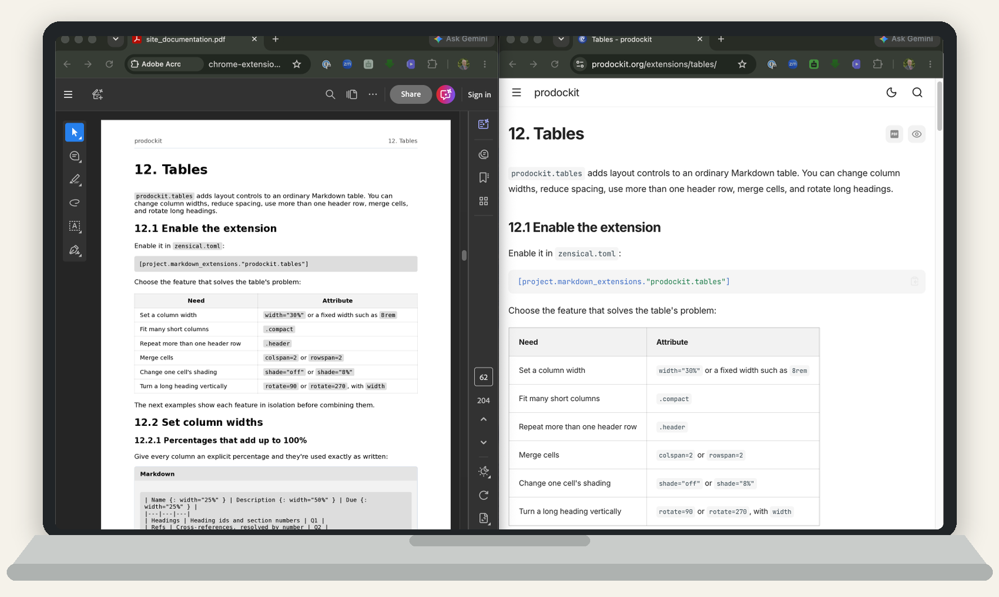

{{ heading_counter_reset(page) }}

# PDF generation {: #pdf-pdf-generation }

`prodockit.pdf` builds a standalone PDF from your Zensical site - the kind of
downloadable, submittable document professional and academic reports
commonly need alongside the website itself. It reads the same
`zensical.toml` your site already has, so there's nothing new to learn or
configure beyond a couple of optional settings.

\ref{fig-website-and-pdf-example} shows the same authored table in the two
outputs.

{ .documentation-diagram }
/// figure-caption
    attrs: {id: fig-website-and-pdf-example}

The same source rendered as a website and PDF
///

## Build your first PDF

Follow these steps from the project root—the directory containing
`zensical.toml`:

/// steps

//// step | Check how the project was prepared

There are three valid setup routes. Bootstrap and Adoption prepare the Python
project environment but do not install PDF runtimes or operating-system
libraries. `pdk pdf` owns its project-local runtimes. Manual installation gives
the author direct control of every dependency. Use the matching row under
[Prepare the PDF tools](#pdf-requirements) before continuing.

////

//// step | Configure only what the document needs

The defaults produce an A4 PDF containing every page in `nav`, in the same
order, at `docs/site_documentation.pdf`. Continue without adding settings for
a first build. Use [Configure the PDF](#pdf-quick-start) only when the document
needs a different output path, page size, margins, a single-page build, or
another optional layout feature.

////

//// step | Build the website strictly

```bash
zensical build --clean --strict
```

The PDF command consumes this completed website. Building it first also makes
broken links, missing anchors, and other Zensical validation failures stop the
process before a PDF is produced.

////

//// step | Build and inspect the result

Run the \index{commands!`prodockit pdf`} command:

```bash
prodockit pdf
```

Open the PDF and check its cover, contents, headings, page breaks, diagrams,
and final page before changing any layout setting.

The command reads the rendered articles from the configured `site_dir`; it
does not invoke or clean Zensical. Rebuild the website first whenever its
Markdown, configuration, templates, or assets have changed.

////

///

## Prepare the PDF tools {: #pdf-requirements }

The command uses [Pandoc](https://pandoc.org/) to assemble the document and
[WeasyPrint](https://weasyprint.org/) to draw the pages. What remains to be
installed depends on the route used to prepare the project:

\ref{tab-pdf-prepare-the-pdf-tools} shows which installation route supplies the PDF tools and what, if anything, remains to be installed manually.

| Setup route {: width="28%" } | PDF preparation |
|---|---|
| [Bootstrap](devcons/bootstrap.md) | Prepares the Python project environment; `pdk pdf` prepares its project-local runtimes on first use. |
| [Adoption](adopt.md) | Aligns the active Python environment and records selected components; `pdk pdf` prepares their runtimes. |
| [Manual installation](installation.md) | Install the PDF dependencies the document uses by following the operating-system instructions below. |
/// table-caption | <
    attrs: {id: tab-pdf-prepare-the-pdf-tools}

Prepare the PDF tools
///

Activate the project's virtual environment, then use the instructions for its
operating system when the route above requires them:

Pandoc and the Inter/JetBrains Mono PDF fonts require no host installation.
The first applicable build downloads verified archives into
`.prodockit/cache/pdf/`; bibliography-only use prepares Pandoc without fonts.
To force preparation before a build, run:

```bash
pdk pdf --prepare pandoc --prepare fonts
```

=== ":material-apple: macOS"

    Install Homebrew first if `brew` is not already available:

    [:simple-homebrew: Install Homebrew](https://brew.sh/){ .md-button .homebrew-button target="_blank" rel="noopener" }

    ```bash
    brew install pango
    pip3 install weasyprint
    ```

=== ":fontawesome-brands-windows: Windows"

    No MSYS2, Pango installation, PATH change, registry change, or Python
    WeasyPrint package is required for the Windows x64 PDF engine. Prepare the
    official verified runtimes explicitly, or let the first PDF build do it:

    ```powershell
    pdk pdf --prepare pandoc --prepare fonts --prepare weasyprint
    ```

    The runtime is cached beneath `.prodockit/cache/pdf/` for this project.

=== ":material-linux: Linux (Ubuntu)"

    ```bash
    sudo apt install libpango-1.0-0 libpangoft2-1.0-0 libharfbuzz-subset0
    pip install weasyprint
    ```

!!! note "If pip or pip3 does not work"

    If `pip` does not work, try `pip3`; if `pip3` does not work, try `pip`.
    Keep the intended virtual environment active and check that the alternative
    command belongs to it before installing packages.

Prepare and verify the exact supported Pandoc in the project-local PDF cache:

```bash
pdk pdf --prepare pandoc
```

`pdk pdf` performs the same preparation transparently before a build. On macOS
and Ubuntu, also verify the system-backed Python renderer with
`python -c "import weasyprint; print(weasyprint.__version__)"`. On Windows
x64, use `pdk pdf --prepare weasyprint`; it validates the cached standalone
CLI by rendering a smoke-test PDF.

If either command fails, use [Fix common PDF build problems](#pdf-common-problems)
rather than changing PDF layout settings.

A [back-of-book index](extensions/index-terms.md#index-terms-requirements)
also needs `pymupdf`. Install `prodockit[index]` only when the document enables
the PDF index:

=== ":material-apple: macOS"

    ```bash
    pip3 install "prodockit[index]"
    ```

=== ":fontawesome-brands-windows: Windows"

    ```powershell
    pip install "prodockit[index]"
    ```

=== ":material-linux: Linux (Ubuntu)"

    ```bash
    pip install "prodockit[index]"
    ```

!!! note "If pip or pip3 does not work"

    If `pip` does not work, try `pip3`; if `pip3` does not work, try `pip`.
    Keep the intended virtual environment active and check that the alternative
    command belongs to it before installing packages.

### Add Mermaid diagrams or TeX maths only when used {: #mermaid-diagrams-and-tex-maths }

\index{WeasyPrint} does not run browser JavaScript. ProDockit therefore
prepares a verified Python-only \index{Mermaid} runtime in the project cache
and turns diagrams into static SVG before \index{Pandoc} assembles the
document. It needs no Node.js, npm, browser, MSYS2 or virtual-environment
package installation.

TeX maths uses a verified project-local MathJax 4 distribution. Its adapter
currently requires Node.js on `PATH`, but it needs no npm package installation.
Both renderers are prepared transparently only when the built content uses
them. Prepare them in advance when required:

```bash
pdk pdf --prepare mermaid --prepare mathjax
```

The command validates an existing healthy cache without contacting the network.
Website mathematics remains separately configured by the author using the
[Zensical MathJax instructions](https://zensical.org/docs/authoring/math/#mathjax).

Once installed, ordinary Markdown maths works in both outputs. For example,
the inline formula $c = \sqrt{a^2 + b^2}$ and the display formula below are
rendered by MathJax on the website and embedded as static SVG in the PDF:

$$c = \sqrt{a^2 + b^2}$$

Build the PDF and inspect at least one real diagram or formula. If source text
appears instead of rendered output, see
[A diagram or formula remains as source](#pdf-unrendered-source).

## Configure the PDF {: #pdf-quick-start }

Website and shared authoring settings are read from `zensical.toml`; PDF-only
policy is read from the adjacent `pdk-pdf.toml`. Nothing is passed on the
command line beyond, optionally, which Zensical config file to use:

```bash
prodockit pdf --config-file zensical.toml   # -f for short; this is the default
```

### Building a single file

To include just one Markdown file in the PDF - a single chapter, say, rather
than the whole document - pass `--markdown-file` (`-m` for short), a path
relative to `docs_dir`:

```bash
prodockit pdf --markdown-file chapter1.md   # -m for short
```

This narrows the PDF's contents; it does not rebuild or narrow the website.
Run the complete strict Zensical build first, then `prodockit pdf` reads only
the requested page from that generated output. `nav` is therefore ignored for
selecting the PDF pages, while fonts, page size, margins,
`heading_numbering`, and the rest still come from
`zensical.toml` exactly as they do for a full PDF. The output defaults to that
file's own name with a `.pdf` extension inside `docs_dir` (for example,
`docs/chapter1.pdf`) instead of `site_documentation.pdf`, unless
`[document].output` is set, in which case that always wins.

Most of what the PDF needs, it already gets from settings your site likely
has for other reasons: `site_name`, `copyright`, `repo_url`, `docs_dir`,
`theme.font.text`/`.code`, `theme.icon.admonition`, and `extra_css` - your
site's own stylesheet(s) are passed straight through, so a `@media print`
rule (e.g. hiding a website-only "Download PDF" link/button, since
WeasyPrint always renders in print mode) applies in the PDF too. The rest
lives in `pdk-pdf.toml`, all optional:

Run `prodockit config` to see these values resolved for the current project,
including which came from `pdk-pdf.toml`, a deprecated Zensical fallback, or
a default. Use
`prodockit config --check` to reject obsolete, misspelled or invalid Prodockit
settings and missing local project inputs instead of letting a successful
build conceal a fallback or incomplete document. The complete project checks
are described under [Test the built output](devcons/testing.md#testing-quick-start).

Projects created before this boundary can continue reading
`project.extra.pdf_*` values. Run `pdk adopt` to copy those values into the
matching `pdk-pdf.toml` tables and remove the old keys. An explicit value
already present in `pdk-pdf.toml` wins, so adoption preserves the newer policy;
running the migration again makes no further change. The legacy reader is a
deprecated upgrade bridge, not a second writer.

\ref{tab-pdf-building-a-single-file} compares a single-page diagnostic build with the checks performed for a complete document.

| Setting {: width="35%" } | Default | What it does |
|---|---|---|
| `[document].output` | `"<docs_dir>/site_documentation.pdf"` | Where the PDF is written. |
| `[document].copyright` | falls back to `project.copyright` | Overrides `copyright` for the PDF's own footer only - see [Copyright text](#copyright-text). |
| `[document].page_size` | `"A4"` | Any WeasyPrint-supported CSS page size (`"Letter"`, ...). |
| `[margins].top` / `.right` / `.bottom` / `.left` | `"2cm"`, except `.bottom` at `"2.5cm"` | Page margins, as CSS lengths. The bottom is deeper because the running footer sits in it - see [Copyright text](#copyright-text). |
| `[document].double_sided` | `false` | Duplex-printing layout - see [Double-sided (duplex) printing](#double-sided-duplex-printing). |
| `[margins].inner` / `.outer` | `"2cm"` each | Spine-side/fore-edge margins, used instead of `.left`/`.right` when double-sided layout is on. |
| `[header_footer].font_size` / `.color` / `.divider_color` | `"10pt"` / `"#555555"` / `"#e2e8f0"` | Running header/footer styling. |
| \index{PDF settings!`heading_numbering`} | `true` | Chapter/appendix numbering on headings and captions. |
| \index{PDF settings!`reference_style`} | `"european"` | `"european"` (tight, single-line citation entries) or `"global"` (double-spaced, hanging indent - the common APA/MLA/Chicago style). |
| `[table_of_contents].include` | `true` | Whether to generate and insert a table of contents. |
| `[table_of_contents].title` | `"Table of Contents"` | That page's own heading text. |
| `[document].extra_css` | none | A list of `docs_dir`-relative stylesheet paths, same shape as `extra_css` above but meant *only* for the PDF. The standard order is managed `pdk-pdf.css` followed by author-owned `print.css`; both are loaded after the renderer foundations and the website styles, so `print.css` has the final say at equal specificity. |
/// table-caption | <
    attrs: {id: tab-pdf-building-a-single-file}

Building a single file
///

A page's own front matter
\index{PDF settings!`pdf_include`}`pdf_include: false` keeps that page on the
website but omits it from a complete, navigation-driven PDF. A single-page
`-m` build still includes the page because it was requested explicitly. For
example:

```yaml
---
pdf_include: false
---
```

A page's own front matter `is_appendix: true` gives it letter-based
numbering ("A", "A.1", ...) instead of numeric, matching
[prodockit.headings](extensions/headings.md)' own `appendix_attr` convention.
A page's own front matter `recto_title: "Short Title"` overrides its
running header text from the *next* page onward - see
[Double-sided (duplex) printing](#double-sided-duplex-printing). Your
`nav`'s index page can also use `{WORDCOUNT}`/`{REPOURL}`/`{RELEASE}`/
`{{ config.site_name }}` markers - see
[Cover page markers](#cover-page-markers).

### Web-only / PDF-only content

Mark any block or inline element `{.web-only}` (via
[`attr_list`](https://python-markdown.github.io/extensions/attr_list/)) for
content meant only for the live website - a "Download PDF" link/button is
the common case, since linking to the very PDF you're already reading
doesn't make sense once it's embedded in that PDF. `{.pdf-only}` is the
opposite: content meant only for the PDF, e.g. an automated word count or
release tag on a cover page that only makes sense in a standalone
document.

```md
[Download this page as PDF](chapter1.pdf){.web-only}

Word count: {WORDCOUNT}{.pdf-only}
```

`.web-only` needs no configuration - `prodockit.pdf`'s own generated CSS
always hides it, in every build, whether you're using `prodockit pdf` or
calling `build_pdf()` directly. `.pdf-only` is the one half prodockit can't
provide automatically (its own CSS has no reach into your live website),
so add this one line to your project's own website stylesheet:

```css
.pdf-only {
  display: none !important;
}
```

(see this project's managed `docs/stylesheets/pdk.css` for a working
example). If your project doesn't yet use `.pdf-only` for anything, there's
nothing to add until it does.

### Copyright text

`copyright` (a native Zensical setting, not one of prodockit's own -
see [Building a single file](#building-a-single-file) above) feeds both
the live website's own footer *and* the PDF's \index{running footer}, by
default - whatever you set once shows, unchanged, in both places.

`copyright` under `pdk-pdf.toml`'s `[document]` table overrides it for the PDF's own
footer only, leaving the website's copyright text completely untouched
either way. Unset by default, so an existing project's PDF and website
keep matching unless you deliberately add it - useful when you want the
PDF to show something the website version wouldn't make sense showing
(or vice versa), without having to keep two near-identical strings in
sync by hand.

Both values accept a real HTML fragment, the
same as Zensical's own website-side `copyright` setting already does -
a real `<a href="...">` link renders as a real, clickable link in the
PDF too, not flattened to plain text. Use a real `<br>` for a forced
line break. The obvious use: crediting the tools your report was built
with, on their own second line, without touching the copyright/licence
text itself:

```toml
[document]
copyright = 'Author: Jane Doe. Licensed under the MIT License.<br>Made with <a href="https://zensical.org/">Zensical</a> and <a href="https://prodockit.org/">prodockit</a>.'
```

Links and line breaks remain real PDF content rather than being flattened to
plain text. Contributors changing the footer implementation should read
[PDF pipeline and API](devcons/pdf-internals.md#preserve-real-footer-markup).

The outer footer prints the page count followed by `Updated on YYYY-MM-DD`.
Each source section carries its own date across all of its PDF pages. A
manually supplied `revision_date` or `git_revision_date_localized` takes
priority; otherwise Prodockit uses the newest Git author date, or the source
file's modification date when the document is not in Git. The cover,
contents, and generated index do not claim a section update date.

The equivalent website-side credit (if your project wants a "Made with
Zensical and *X*" line on the live site too) isn't a prodockit setting
at all - prodockit has no reach into the website's own Jinja partials.
It's a Zensical theme override instead: with `custom_dir` set (see
Zensical's own docs), drop your own `overrides/partials/copyright.html`
based on the bundled version, adding a second credit line after the
existing "Made with Zensical" one.


!!! note "Why the bottom margin is deeper than the others"
    The footer is top-aligned in the bottom margin and grows *downward* as
    it gains lines, so whatever the margin does not use is the space left
    before the paper edge. A two-line footer at a 2cm bottom margin ends
    about 6.1mm from the edge - inside the 5-6.4mm many consumer and office
    printers cannot print at all, so the second line risks being cropped
    even though the PDF itself is correct.

    `[margins].bottom` therefore defaults to `2.5cm`, which leaves about
    11.1mm. A footer of three or more lines needs more again: set
    `[margins].bottom` explicitly and check the result on paper, not just
    on screen.

### Cover page markers

Drop any of these literal strings into your `nav`'s index page - typically
a \index{cover page}, e.g. wrapped in `{.pdf-only}` as in the example above - and
`prodockit pdf` substitutes a real value once that page's HTML exists, no
configuration needed:

\ref{tab-pdf-cover-page-markers} lists the cover-page placeholders and the values substituted for them.

| Marker {: width="25%" } | Becomes |
|---|---|
| `{WORDCOUNT}` | The site-wide word count (the same value a `{{ word_count }}` website [macro variable](macros.md#variables) would show), so a submission's PDF and its live website page never disagree. |
| `{REPOURL}` | The git-detected repo URL (the same value `{{ repo_url }}` gives a website macro). |
| `{RELEASE}` | The latest published GitHub/GitLab release tag (e.g. `v1.2.0`). The *whole line* containing this marker is dropped instead if there isn't one - most projects never publish a release at all, so nothing shows a bare `"Release: "` label by default. |
| `{{ config.site_name }}` | Your project's own `site_name`, substituted literally - `prodockit pdf` never evaluates Jinja, so the exact same native Zensical expression works here too, one line of Markdown for both outputs. The former `{{ site_name }}` spelling remains accepted while projects migrate. |
/// table-caption | <
    attrs: {id: tab-pdf-cover-page-markers}

Cover page markers
///

Skipped entirely for a `--markdown-file`-scoped build, or if your `nav`
has only one page - there's no separate "cover" vs "content" to compute a
word count from either way.

### Landscape pages

Anything too wide for a portrait page - a reference table, a diagram, a
chart - can be given landscape page(s) of its own instead: wrap it (and
its own caption) in `<div class="landscape-page" markdown="1">`, using
[`md_in_html`](https://python-markdown.github.io/extensions/md_in_html/)
(the `markdown="1"` is required - without it, the content inside is left
as literal, unconverted text):

```md
<div class="landscape-page" markdown="1">

**A wide reference table**

| ID {: width="15%" } | Description {: width="70%" } | Due {: width="15%" } |
|---|---|---|
| 1 | ... | Q1 |

</div>
```

It is not limited to tables. A Mermaid diagram, an image, a wide code
block - whatever is in the block gets the page:

```md
<div class="landscape-page" markdown="1">


</div>
```

The content prints on its own landscape-sized page(s) - the same
configured page size, width and height swapped. A page break is always
forced immediately before and after the block, so it never shares a page
with anything else.

**Content longer than one page simply carries on.** A table spanning
several landscape pages repeats its header row on every one of them,
exactly as it would on a portrait page - measured directly: a 90-row
table produced five landscape pages, each carrying the header (see
[prodockit.tables](extensions/tables.md) for the `width` syntax above,
which works the same way here).

A document mixing portrait and landscape pages prints without any special
handling - a PDF reader rotates each page to fit the paper on its own.

This is PDF-only - the same wrapped content renders completely normally
on the live website, the same way `.web-only` content
elsewhere in this project only ever affects one of the two outputs.

### Syntax-highlighted code

Fenced code blocks use Zensical's light-theme syntax palette in the PDF, with
medium-weight characters and name tokens slightly darkened for print contrast.
The PDF conversion reuses the tokens produced for the website, so it does not
need to guess the language and
preserves the same distinction between keywords, names, operators and strings.
Plain code blocks remain plain. Inline and fenced code use Zensical's relative
`0.85em` scale, so their font size follows the surrounding text rather than
being fixed at an absolute point size.

If a block is not coloured on the website, add its language after the opening
fence (for example, `` ```toml ``). The PDF deliberately does not invent
highlighting that is absent from the generated website.

### Double-sided (duplex) printing

Set `double_sided = true` under `[document]` for a document meant
to be printed and bound on both sides - a book or handbook, rather than a
web-printed report. Left-hand (verso) and right-hand (recto) pages mirror
their header/footer content and page margins, and every numbered heading
starts its own recto page:

```toml
[document]
double_sided = true

[margins]
inner = "3cm"   # spine side - wider, to leave room for binding
outer = "1.5cm" # fore-edge (outer) side
```

`[margins].inner`/`.outer` replace `.left`/`.right` once
`[document].double_sided` is on - the "inner" (spine) side is the left
margin on a recto page but the right margin on a verso page, and vice
versa for "outer" (fore-edge), so a single pair of settings covers both
without you having to think about which physical side is which for any
given page. `[margins].top`/`.bottom` are unaffected either way.

Every corner of the running header/footer mirrors between recto and
verso, keeping the chapter title and page number on the outer, fore-edge
corner and the site name/copyright on the inner, spine-side corner,
whichever physical side that happens to be for a given page - confirmed
directly, by rendering a real double-sided document and inspecting facing
pages, that this is how it actually looks.

Every numbered heading (chapter start) also always starts on its own
recto page - a blank page is inserted automatically if the previous
chapter ended on an odd page, exactly like the blank pages you'd expect at
the start of each chapter in a real printed book. This needs no
configuration; it's part of what `[document].double_sided` turns on.


A page's own front matter `recto_title: "Short Title"` overrides that
page's own running header text with a shorter title, from the *next* page
onward (the heading's own page still shows its full title) - handy when a
chapter's real title is too long to comfortably fit the running header:

```md
---
recto_title: "Ch. 1"
---

# Chapter One: A Rather Long Title That Wouldn't Fit In A Running Header
```

This setting is meaningful whether or not `[document].double_sided` is on - the
running chapter title appears in the header either way, just in a
different corner.

### Bundling source into a PDF

The \index{commands!`prodockit source-bundle`} command builds a second PDF - your Markdown content and
`zensical.toml`, one file per page - for a submission that needs the
underlying source alongside the rendered document:

```bash
prodockit source-bundle
```

This is separate from `prodockit pdf` because the two files serve different
purposes: one is the rendered document and the other is a record of its
source. Run each command only when you need that output.

Writes `docs_dir/source_bundle.pdf` by default, so Zensical serves it
with no separate copy step. Override with `[source_bundle].output` in
`pdk-pdf.toml`:

```toml
[source_bundle]
output = "dist/source.pdf"
```

The running header's report name is your `site_name`; the page size is
`[document].page_size` - the same setting `prodockit pdf` reads, so both PDFs a
project publishes share one physical page size rather than needing it
set twice.

Every file is rendered in 8pt Courier with wrapped lines (a genuinely
long line wraps rather than running off the page or getting cut off),
starting on its own page, with a running header (that page's own file
path on the right) and a "Page N of M" footer.

Which files are included: `README.md` at the project root, every `.md` file
under `docs_dir` recursively, the Zensical config used for the build, and
`pdk-pdf.toml` when present -
your editable documentation source, not generated root Markdown such as
`CHANGELOG.md`, `CONTRIBUTING.md`, or `LICENSE.md`, and not the project's
tooling around it. A file that isn't valid UTF-8 text is
silently skipped rather than failing the build, though in practice that
never applies here (Markdown and TOML are always text).

!!! info "Need to bundle more than the document source?"
    The command deliberately includes only the root README, documentation
    pages, Zensical config, and PDF policy. Contributors building a custom bundle can use the
    Python API described in [PDF pipeline and API](devcons/pdf-internals.md).

### Table of contents and bookmark outline

A PDF built by `prodockit pdf` has two separate tables of contents, built by
two different tools:

- The **Table of Contents page** itself (`[table_of_contents].include`/
  `.title` above) - generated by Pandoc from every
  heading it sees, via `pandoc.structure.table_of_contents()`.
- The **bookmark outline** - the navigation pane a PDF reader shows down
  the side, e.g. Adobe Reader's or a browser's own PDF viewer's sidebar.
  This is built separately by WeasyPrint, which bookmarks every `h1`-`h6`
  straight from its own UA stylesheet.

[prodockit.headings](extensions/headings.md#unlisted-and-unbookmarked-headings-pdf-only)'s
`unlisted` class (Pandoc's own, not a prodockit invention) keeps a heading
off the Table of Contents page. It has no effect on the bookmark outline -
an `.unlisted` heading still becomes an outline node, and because outline
nesting follows heading level, every later heading of lower level nests
underneath it instead of under its real chapter. Add `unbookmarked` too
(prodockit's own generated CSS gives `h1.unbookmarked`-`h6.unbookmarked`
`bookmark-level: none`) to remove a heading from the outline as well:

```md
# Illustrative Example {: .unnumbered .unlisted .unbookmarked }
```

Nothing `prodockit pdf` generates itself carries `unbookmarked` - the
back-of-book index's own A/B/C letter headings, the Table of Contents
title, and every cover-page heading are all `unnumbered unlisted` (so a
reader can still navigate to them) but deliberately *not* `unbookmarked`,
since they belong in the outline. Reach for `unbookmarked` yourself only
for a heading that shouldn't be there at all - e.g. an illustrative
heading in documentation that demonstrates real rendered output rather
than a code sample (see this project's own
[docs/extensions/refs.md](https://github.com/buckwem/prodockit-extensions/blob/main/docs/extensions/refs.md)).

### Back-of-book index

A traditional, two-column \index{back-of-book index}, generated from every
`\index{Term}` marker when `include = true` in the `prodockit.index`
extension's settings. It is PDF-only; there is no equivalent on the live
website. Marking terms, turning the setting on, and what the
generated page itself looks like are all covered together in
[Index (PDF only)](extensions/index-terms.md#index-terms-generating-the-index),
since (unlike every other feature on this page) marking and generation
are two different extensions - see that page for the full syntax and
worked examples. Contributors scripting a custom build can read about the
two-pass implementation in
[PDF pipeline and API](devcons/pdf-internals.md#know-the-internal-modules).

Contributors calling the Python API or changing the HTML, Lua, CSS,
Mermaid, source-bundle, or index stages should use
[PDF pipeline and API](devcons/pdf-internals.md).

## Fix common PDF build problems {: #pdf-common-problems }

Start with the symptom shown by the failed command. The following subsections
cover missing native libraries, browser-rendered components, and output that is
valid but laid out unexpectedly.

### The active environment is older than the project requires

Before it changes the generated site, `prodockit pdf` compares the active
`prodockit` and Zensical commands with their `>=` floors in the project's
`requirements.txt`. If either is older, the build stops and names the active
version, the required version, the Python executable and the requirement file.

Activate the project's virtual environment, install its requirements with the
exact command printed in the error, and run `prodockit pdf` again. This is a
live-environment check; `prodockit pins --check` remains the separate,
deterministic check that the versions written across project files agree.

### WeasyPrint cannot load a graphics library

Installing the WeasyPrint Python package does not install the operating
system's \index{Pango}, GLib, HarfBuzz, or fontconfig libraries. This usually
appears as `cannot load library 'libgobject-2.0-0'`, sometimes beneath Pandoc
status 43. Pandoc has started successfully in that case; the PDF engine it
called could not start.

First repeat the import check from the activated project environment:

```bash
python -c "import weasyprint; print(weasyprint.__version__)"
```

Then open the tab for the operating system used for the build and check its
library location.

=== ":material-apple: macOS"

    On Apple Silicon, Homebrew installs the libraries under
    `/opt/homebrew/lib`. Export that path in the terminal used for the build:

    ```bash
    export DYLD_FALLBACK_LIBRARY_PATH=/opt/homebrew/lib
    ```

    Use `/usr/local/lib` instead on an Intel Mac.

=== ":fontawesome-brands-windows: Windows"

    The normal Windows x64 path does not import Python WeasyPrint or load a
    host Pango installation. Run `pdk pdf --prepare weasyprint` to validate or
    repair the digest-pinned project cache, then retry the build. Diagnostics
    reports the cached version, digest, path and health without downloading.

=== ":material-linux: Linux (Ubuntu)"

    Confirm that `libpango-1.0-0`, `libpangoft2-1.0-0`, and the separate
    `libharfbuzz-subset0` package are installed.

Repeat the platform-appropriate check before retrying `prodockit pdf`.

### A diagram or formula remains as source {: #pdf-unrendered-source }

Run `pdk pdf --prepare mermaid` or `pdk pdf --prepare mathjax` to validate or
repair the relevant project cache, then rebuild. MathJax also requires Node.js
on `PATH`; neither renderer requires npm, Puppeteer, Chrome/Chromium or MSYS2
in production.

Browser-level website checks are test-only. Configure website mathematics
using Zensical's own authoring instructions rather than the private PDF cache.

After the build, open a page containing a real diagram or formula. Automated
[output checks](devcons/testing.md) can also detect raw Mermaid or TeX left in
the finished PDF.

## Limitations and workarounds {: #pdf-limitations-and-workarounds }

`prodockit.pdf` pipes your site's own rendered HTML through Pandoc and
WeasyPrint to produce the PDF - two tools with their own reader/writer
quirks and no JS engine, quite different from a browser rendering your
live website. See [Known limitations](about/limitations.md)
for the confirmed limitations this shapes in `prodockit.pdf.html`/`.lua`/
`.css`, and the workaround each one gets.

For supported tool versions, platforms, and the pre-1.0 stability boundary,
see [Support and compatibility](about/support.md).
