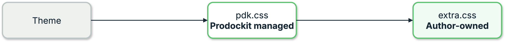
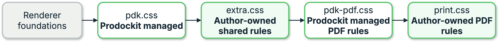

{{ heading_counter_reset(page) }}

# Stylesheets

Stylesheets control the appearance of a document beyond the options exposed by
Zensical and Prodockit. This is an advanced feature: use it when a configuration
setting cannot make the required change.

## Keep managed and author styles separate

The \index{stylesheets!stylesheet ownership} rules separate styles Prodockit
maintains from styles that belong to the document author. Keep that separation
when changing colours, spacing, fonts, or the PDF presentation:

| File | Owner | Applies to |
|---|---|---|
| `docs/stylesheets/pdk.css` | Prodockit | Website and PDF component defaults |
| `docs/stylesheets/extra.css` | Document author | Website and PDF additions or overrides |
| `docs/stylesheets/pdk-pdf.css` | Prodockit | PDF-only presentation defaults |
| `docs/stylesheets/print.css` | Document author | PDF-only additions or overrides |

The two `pdk` files are delivered with Prodockit and checked by
[`prodockit pins`](devcons/pinning-drift.md#pinning-shared-files). Do not edit
them: an update replaces them with the release's current defaults. Add your
own rules to `extra.css` or `print.css` instead. Those two author-owned files
are not shared, pinned, or replaced by `template-sync`.

## Load the cascade in order

The website theme and PDF renderer provide the foundations for their respective
outputs. Prodockit's managed styles and the author's styles then load in the
order shown below. A rule in `extra.css` therefore changes both outputs, while
a rule in `print.css` changes only the PDF and has the final say when selectors
have equal specificity. A final internal guard protects only the page canvas
and removes website navigation from the PDF; it does not set the document's
colours, typography, tables, contents presentation, or component spacing.

| Output | Styles loaded, from first to last |
|---|---|
| Website | Theme → `pdk.css` → `extra.css` |
| PDF | Renderer foundations → `pdk.css` → `extra.css` → `pdk-pdf.css` → `print.css` |

The arrows show which later layer can override an earlier layer at equal CSS
specificity. The website leaves the cascade after `extra.css`; the PDF
continues through its two PDF-only files:

**Website stylesheet cascade**

{ .documentation-diagram }
/// figure-caption
    attrs: {id: fig-website-stylesheet-cascade}

Website stylesheet cascade
///

**PDF stylesheet cascade**

{ .documentation-diagram }
/// figure-caption
    attrs: {id: fig-pdf-stylesheet-cascade}

PDF stylesheet cascade
///

Implement the cascade by listing the files in this order in `zensical.toml`:

```toml
[project]
extra_css = [
  "stylesheets/pdk.css",
  "stylesheets/extra.css",
]

[project.extra]
pdf_extra_css = [
  "stylesheets/pdk-pdf.css",
  "stylesheets/print.css",
]
```

## Put a change in the narrowest file

- Use `extra.css` when the website and PDF should look alike.
- Use `print.css` when the change applies only to paginated output.
- Propose a change to Prodockit when every project should receive it; do not
  make that change directly in either `pdk` file.

For example, this makes level-three entries in the PDF contents page more
widely spaced without changing the website:

```css
/* docs/stylesheets/print.css */
#TOC > ul > li > ul > li > ul > li {
  line-height: 1.15 !important;
}
```

## Keep the managed stylesheets up to date

Follow [Staying in step with the template](devcons/template-sync.md) to receive
new versions of `pdk.css` and `pdk-pdf.css` alongside the template's other
maintained files. `prodockit template-sync` previews the changes before they
are applied.

Run `prodockit pins --check` to compare the two managed stylesheets with the
installed release. If `template-sync` finds local edits in either one, it
prints a managed-stylesheet warning and keeps the local file. Move intentional
rules into `extra.css` or `print.css`, then restore the managed file using the
exact `--force FILE-PATH` command shown by the report.
