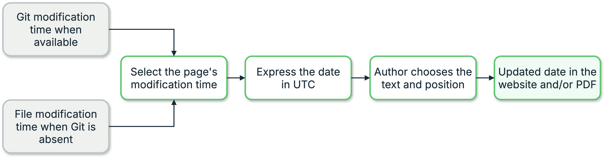

{{ heading_counter_reset(page) }}

# Page update dates

Page update dates are optional. Use this feature only when readers need to see
when individual pages changed. If dates are not required, do not run
`prodockit update-dates`; an ordinary Zensical build needs no replacement
command or other configuration.

When enabled, \index{page update dates} record when each source page was last
changed. After the publication build, Prodockit finds the HTML page produced
from each Markdown file and supplies its update date. It uses the latest Git
author date when history is available and the Markdown file's modification
date otherwise. Every automatic timestamp is converted to UTC before its
`YYYY-MM-DD` calendar date is selected, so the result does not depend on the
time zone of the computer running the build.

\ref{fig-page-update-dates} shows the two date sources converging on the
author-selected position in both outputs.

{ .documentation-diagram }
/// figure-caption
    attrs: {id: fig-page-update-dates}

Page update-date workflow
///

### How time zones are handled

All automatic timestamps are converted to UTC before prodockit selects the
calendar date, regardless of where the build runs:

- **Git history:** the author timestamp includes its recorded UTC offset.
  Prodockit converts that instant to UTC, then selects its calendar date.
- **File modification time:** the filesystem timestamp is converted directly
  to UTC before its calendar date is selected.
- **Manual front matter:** a `revision_date` is already a calendar date, so
  Prodockit uses the author's value exactly as written.

Only the resulting `YYYY-MM-DD` value is displayed; no time or time-zone label
appears. The website and PDF use the same resolved date.

## Place the website date

Write the introductory text you want and put
`<!-- prodockit-update-date -->` at the exact insertion point:

```markdown
Document reviewed: <!-- prodockit-update-date -->
```

The completed website renders, for example:

> Document reviewed: 2026-08-27

The text before or after the marker is ordinary Markdown and is entirely the
author's choice. Without a marker, Prodockit retains the default behaviour and
places an **Updated** fact at the bottom of the generated page.

During `zensical serve`, the marker itself is invisible and only the author's
text is shown. Run the static build followed by `prodockit update-dates` to
inspect the date in its final position.

## Understand the PDF position

The PDF uses the same page date automatically. `prodockit pdf` prints
`Updated on YYYY-MM-DD` below the page number for each source section. The PDF
position follows the document's running-footer design and is not controlled by
the website marker.

The website and PDF need no date macro, Markdown extension, or change to
`zensical.toml`.

## Override one page's date

To override the automatic date for one page, add `revision_date` to that
page's YAML front matter:

```yaml
---
revision_date: 2026-08-27
---

# Page title
```

The explicit value appears in a `zensical serve` preview and takes priority
in the completed website and PDF. Use it only when the displayed date needs
to be controlled independently of the file's history.

This page was updated: <!-- prodockit-update-date -->

Continue to [Build with revision dates](publishing.md#build-with-revision-dates)
for the two publication commands, Git and non-Git behaviour, and CI history
requirements.
