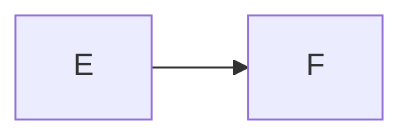

# Nested math and diagrams

- Unordered list item

    $$u^2$$

    ```mermaid
    graph LR
      U --> V
    ```

## Ordered list

1. Ordered list item

    $$o^2$$

    ```mermaid
    graph LR
      O --> P
    ```

## Task list

- [x] Task list item

    $$t^2$$

    ```mermaid
    graph LR
      T --> U
    ```

Definition term

:   Definition body

    $$d^2$$

    ```mermaid
    graph LR
      D --> E
    ```

=== "Tab one"

    $$y^2$$

    ```mermaid
    graph LR
      C --> D
    ```

=== "Tab two"

    $$y_2^2$$

    ```mermaid
    graph LR
      C2 --> D2
    ```

<div class="grid" markdown>

$$z^2$$



</div>

<div class="grid" markdown>

=== "Nested tab"

    $$w^2$$

    ```mermaid
    graph LR
      G --> H
    ```

=== "Nested second"

    $$w_2^2$$

    ```mermaid
    graph LR
      G2 --> H2
    ```

</div>
